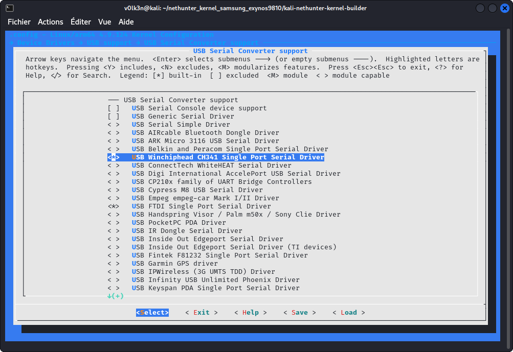

# NetHunter-CANArsenal

This repo is used as documentation for my CAN Arsenal addition in NetHunter apk.

## Description

EXPERIMENTAL VERSION

CAN-Arsenal is used to communicate with CAN Bus for testing, diagnostics or car hacking.

## Prerequisite - Kernel Modification

### CAN support

CAN support will be needed for CAN Arsenal usage.

In section ***“Networking support”***:

- Select ***"CAN bus subsystem support"***


Under ***"CAN bus subsystem support --->"***

- Select ***"Raw CAN Protocol (raw access with CAN-ID filtering)"***
- Select ***"Broadcast Manager CAN Protocol (with content filtering)"***
- Select ***"CAN Gateway/Router (with netlink configuration)"***


Under ***"CAN Device Drivers --->"***

- Select ***"Virtual Local CAN Interface (vcan)"***
- Select ***"Serial / USB serial CAN Adaptors (slcan)"***
- Select ***"Platform CAN drivers with Netlink support"***
- Select ***"CAN bit-timing calculation"***
- Select ***"Enable LED triggers for Netlink based drivers"***
- Select ***"CAN devices debuging messages"***


Under ***"CAN SPI interfaces --->"***

- Select ***"Microchip MCP251x SPI CAN controllers"***


Under ***"CAN USB interfaces --->"***

- Select ***"EMS CPC-USB/ARM7 CAN/USB interface"***
- Select ***"ESD USB/2 CAN/USB interface"***
- Select ***"Geschwister Schneider UG interfaces"***
- Select ***"Kvaser CAN/USB interface"***
- Select ***"PEAK PCAN-USB/USB Pro interfaces for CAN 2.0b/CAN-FD"***
- Select ***"8 devices USB2CAN interface"***


In section ***"Device Drivers ---> USB support ---> USB Serial Converter support --->"*** :

- Select ***"USB Winchiphead CH341 Single Port Serial Driver"***
- Select ***"USB FTDI Single Port Serial Driver"***




## Nethunter CAN Arsenal Documentation

> Warning : Actually in Experimental Version

## Menu


### Documentation

This button will redirect to the following documentation.

### Setup

This button will install needed CAN tools and packages. Note that it shouldn't be needed as it should be launched at first run of CAN Arsenal.

### Update

This button will update the installed CAN tools and packages.


## Settings


Settings are used to configure CAN Arsenal toolset.

## Interface


Interface section is used to Start or Stop CAN, VCAN or SLCAN interface.

### CAN

***Start CAN Interface - Settings Prerequisite :*** 

Set "CAN Interface" and "UART Speed" in Settings

> CAN Interface should respect the following format : can0-9 (such as can0, can1, can2...)


***Start CAN Interface - Used command :***

```bash
sudo ip link set <CAN Interface> type can bitrate <UART Speed>
sudo ip link set <CAN Interface> up
```


***Stop CAN Interface - Settings Prerequisite :*** 

Set "CAN Interface" in Settings

> CAN Interface should respect the following format : can0-9 (such as can0, can1, can2...)


***Stop CAN Interface - Used command :***

```bash
sudo ip link set <CAN Interface> down
```

### VCAN

***Start VCAN Interface - Settings Prerequisite :*** 

Set "CAN Interface" and "MTU" in Settings

> VCAN Interface should respect the following format : vcan0-9 (such as vcan0, vcan1, vcan2...)


***Start VCAN Interface - Used command :***

```bash
ip link add dev <CAN Interface> type vcan
ip link set <CAN Interface> mtu <MTU>
ip link set <CAN Interface> up
```


***Stop VCAN Interface - Settings Prerequisite :*** 

Set "CAN Interface" in Settings

> VCAN Interface should respect the following format : vcan0-9 (such as vcan0, vcan1, vcan2...)

***Stop VCAN Interface - Used command :***

```bash
sudo ip link set <CAN Interface> down 
sudo ip link delete <CAN Interface>
```

### SLCAN

***Start SLCAN Interface - Settings Prerequisite :*** 

Set "CAN Interface", "USB Device", "CAN Speed", "UART Speed" and "Flow Control" in Settings

> SLCAN Interface should respect the following format : slcan0-9 (such as slcan0, slcan1, slcan2...)

> CAN USB Adapter should be plugged in your device and hit refresh button to set USB Device with you'r plugged adapter.


***Start SLCAN Interface - Used command :***

```bash
sudo slcan_attach -f -s<CAN Speed> -o <USB Device>
sudo slcand -o -s<CAN Speed> -t <Flow Control> -S <UART Speed> <USB Device> <CAN Interface>
sudo ip link set <CAN Interface> up
```


***Stop SLCAN Interface - Settings Prerequisite :*** 

Set "CAN Interface" and "USB Device" in Settings.

> SLCAN Interface should respect the following format : slcan0-9 (such as slcan0, slcan1, slcan2...)

> CAN USB Adapter should be plugged in your device and hit refresh button to set USB Device with you'r plugged adapter.


***Stop SLCAN Interface - Used command :***

```bash
sudo ip link set <CAN Interface> down
sudo slcan_attach -d <USB Device>
```


## Tools


### Can-Utils : CanGen

Used to generate CAN Bus Traffic.


***CanGen - Settings Prerequisite :*** 

Your desired CAN Interface should be started and set in Settings.


***CanGen - Used command :***

```bash
cangen <CAN Interface> -v
```


### Can-Utils : CanSniffer

Used to sniff CAN Bus Traffic.


***CanSniffer - Settings Prerequisite :*** 

Your desired CAN Interface should be started and set in Settings.


***CanSniffer - Used command :***

```bash
cansniffer <CAN Interface>
```


### Can-Utils : CanDump

Used to dump CAN Bus traffic to an output file.


***CanDump - Settings Prerequisite :*** 

Your desired CAN Interface should be started and set with "Output" path in Settings. 


***CanDump - Used command :***

```bash
candump <CAN Inteface> -f <Output Log>
```


### Can-Utils : CanSend

Used to replay a specific sequence to CAN bus.


***CanSend - Settings Prerequisite :*** 

Your desired CAN Interface should be started and set with "Sequence" in Settings. 

***CanSend - Used command :***

```bash
cansend <CAN Interface> <Sequence>
```

### Can-Utils : CanPlayer

Used to replay dumped sequences from a log file to CAN bus.


***CanPlayer - Settings Prerequisite :*** 

Your desired CAN Interface should be started and set with "Input" path in Settings. 

> CAN Interface will be taken from the Input Log, check that your interface is the same one. (If you dump with vcan0, you should replay with vcan0)

***CanPlayer - Used command :***

```bash
canplayer -I <Input Log>
```

### Custom Script : SequenceFinder

<a href="https://raw.githubusercontent.com/V0lk3n/NetHunter-CANArsenal/refs/heads/main/sequence_finder.sh">You can see the source code here.</a>

Used to find the exact sequence of the desired action from a log file.

>This custom script will auto split a log files using head and tail. Replay theses with user input in loop using CanPlayer, until finding the exact sequence of the desired action. Finally it replay it using CanSend.


***SequenceFinder - Settings Prerequisite :*** 

Your desired CAN Interface should be started and set with "Input" path in Settings. 

> CAN Interface will be taken from the Input Log, check that your interface is the same one. (If you dump with vcan0, you should replay with vcan0)


***SequenceFinder - Used command :***

```bash
/opt/car_hacking/sequence_finder.sh <Input Log>
```


### Freediag

Used to diagnose your car.


***Freediag - Used command :***

```bash
Freediag
```


### Freediag : DiagTest

DiagTest is a standalone program from Freediag, used to exercise code paths.


***DiagTest - Used command :***

```bash
diag_test
```

## USB-CAN


Mainly used to Dump and Send sequence using CAN USB Analyser.


***USB-CAN Dump - Settings Prerequisite :*** 

Set "USB Device" in Settings.

In USB-CAN, set "CAN Speed" and "Baudrate". Optionally add debug parameter.

> CAN USB Adapter should be plugged in your device and hit refresh button to set USB Device with you'r plugged adapter.


***USB-CAN Dump - Used command :***

```bash
canusb -d <USB Device> -s <USB CAN Speed> -b <USB Baudrate> <Optional Debug Parameters>
```


***USB-CAN Send - Settings Prerequisite :*** 

Set "USB Device" in Settings.

In USB-CAN, set "CAN Speed" and "Baudrate". Set "ID" and "Data" as what you want to send to CAN bus. Optionally add debug and sleep parameter.

> CAN USB Adapter should be plugged in your device and hit refresh button to set USB Device with you'r plugged adapter.


***USB-CAN Send - Used command :***

```bash
canusb -d <USB Device> -s <USB CAN Speed> -b <USB Baudrate> <ID> <Data> <Optional Debug/Sleep Parameters>
```

## Cannelloni


Used to communicate with two machine on a CAN bus by Ethernet.


***Cannelloni - Settings Prerequisite :*** 

Your desired CAN Interface should be set in Settings.

In Cannelloni, "RHOST", "RPORT" and "LPORT" need to be set.

> Both device should be linked using an Ethernet Cable.


***Cannelloni - Used command :***

```bash
sudo cannelloni -I <CAN Interface> -R <RHOST> -r <RPORT> -l <LPORT>
```


## Logging


### Asc2Log

From can-utils suite, Asc2Log is used to convert ASC file format to the classic LOG.


***Asc2Log - Settings Prerequisite :*** 

Set "Input" and "Output" path in Settings. 


***Asc2Log - Used command :***

```bash
asc2log -I <Input Log> -O <Output File>
```


### Log2Asc

From can-utils suite, Log2Asc is used to convert dumped LOG file to the ASC format.


***Log2Asc - Settings Prerequisite :*** 

Your desired CAN Interface should be started and set with "Input", "Output" path in Settings. 


***Log2Asc - Used command :***

```bash
log2asc -I <Input Log> -O <Output File> <CAN Interface>
```


## Custom Command


Used in case you need to run a specific command which doesnt match the one provided.


## Resources

***Tools Documentations***
* <a href="https://github.com/linux-can/can-utils">can-utils</a>
* <a href="https://freediag.sourceforge.io/">freediag</a>
* <a href="https://github.com/kobolt/usb-can">usb-can</a>
* <a href="https://github.com/mguentner/cannelloni">cannelloni</a>


***Guide***
* <a href="https://www.offsec.com/blog/introduction-to-car-hacking-the-can-bus/">Introduction to Car Hacking: The CAN Bus</a>


## Credits

* <a href="https://github.com/fenugrec">Fenugrec</a> for freediag
* <a href="https://gitlab.com/kimoc0der">Kimocoder</a> for help and support
* <a href="https://github.com/kobolt">Kobolt</a> for usb-can
* <a href="https://github.com/linux-can">Linux-Can</a> for can-utils
* <a href="https://github.com/mguentner">Mguentner</a> for cannelloni
* <a href="https://gitlab.com/V0lk3n">V0lk3n</a> for Nethunter CAN Arsenal tab
* <a href="https://gitlab.com/yesimxev">Yesimxev</a> for help and support
