# NetHunter : CAN Arsenal

> EXPERIMENTAL VERSION

This Documentations may be updated. 

## Description

CAN-Arsenal is used to communicate with CAN Bus for testing, diagnostics or car hacking.

### Why?

By porting my Samsung Galaxy S9 kernel to Nethunter, i was looking <a href="https://www.youtube.com/watch?v=FwSHbZqY88k">yesimxev youtube video</a>. I noticed that he was enabling CAN support, and at this moment this project started.

I'm starting to learn how CAN Bus work, and decided to make a tab for this usage. Bellow you can find the kernel change needed, and the documentation how CAN Arsenal work.

### My Kernels

- <a href="https://github.com/V0lk3n/nethunter_kernel_samsung_exynos9810/tree/nethunter-lineage-20">Samsung Galaxy S9 - Lineage OS 20 Nethunter Kernel</a>
- <a href="https://github.com/V0lk3n/nethunter_kernel_samsung_exynos9820/tree/nethunter-lineage-21">Samsung Galaxy S10 - Lineage OS 21 Nethunter Kernel</a>
- <a href="https://github.com/V0lk3n/nethunter_kernel_samsung_exynos9820/tree/nethunter-lineage-22.1">Samsung Galaxy S10 - Lineage OS 22.1 Nethunter Kernel</a>

### Official Documentation

- <a href="https://www.kali.org/docs/nethunter/nethunter-canarsenal/">NetHunter - CAN Arsenal</a>
- <a href="https://www.kali.org/docs/nethunter/nethunter-kernel-9-config-8/">Configuring the kernel - CAN Arsenal</a>

## Table of Contents

* [Prerequisite - Kernel Modification](#KernelModification)
  * [Configuring the kernel - CAN Arsenal](#KernelConfiguration)
* [CAN Arsenal - Documentations](#Documentations) 
  * [Menu](#Menu)
    * [Documentation](#Menu-Documentation)
    * [Setup](#Menu-Setup)
    * [Update](#Menu-Update)
  * [Settings](#Settings)
  * [Interface](#Interface)
    * [ldattach](#ldattach)
    * [slcand](#slcand)
    * [slcan_attach](#slcan_attach)
    * [RFCOMM Bind](#rfcomm)
    * [Socketcand](#socketcand)
  * [Tools](#Tools)
    * [Can-Utils : CanGen](#CanGen)
    * [Can-Utils : CanSniffer](#CanSniffer)
    * [Can-Utils : CanDump](#CanDump)
    * [Can-Utils : CanSend](#CanSend)
    * [Can-Utils : CanPlayer](#CanPlayer)
    * [Custom Script : SequenceFinder](#SequenceFinder)
    * [Freediag](#Freediag)
    * [Freediag - DiagTest](#DiagTest)
  * [USB-CAN](#USB-CAN)
  * [Cannelloni](#Cannelloni)
  * [Logging](#Logging)
    * [Asc2Log](#Asc2Log)
    * [Log2Asc](#Log2Asc)
  * [Custom Command](CustomCommand)
* [Resource](#Resource)  
* [Credits](#Credits)<br/><br/>


## Prerequisite - Kernel Modification<a name="KernelModification"></a>

### Configuring the kernel - CAN Arsenal<a name="KernelConfiguration"></a>

CAN support will be needed for CAN Arsenal usage. Note that this documentations may be updated a lot since CAN Arsenal is in Experimental Version.

In section ***"Networking support"***:


- Select ***"CAN bus subsystem support"***
- Select ***"Network physical/parent device Netlink interface"***

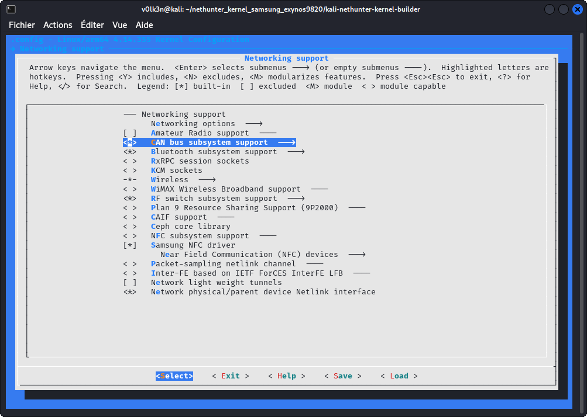

Under ***"CAN bus subsystem support --->"***

- Select ***"Raw CAN Protocol (raw access with CAN-ID filtering)"***
- Select ***"Broadcast Manager CAN Protocol (with content filtering)"***
- Select ***"CAN Gateway/Router (with netlink configuration)"***

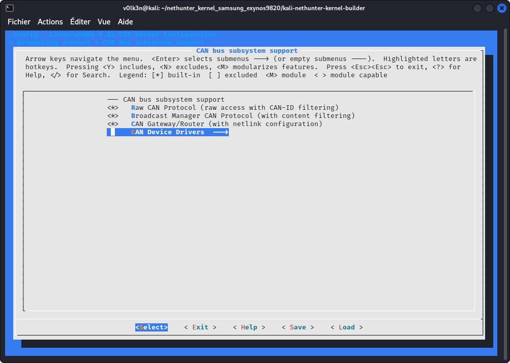

Under ***"CAN Device Drivers --->"***

- Select ***"Virtual Local CAN Interface (vcan)"***
- Select ***"Serial / USB serial CAN Adaptors (slcan)"***
- Select ***"Platform CAN drivers with Netlink support"***
- Select ***"CAN bit-timing calculation"***
- Select ***"Enable LED triggers for Netlink based drivers"***

Optionally you may also :
- Select ***"Aeroflex Gaisler GRCAN and GRHCAN CAN devices"***
- Select ***"Xilinx CAN"***
- Select ***"Bosch C_CAN/D_CAN devices"***
- Select ***"Bosch CC770 and Intel AN82527 devices"***
- Select ***"IFI CAN_FD IP"***
- Select ***"Bosch M_CAN devices"***
- Select ***"Philips/NXP SJA1000 devices"***
- Select ***"Softing Gmbh CAN generic support"***

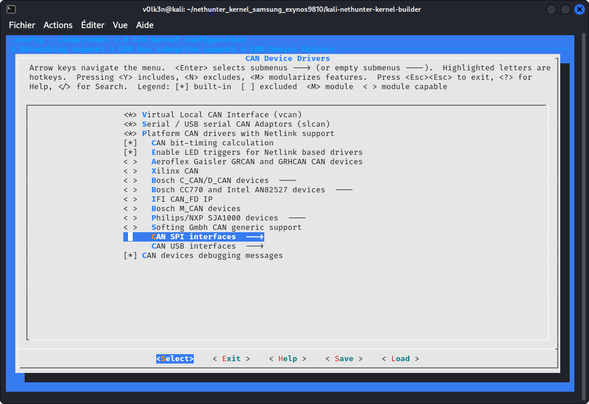

Under ***"CAN SPI interfaces --->"***

- Select ***"Holt HI311x SPI CAN controllers"***
- Select ***"Microchip MCP251x SPI CAN controllers"***

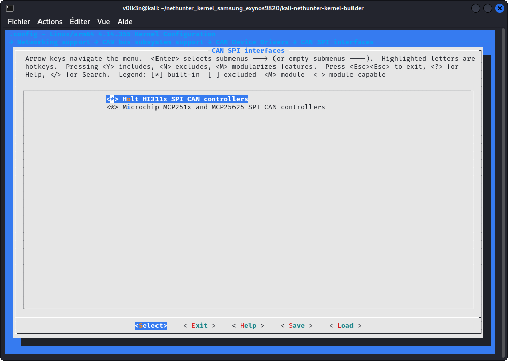

Under ***"CAN USB interfaces --->"***

- Select ***"EMS CPC-USB/ARM7 CAN/USB interface"***
- Select ***"ESD USB/2 CAN/USB interface"***
- Select ***"Geschwister Schneider UG interfaces"***
- Select ***"Kvaser CAN/USB interface"***
- Select ***"PEAK PCAN-USB/USB Pro interfaces for CAN 2.0b/CAN-FD"***
- Select ***"8 devices USB2CAN interface"***

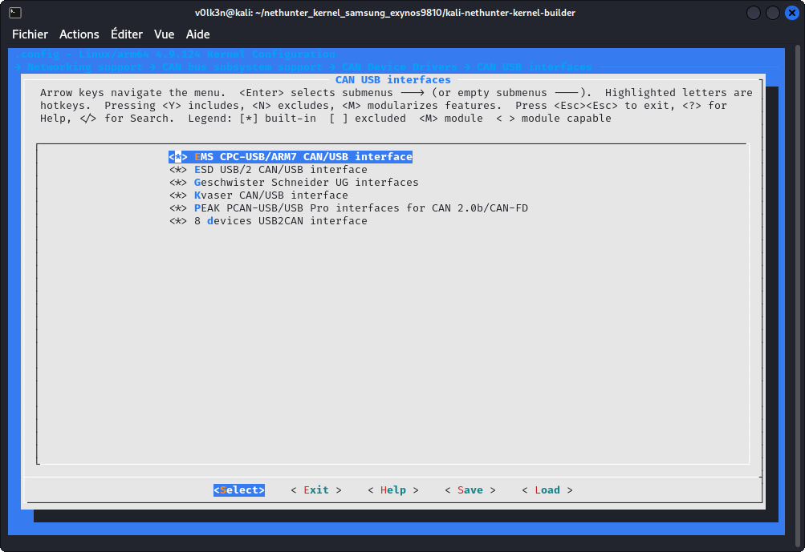

In Section ***"Networking Support"***

Under ***"Networking options"***

- Select ***"Virtual Socket protocol"***
- Select ***"NETLINK: socket monitoring interface"***

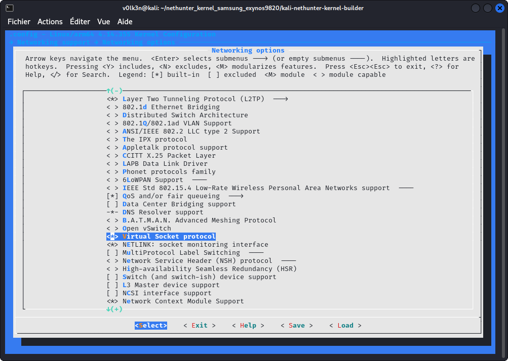

Under ***"QoS and/or fair queueing"***

- Select ***"CAN Identifier"***

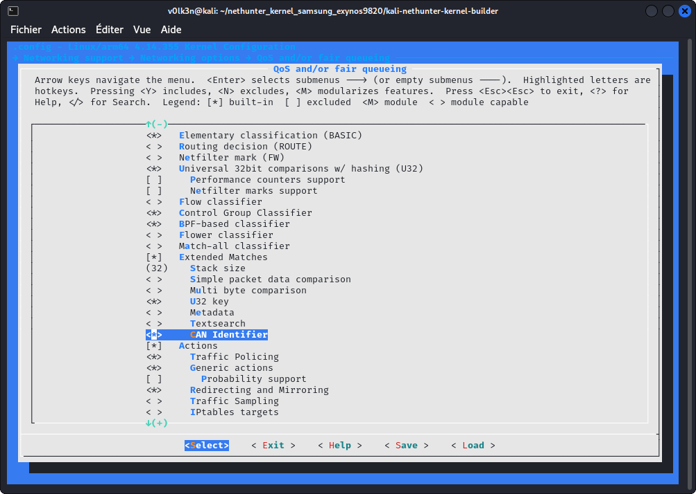


In section ***"Device Drivers ---> USB support ---> USB Serial Converter support --->"*** :

- Select ***"USB Serial Console device support"***
- Select ***"USB Generic Serial Driver"***
- Select ***"USB Winchiphead CH341 Single Port Serial Driver"***
- Select ***"USB FTDI Single Port Serial Driver"***
- Select ***"USB Prolific 2303 Single Port Serial Driver"***

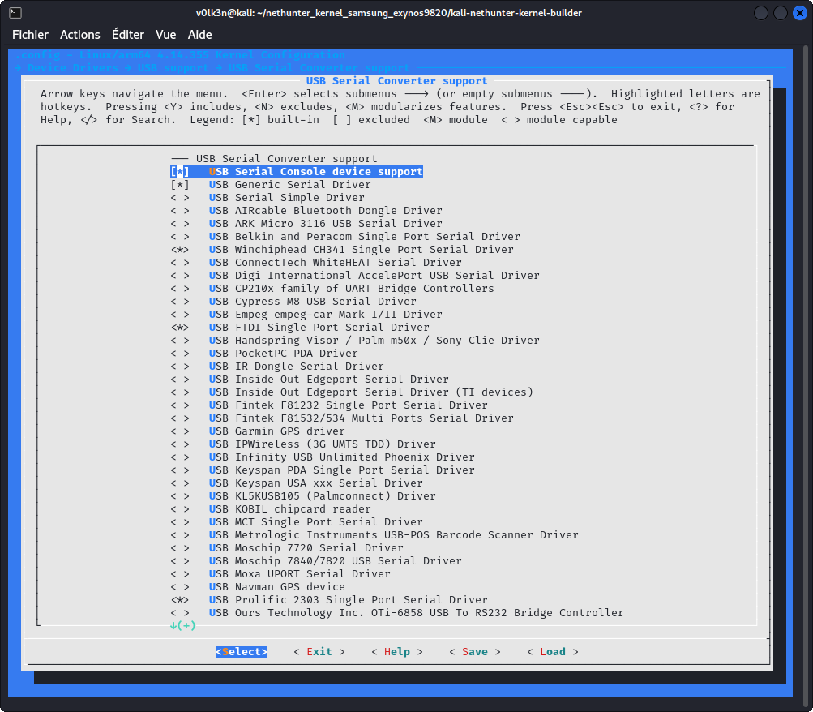


#### ISO 15765-2 Driver CAN-ISOTP (Optional)

Go to your kernel sources folder and clone as submodule can-isotp driver.

```
git submodule add https://github.com/V0lk3n/can-isotp drivers/net/can/can-isotp
```

Download ***"isotp.h"*** to ***"include/uapi/linux/can"***

```
cd include/uapi/linux/can
wget https://raw.githubusercontent.com/v0lk3n/can-isotp/refs/heads/master/include/uapi/linux/can/isotp.h
```

Edit drivers/net/can/Kconfig and add the following line :

```
source "drivers/net/can/can-isotp/Kconfig"
```

Edit drivers/net/can/Makefile and add the following line :

```
obj-y				+= can-isotp/
```

In Section ***"Networking Support"***

Under ***"CAN bus subsystem support ---> CAN Device Drivers"***

- Select as Module ***"CAN ISO 15765-2 driver"***

#### ELM327 (Optional)

This driver should be build as module! To get the ability to load it using ```sudo insmod elmcan.ko accept_flaky_uart=1``` if needed.

##### Kernel 6.0 or Higher

This driver has become an official part of Linux since v6.0

In Section ***"Networking support"***

Under ***" > CAN bus subsystem support >  CAN Device Drivers --->"***

- Select as module (\<M\>) ***Serial / USB serial ELM327 based OBD-II Interfaces (can327)***

##### Kernel 4.11 or Higher

For Kernel 4.11 or higher. You can add ELM327 driver by following these step :

- Go to root of your Kernel repository and run these commands

```
git submodule add https://github.com/V0lk3n/elmcan drivers/net/can/elmcan
cp drivers/net/can/elmcan/can327.c drivers/net/can/
```

- Edit ***drivers/net/can/Makefile*** and add the following line.

```
obj-$(CONFIG_CAN_CAN327)	+= can327.o
```

- Edit ***drivers/net/can/Kconfig*** and add the following config.

```
config CAN_CAN327
	tristate "Serial / USB serial ELM327 based OBD-II Interfaces (can327)"
	depends on TTY
	select CAN_RX_OFFLOAD
	help
	  CAN driver for several 'low cost' OBD-II interfaces based on the
	  ELM327 OBD-II interpreter chip.

	  This is a best effort driver - the ELM327 interface was never
	  designed to be used as a standalone CAN interface. However, it can
	  still be used for simple request-response protocols (such as OBD II),
	  and to monitor broadcast messages on a bus (such as in a vehicle).

	  Please refer to the documentation for information on how to use it:
	  Documentation/networking/device_drivers/can/can327.rst

	  If this driver is built as a module, it will be called can327.
```

Finally, build the kernel.

In Section ***"Networking support"***

Under ***"CAN bus subsystem support >  CAN Device Drivers --->***

- Select as module (\<M\>) ***Serial / USB serial ELM327 based OBD-II Interfaces (can327)***

#### Kernel Lower than 4.11

For Kernel lower than 4.11. You can add ELM327 driver by following these step :

- Go to root of your Kernel repository and run these commands

```
git submodule add -b linux-pre-4.11 https://github.com/V0lk3n/elmcan drivers/net/can/elmcan
```

- Edit ***drivers/net/can/Makefile*** and add the following line.

```
obj-y                           += elmcan/
```

Finally, build the kernel.

In Section ***"Networking support"***

Under ***"CAN bus subsystem support >  CAN Device Drivers --->***

- Select as module (\<M\>) ***Serial / Serial ELM327 driver***

## CAN Arsenal - Documentation<a name="Documentation"></a>

> Warning : Actually in Experimental Version

## Menu<a name="Menu"></a>

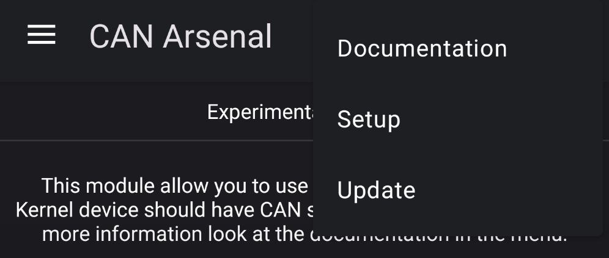

### Documentation<a name="Menu-Documentation"></a>

This button will redirect to the following documentation.

### Setup<a name="Menu-Setup"></a>

This button will install needed CAN tools and packages. Note that it shouldn't be needed as it should be launched at first run of CAN Arsenal.

### Update<a name="Menu-Update"></a>

This button will update the installed CAN tools and packages.


## Settings<a name="Settings"></a>

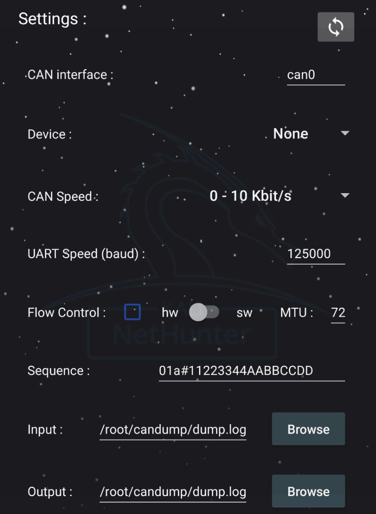

Settings are used to configure CAN Arsenal toolset.

## Interface<a name="Interface"></a>

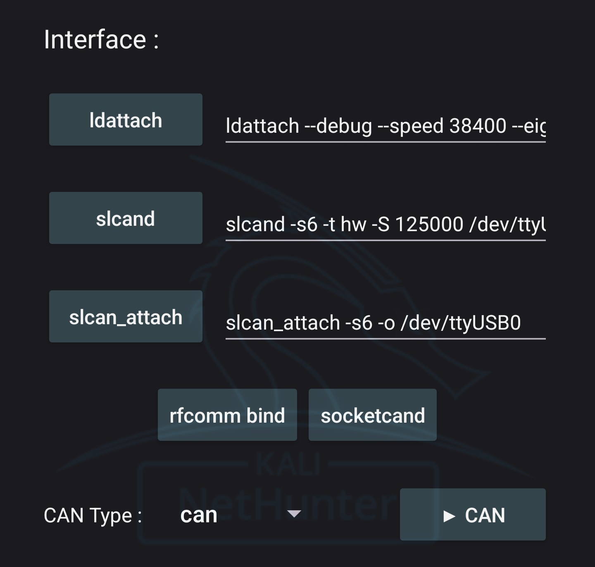

Interface section is used to Configure your CAN interfaces.

### ldattach<a name="ldattach"></a>

Attach your device. Set as default for /dev/rfcomm0 (Bluetooth)

***ldattach - Used command :***

You may modify this as your wish.

```bash
ldattach --debug --speed 38400 --eightbits --noparity --onestopbit --iflag -ICRNL,INLCR,-IXOFF 29 /dev/rfcomm0
```

### slcand<a name="slcand"></a>

Daemon for Serial CAN devices.

***slcand - Used command :***

You may modify this as your wish.

```bash
slcand -s6 -t sw -S 200000 /dev/ttyUSB0 can0
```

### slcan_attach<a name="slcan_attach"></a>

Attach your serial CAN device.

***slcan_attach - Used command :***

```bash
slcan_attach -s6 -o /dev/ttyUSB0
```

### RFCOMM bind<a name="rfcomm"></a>

For bluetooth CAN adapter usage. Run it to bind bluetooth to your device.

***Bind RFCOMM - Settings Prerequisite :*** 

Set "Target" MAC address in Settings.

> Note : RFCOMM should be supported, you need to enable services in bluetooth arsenal prior this to work.
> Pair and Trust your bluetooth device with bluetoothctl prior using this.

***Bind RFCOMM - Used command :***

```bash
rfcomm bind <Target MAC Address>
```

### socketcand<a name="socketcand"></a>

Daemon to bridge CAN interfaces.

***socketcand - Settings Prerequisite :*** 

Set "CAN Inteface" in Settings.

***socketcand - Used command :***

```bash
socketcand -v -l wlan0 -i <CAN Interface>
```

### CAN Interfaces

> Note : Actually you only may start one interface at a time. Will be rewritten for next release. If you need to start more than one, you will need to start these manually.

***Start CAN Interface - Settings Prerequisite :*** 

Set "CAN Interface", "MTU" in Settings and "CAN Type" in Inteface.

> If you use adapter for CAN or SLCAN interfaces, you may need to setup "ldattach","slcand","slcan_attach","rfcomm bind" or "socketcand"

***Start CAN Interface - Used command :***

If CAN Type is set to : CAN 

```bash
sudo ip link set <CAN Interface> bitrate <Selected Bitrate>
sudo ip link set <CAN Interface> mtu <MTU>
sudo ip link set <CAN Interface> up 
```

If CAN Type is set to : VCAN

```bash
sudo ip link add dev <CAN Interface> type vcan
sudo ip link set <CAN Interface> mtu <MTU>
sudo ip link set <CAN Interface> up 
```

If CAN Type is set to : SLCAN

```bash
sudo ip link set <CAN Interface> mtu <MTU>
sudo ip link set <CAN Interface> up 
```

***Stop CAN Interface - Settings Prerequisite :*** 

Set "CAN Interface" in Settings

***Stop CAN Interface - Used command :***

If CAN Type is set to : CAN or SLCAN

```bash
sudo ip link set <CAN Interface> down
```

If CAN Type is set to : VCAN

```bash
sudo ip link set <CAN Interface> down && sudo ip link delete <CAN Interface>
```

## Tools<a name="Tools"></a>

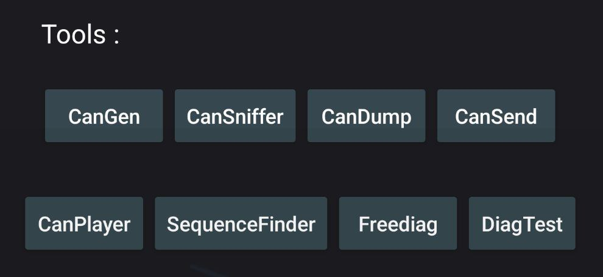


### Can-Utils : CanGen<a name="CanGen"></a>

Used to generate CAN Bus Traffic.


***CanGen - Settings Prerequisite :*** 

Your desired CAN Interface should be started and set in Settings.


***CanGen - Used command :***

```bash
cangen <CAN Interface> -v
```


### Can-Utils : CanSniffer<a name="CanSniffer"></a>

Used to sniff CAN Bus Traffic.


***CanSniffer - Settings Prerequisite :*** 

Your desired CAN Interface should be started and set in Settings.


***CanSniffer - Used command :***

```bash
cansniffer <CAN Interface>
```


### Can-Utils : CanDump<a name="CanDump"></a>

Used to dump CAN Bus traffic to an output file.


***CanDump - Settings Prerequisite :*** 

Your desired CAN Interface should be started and set with "Output" path in Settings. 


***CanDump - Used command :***

```bash
candump <CAN Inteface> -f <Output Log>
```


### Can-Utils : CanSend<a name="CanSend"></a>

Used to replay a specific sequence to CAN bus.


***CanSend - Settings Prerequisite :*** 

Your desired CAN Interface should be started and set with "Sequence" in Settings. 

***CanSend - Used command :***

```bash
cansend <CAN Interface> <Sequence>
```

### Can-Utils : CanPlayer<a name="CanPlayer"></a>

Used to replay dumped sequences from a log file to CAN bus.


***CanPlayer - Settings Prerequisite :*** 

Your desired CAN Interface should be started and set with "Input" path in Settings. 

> CAN Interface will be taken from the Input Log, check that your interface is the same one. (If you dump with vcan0, you should replay with vcan0)

***CanPlayer - Used command :***

```bash
canplayer -I <Input Log>
```

### Custom Script : SequenceFinder<a name="SequenceFinder"></a>

<a href="https://raw.githubusercontent.com/V0lk3n/NetHunter-CANArsenal/refs/heads/main/sequence_finder.sh">You can see the source code here.</a>

Used to find the exact sequence of the desired action from a log file.

>This custom script will auto split a log files using head and tail. Replay theses with user input in loop using CanPlayer, until finding the exact sequence of the desired action. Finally it replay it using CanSend.


***SequenceFinder - Settings Prerequisite :*** 

Your desired CAN Interface should be started and set with "Input" path in Settings. 

> CAN Interface will be taken from the Input Log, check that your interface is the same one. (If you dump with vcan0, you should replay with vcan0)


***SequenceFinder - Used command :***

```bash
/opt/car_hacking/sequence_finder.sh <Input Log>
```


### Freediag<a name="Freediag"></a>

Used to diagnose your car.


***Freediag - Used command :***

```bash
sudo -u kali freediag
```


### Freediag : DiagTest<a name="DiagTest"></a>

DiagTest is a standalone program from Freediag, used to exercise code paths.


***DiagTest - Used command :***

```bash
sudo -u kali diag_test
```

## USB-CAN<a name="USB-CAN"></a>

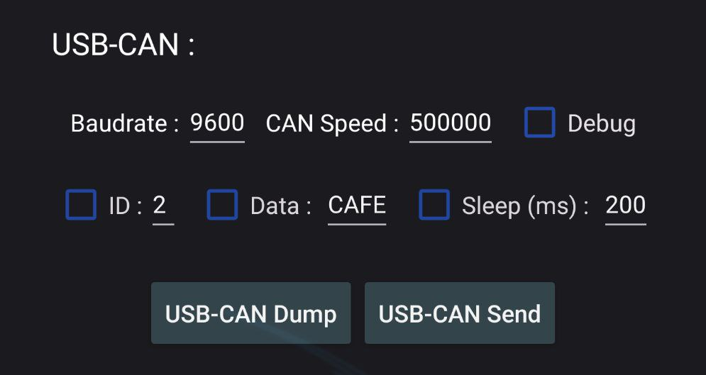


Mainly used to Dump and Send sequence using CAN USB Analyser.


***USB-CAN Dump - Settings Prerequisite :*** 

Set "USB Device" in Settings.

In USB-CAN, set "CAN Speed" and "Baudrate". Optionally add debug parameter.

> CAN USB Adapter should be plugged in your device and hit refresh button to set USB Device with you'r plugged adapter.


***USB-CAN Dump - Used command :***

```bash
canusb -d <USB Device> -s <USB CAN Speed> -b <USB Baudrate> <Optional Debug Parameters>
```


***USB-CAN Send - Settings Prerequisite :*** 

Set "USB Device" in Settings.

In USB-CAN, set "CAN Speed" and "Baudrate". Set "ID" and "Data" as what you want to send to CAN bus. Optionally add debug and sleep parameter.

> CAN USB Adapter should be plugged in your device and hit refresh button to set USB Device with you'r plugged adapter.


***USB-CAN Send - Used command :***

```bash
canusb -d <USB Device> -s <USB CAN Speed> -b <USB Baudrate> <ID> <Data> <Optional Debug/Sleep Parameters>
```

## Cannelloni<a name="Cannelloni"></a>

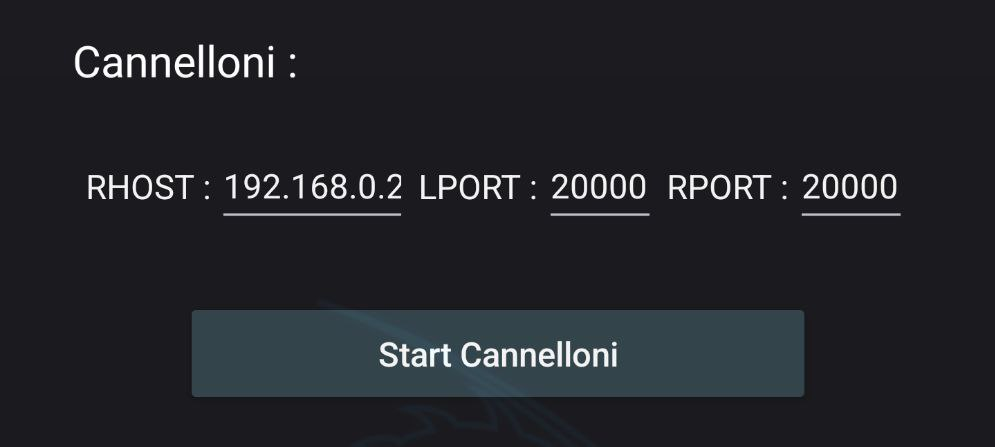

Used to communicate with two machine on a CAN bus by Ethernet.


***Cannelloni - Settings Prerequisite :*** 

Your desired CAN Interface should be set in Settings.

In Cannelloni, "RHOST", "RPORT" and "LPORT" need to be set.

> Both device should be linked using an Ethernet Cable.


***Cannelloni - Used command :***

```bash
sudo cannelloni -I <CAN Interface> -R <RHOST> -r <RPORT> -l <LPORT>
```


## Logging<a name="Logging"></a>


### Asc2Log<a name="Asc2Log"></a>

From can-utils suite, Asc2Log is used to convert ASC file format to the classic LOG.


***Asc2Log - Settings Prerequisite :*** 

Set "Input" and "Output" path in Settings. 


***Asc2Log - Used command :***

```bash
asc2log -I <Input Log> -O <Output File>
```


### Log2Asc<a name="Log2Asc"></a>

From can-utils suite, Log2Asc is used to convert dumped LOG file to the ASC format.


***Log2Asc - Settings Prerequisite :*** 

Your desired CAN Interface should be started and set with "Input", "Output" path in Settings. 


***Log2Asc - Used command :***

```bash
log2asc -I <Input Log> -O <Output File> <CAN Interface>
```


## Custom Command<a name="CustomCommand"></a>

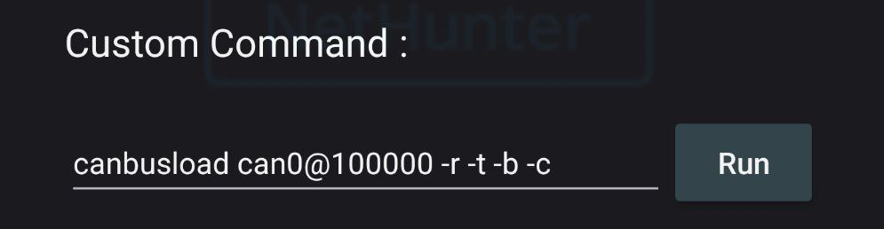

Used in case you need to run a specific command which doesnt match the one provided.


## Resources<a name="Resources"></a>

***Tools Documentations***
* <a href="https://github.com/linux-can/can-utils">can-utils</a>
* <a href="https://freediag.sourceforge.io/">freediag</a>
* <a href="https://github.com/kobolt/usb-can">usb-can</a>
* <a href="https://github.com/mguentner/cannelloni">cannelloni</a>


***Guide***
* <a href="https://www.offsec.com/blog/introduction-to-car-hacking-the-can-bus/">Introduction to Car Hacking: The CAN Bus</a>


## Credits<a name="Credits"></a>

* <a href="https://github.com/fenugrec">Fenugrec</a> for freediag
* <a href="https://gitlab.com/kimoc0der">Kimocoder</a> for help and support
* <a href="https://github.com/kobolt">Kobolt</a> for usb-can
* <a href="https://github.com/linux-can">Linux-Can</a> for can-utils
* <a href="https://github.com/mguentner">Mguentner</a> for cannelloni
* <a href="https://gitlab.com/V0lk3n">V0lk3n</a> for Nethunter CAN Arsenal tab
* <a href="https://gitlab.com/yesimxev">Yesimxev</a> for help and support
