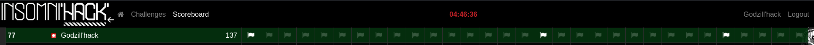
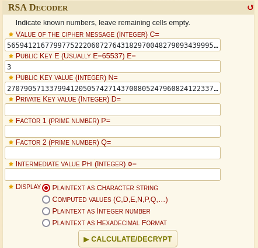
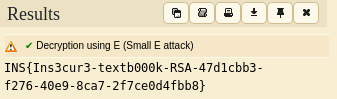
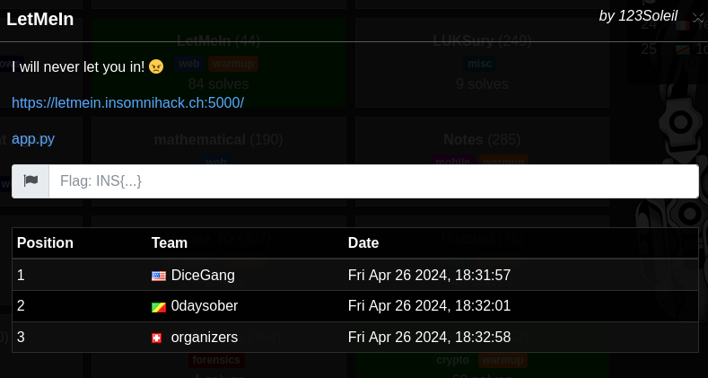
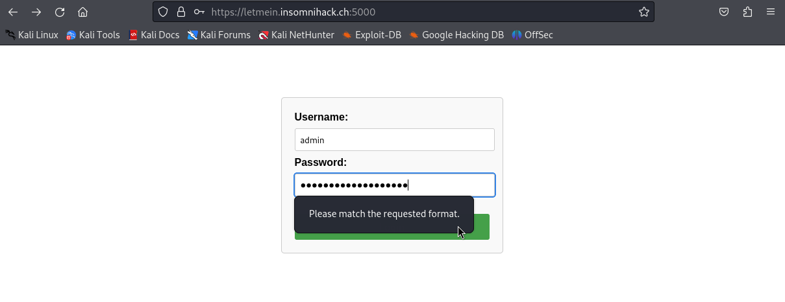
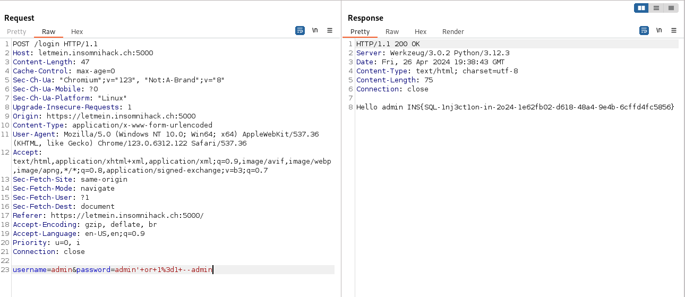
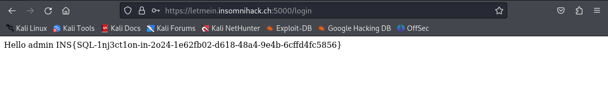

# Insomni'hack CTF 2024 - WriteUp

<p align="center">
	
</p>

> Written by [V0lk3n](https://twitter.com/V0lk3n)

## Scoreboard

### At the time we leaved

<p align="center">
	
</p>

<p align="center">
	
</p>

> There was a total of 109 Teams playing that CTF

### Final Scoreboard (CTFTime Based)

<p align="center">
	
</p>

> There was a total of 92 Teams playing that CTF (Don't know why there is less team than in place)

## Author Notes 

```
As alway this was an amazing two days event! The talk was so nice! And the CTF had a very good atmosphere as alway.

Insomni'hack is one of my best experiance in my LIFE!

About the CTF. This time we managed to solve three warmup challenge. Compared to the last year where we managed to solve only the welcome challenge, this is a great progress!

Thanks so much to the organizers for this event, i just can't wait next year to attend this again!

-V0lk3n
```

## Table of Contents
  
* [**Cryptography**](#crypto)
	* [Textbook](#textbook)<br><br>
* [**Web**](#web)
	* [LetMeIn](#LetMeIn)<br><br>
* [**Credits**](#Credits)


## Cryptography<a name="crypto"></a>

### Textbook<a name="textbook"></a>

Challenge :

<p align="center">
	
</p>

Attachments :

- <a href="assets/challenges/cryptography/Textbook/TextbookRSA.py">TextbookRSA.py</a>
- <a href="assets/challenges/cryptography/Textbook/output.txt">output.txt</a>

### Solution

In this challenge, we go two files. A python script called <a href="assets/challenges/cryptography/Textbook/TextbookRSA.py">TextbookRSA.py</a> with the following content.

```python
import binascii

def string_to_big_number(s):
    hex_string = s.encode("utf-8").hex()
    return int(hex_string, 16)

def big_number_to_string(n):
    hex_string = hex(int(n))[2:]  # Remove '0x' prefix
    if len(hex_string) % 2 != 0:
        hex_string = "0" + hex_string  # Ensure even length
    byte_string = binascii.unhexlify(hex_string)
    return byte_string.decode("utf-8")

# textbook RSA encryption
# e and n are the public key of the RSA encryption
# plaintext is a number representing a string, probably generated by the usage of `string_to_big_number(s)`
def encrypt(e, n, plaintext):
    cipher = pow(plaintext, e, n)
    return cipher

if __name__ == "__main__":
    n = 27079057133799412050574271437008052479608241223378451645921828586987123275384389661190553748448131519947241422660530887207052569407854395838748787042401384171004075065289693865326335229373180653322729951129863580393632355060254900268199341538759231436658420086612699118387712385798095800079241523407995250557541194616409131909211593714204924250020714684886257490233315018260104680317027639085285801307224595400670158526070066366240039167026375801898715172465640224571404900157050983353328416661007442709676702248323670028687937388451334051028292837462090344713796045666811858601266699076083800170158980716593299585259
    e = 3
    print("Public keys:", e, n)
  
    content = "???????????????????????????????????????????????????????????"
    flag = "INS{" + content + "}"
    assert(len(flag) == 64)

    # perform the encryption
    flag_num = string_to_big_number(flag)
    encrypted_msg = encrypt(e, n, string_to_big_number(flag))
    print("Encrypted message:", encrypted_msg)
```

And a text file called <a href="assets/challenges/cryptography/Textbook/output.txt">output.txt</a> with the following content.

```
Public keys: 3 27079057133799412050574271437008052479608241223378451645921828586987123275384389661190553748448131519947241422660530887207052569407854395838748787042401384171004075065289693865326335229373180653322729951129863580393632355060254900268199341538759231436658420086612699118387712385798095800079241523407995250557541194616409131909211593714204924250020714684886257490233315018260104680317027639085285801307224595400670158526070066366240039167026375801898715172465640224571404900157050983353328416661007442709676702248323670028687937388451334051028292837462090344713796045666811858601266699076083800170158980716593299585259
Encrypted message: 56594121677997752220607276431829700482790934399952073873985673376275627839001844292485471807397871097275395609294585018857153433532241532955624760068010089737094396465889850992818015700654441456736195039510931432278419326554279365041295917253950911528145497289077466288304560003359935645326885952227561526993962879620894932357491692265941378691020322367234989484400147908675111983459941244440416401817013935255897074795208750963711463596125595936659690953487717
```

Reading at the python script we understand that the first line of the output is the exponent (e) followed by the modulus (n).

The second line contain the encrypted flag (c). 

Our goal is to decrypt the flag, and to solve it i used the <a href="https://www.dcode.fr/rsa-cipher">RSA Decoder from dcode</a> and supplied the exponent, modulus and cipher (encrypted flag) to retrieve the flag.

<p align="center">
	
</p>

Once decoded we retrieve the flag.

<p align="center">
	
</p>

**FLAG : INS{Ins3cur3-textb000k-RSA-47d1cbb3-f276-40e9-8ca7-2f7ce0d4fbb8}**


## Web<a name="web"></a>

### LetMeIn<a name="LetMeIn"></a>

Challenge :

<p align="center">
	
</p>

Attachment :

- Challenge URL : https://letmein.insomnihack.ch:5000/
- <a href="assets/challenges/web/LetMeIn/app-provided-3ee2d50c7746010d3b8fbc66579e41603263a7cf6b85b5eac484479a94064a34.py">app.py</a>

### Solution

In this challenge, we got a python source code called  <a href="assets/challenges/web/LetMeIn/app-provided-3ee2d50c7746010d3b8fbc66579e41603263a7cf6b85b5eac484479a94064a34.py">app.py</a> of the web app running on `https://letmein.insomnihack.ch:5000/`.

Bellow is the source code :

```python
from flask import Flask, render_template, request 
from flask_sqlalchemy import SQLAlchemy
from const import FLAG, CRENDENTIALS

app = Flask(__name__)
app.config['SQLALCHEMY_DATABASE_URI'] = f'postgresql://{CRENDENTIALS}@db:5432/application'
db = SQLAlchemy(app)

@app.route('/')
def index():
    return render_template('index.html')

@app.route('/login', methods=['GET','POST'])
def login():
    if request.method == 'GET':
        return render_template('index.html')

    username = request.form['username']
    password = request.form['password']

    if username != 'admin' or password[:5] != 'admin' or password[-5:] != 'admin':
        return 'Login failed. Please check your username and password.'


    query = f"SELECT * FROM users WHERE username='{username}' AND password='{password}'"
    user = db.session.execute(db.text(query)).fetchone()

    if user:
        return 'Hello admin ' + FLAG
    else:
        return 'Login failed. Please check your username and password.'

if __name__ == '__main__':
    app.run(debug=False, host='0.0.0.0')
```

So it's a Flask app with a login form using SQLAlchemy. Looking at the web app, and trying to login with random credentials we can see that there is a restriction.

<p align="center">
	
</p>

For a better request management, i used BurpSuite to solve this challenge.

Now let's get back to the source code, and analyse it.

First, let's see our goal. 

```python
    if user:
        return 'Hello admin ' + FLAG
    else:
        return 'Login failed. Please check your username and password.'
```

As we can see, we need to login as "admin" to retrieve the flag. And as we can see bellow, we should be able to exploit a SQL Injection on username and password field.

```python
    query = f"SELECT * FROM users WHERE username='{username}' AND password='{password}'"
    user = db.session.execute(db.text(query)).fetchone()
```

But here is the real challenge. We need to respect the condition bellow while exploiting the SQL Injection.

```python
    if username != 'admin' or password[:5] != 'admin' or password[-5:] != 'admin':
        return 'Login failed. Please check your username and password.'
```

So, our username should be `admin`. This mean that we can't exploit an SQL injection in username field, because for example `admin'` is not equal to `admin` because of the quote.

Also, the first five letter of the password should be `admin` and the last five letter of the password should be `admin`. 

After analyzing it, we understand that we can exploit our SQL Injection in the middle of the password. For example : `admin'admin` respect the condition, because the five first and last letter of the password is `admin`.

After trying few payload, we managed to exploit it with success using `admin' or 1=1 --admin` as password payload.

> As i used burp, i needed to URL encode the payload to send the request. Thats why the password is `admin'+or+1%4d1+--admin`. (The space is converted with `+`, and the equal is converted to `%3d`)

<p align="center">
	
</p>

And trying the SQL injection directly on the web.

<p align="center">
	
</p>

**FLAG : INS{SQL-1nj3ct1on-in-2o24-1e62fb02-d618-48a4-9e4b-6cffd4fc5856}**

### Credits<a name="Credits"></a>

Special thanks to :

- My team mate <a href="https://twitter.com/MarkusR0st">@R0stM to be there with me for the two days and the CTF!
- Insomni'hack organizers, for this amazing two days event!

And of course... 

**Thanks to all my team [Godzillhack!](https://godzillhack.com)**
